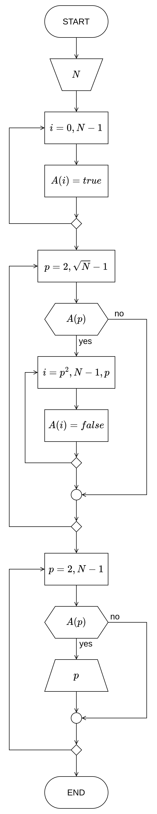

# Друга вежба

**Основне алгоритамске структуре и типови података**

[:fontawesome-regular-file-pdf: Нерешени задаци](../../assets/AIP_V2_zadaci_za_vezbu.pdf)

## Неке белешке...


## Задатак 1.

Нацртати структурни дијаграм тока алгоритма и на програмском језику _C_ написати структурни програм који одређује и приказује све просте бројеве мање од $N$. Целобројни параметар $N$ уноси корисник. Уколико се при извршавању програма за $N$ унесе вредност $100$, шта ће програм приказати на излазу?

### Териотисање

Из математике знамо да се прост број дефинише као број који је дељив само самим собом и бројем $1$. Број $1$ се не сматра ни простим ни сложеним бројем, неки би рекли да јесте, а неки да није прост број (јер дефиниција простих бројева може да налаже да је прост број онај број који има тачно два, међусобно различита фактора, па онда $1$ не би задовољавао услов у том случају).

Даћемо пример привх 10 простих бројева: $2, 3, 5, 7, 11, 13, 17, 19, 23, 29$.  
Приметимо да је први прост број $2$, други је $3$, и тако даље. Осим броја $2$ који је и једини паран прост број, сви остали прости бројеви су заправо непарни (јер је сваки паран број дељив и бројем $2$, па онда такви бројеви, сем броја $2$, нису прости).

Негативни бројеви нису прости бројеви, јер су сви дељиви барем са $-1$. $0$, слично броју $1$, није ни прост ни сложен број – број $0$ подељен самим собом није дефинисано и сваки други број је могуће поделити са $0$. Ово може бити **први услов**, бројеви мањи или једнаки $1$ ($N \leq 1$) нису прости бројеви.

Претходно је речено да је први прост број $2$, а други $3$, ово може бити **други услов** – уколико је $N = 3 \lor N = 2$, број је прост.

У супротном, ако је број дељив са $2$ или $3$ ($N \bmod 2 = 0 \lor N \bmod 3 = 0$), број није прост и ово је **трећи услов**.

Можемо приметити да су сви прости бројеви већи од $3$ у форми $6k\pm 1$. Целе бројеве је могуће представити у облику $6k+i$, за $i = -1, 0, 1, 2, 3, 4$. Број $2$ дели $6k$, $6k+2$, $6k+4$, а број $3$ дели $6k+3$, што је већ покривено другим условом. Остаје једино проверити да ли је $N$ дељиво са свим бројевима облика $6k\pm 1$.

Проверу не морамо да вршимо док не дођемо до самог броја $N$. Сви делиоци броја $N$ (без њега самог) биће мањи од или једнаки $\frac{N}{2}$. Нпр. $1, 2, 4, 5, 10, 20, 25, 50$ су делиоци броја $100$, а највећи $50$. Додатно, можемо уочити понављање производа у факторизацији броја $100$, $2 \cdot 50, 4 \cdot 25, 5 \cdot 20, 10 \cdot 10, 20 \cdot 5, 50 \cdot 2$ – парови $2 \cdot 50$ и $50 \cdot 2$, $4 \cdot 25$ и $25 \cdot 4$, $5 \cdot 25$ и $25 \cdot 5$, су сачињени од истих бројева. Ово важи за било који број $N$, тако да није потребно трагати даље од $\sqrt{N}$.

У почетном тренутку, помоћу флега (енг. flag, **променљива** у којој чувамо неко стање програма), сматрати да је број прост уколико се не докаже супротно. Први и трећи услов се могу објединити у један ($N \leq 1 \lor N \bmod 2 = 0 \lor N \bmod 3 = 0$), ако и само ако прво проверимо важење другог услова ($N = 2 \lor N = 3$). Потом кроз петљу, од наредног познатог простог броја $k = 5$, док је $k \leq \sqrt{N}$, проверавати услов $N \bmod 6k = 0 \lor N \bmod 6k+1 = 0$ и увећавати $k$ за $6$ при свакој итерацији. У случају да смо доказали да број није прост нема потребе проверавати даље – услов петље можемо кореговати да петља ради док је и флег тачан, тј. док сматрамо још увек да је број прост, $k \leq \sqrt{N} \land flag$.

За решавање задатка, ове провере објединити у бројачкој петљи од $2$ до $N - 1$ (како не би укључили $N$ у проверу, како се у задатку тражи прости бројеви **мањи од** $N$).

### Дијаграм тока алгоритма


{ .no-indent }

### Изворни код програма

```c linenums="1"
#include <stdio.h>

main()
{
    int n, i, k, prost;

    printf("Unesite ceo broj N: ");
    scanf("%d", &n);

    for (i = 2; i < n; i++) {
        prost = 1;

        if (i == 2 || i == 3)
            prost = 1;
        else if (i <= 1 || i % 2 == 0 || i % 3 == 0)
            prost = 0;
        else {
            k = 5;
            while (k * k <= i && prost) {
                if (i % k == 0 || i % (k + 2) == 0)
                    prost = 0;

                k += 6;
            }
        }

        if (prost)
            printf("%d\n", i);
    }
}
```

??? tip "Алтернативно решење"

    !!! warning "Упозорење!"

        Ово решење користи елементе програмирања који **нису** предвиђени за извођење ове вежбе. У овом решењу су коришћени **низови (поља)** који су предвиђени за извођење наредне, треће, лабораторијске вежбе и овде неће бити објашњени!

    За решавање овог задатка погодно је искористити алгоритам „Ератостеново сито”:

    1. Направити низ целих бројева од $2$ до $N$, $\{2, 3, 4, …, N\}$;
    1. Нека је $p = 2$, најмањи прост број;
    1. У низу означити бројеве који су умношци $p$–а ($2p, 3p, 4p, …$);
    1. Пронаћи најмањи број у низу већи од $p$ који није означен. Тај број поставити као нову вредност $p$–а, поновити претходни корак. Уколико такав број не постоји, крај алгоритма;
    1. Преостали, неозначени бројеви по завршетку алгоритма биће само прости бројеви мањи од $N$.

    ***Пример, корак по корак***

    **Легенда**:<br>
    `x` – неозначен елемент, разматра се као прост број;<br>
    {++`x`++} – неозначен елемент у односу на који се његови умношци означавају;<br>
    **`x`** – означен елемент у тренутном кораку алгоритма, одредили смо да није прост број;<br>
    ~~`x`~~ – означен елемент у претходним корацима, није прост број;<br>
    ~~**`x`**~~ – означен елемент у тренутном кораку који је већ био претходно означен.

    Генерисати низ од $N = 100$ елемената, од $1$ до $N$. Притом, први елемент $1$ не разматрамо и занемарујемо. Ради прегледности, низ је представљен у 10 редова.

    ` ` `/` ` ` `2`  ` ` ` 3` ` ` ` 4` ` ` ` 5` ` ` ` 6` ` ` ` 7` ` ` ` 8` ` ` ` 9` `10`<br>
    `11` `12` `13` `14` `15` `16` `17` `18` `19` `20`<br>
    `21` `22` `23` `24` `25` `26` `27` `28` `29` `30`<br>
    `31` `32` `33` `34` `35` `36` `37` `38` `39` `40`<br>
    `41` `42` `43` `44` `45` `46` `47` `48` `49` `50`<br>
    `51` `52` `53` `54` `55` `56` `57` `58` `59` `60`<br>
    `61` `62` `63` `64` `65` `66` `67` `68` `69` `70`<br>
    `71` `72` `73` `74` `75` `76` `77` `78` `79` `80`<br>
    `81` `82` `83` `84` `85` `86` `87` `88` `89` `90`<br>
    `91` `92` `93` `94` `95` `96` `97` `98` `99` `100`
    { .no-ident }

    У почетку разматрамо $2$, најмањи прост број. Означавамо све елементе низа који су умношци броја $2$. Дакле, означени бројеви биће $\{ 4, 6, 8, …, 100 \}$.

    ` ` `/` ` ` {++`2`++}  ` ` ` 3` ` ` **` 4`** ` ` ` 5` ` ` **` 6`** ` ` ` 7` ` ` **` 8`** ` ` ` 9` **`10`**<br>
    `11` **`12`** `13` **`14`** `15` **`16`** `17` **`18`** `19` **`20`**<br>
    `21` **`22`** `23` **`24`** `25` **`26`** `27` **`28`** `29` **`30`**<br>
    `31` **`32`** `33` **`34`** `35` **`36`** `37` **`38`** `39` **`40`**<br>
    `41` **`42`** `43` **`44`** `45` **`46`** `47` **`48`** `49` **`50`**<br>
    `51` **`52`** `53` **`54`** `55` **`56`** `57` **`58`** `59` **`60`**<br>
    `61` **`62`** `63` **`64`** `65` **`66`** `67` **`68`** `69` **`70`**<br>
    `71` **`72`** `73` **`74`** `75` **`76`** `77` **`78`** `79` **`80`**<br>
    `81` **`82`** `83` **`84`** `85` **`86`** `87` **`88`** `89` **`90`**<br>
    `91` **`92`** `93` **`94`** `95` **`96`** `97` **`98`** `99` **`100`**
    { .no-ident }

    Наредни неозначени број након броја $2$ је број $3$. Означавамо све елементе низа који су умношци броја $3$. Означени бројеви биће $\{ 6, 9, 12, …, 99 \}$.

    ` ` `/` ` ` `2`  ` ` {++` 3`++} ` ` ~~` 4`~~ ` ` ` 5` ` ` ~~**` 6`**~~ ` ` ` 7` ` ` ~~` 8`~~ ` ` **` 9`** ~~`10`~~<br>
    `11` ~~**`12`**~~ `13` ~~`14`~~ **`15`** ~~`16`~~ `17` ~~**`18`**~~ `19` ~~`20`~~<br>
    **`21`** ~~`22`~~ `23` ~~**`24`**~~ `25` ~~`26`~~ **`27`** ~~`28`~~ `29` ~~**`30`**~~<br>
    `31` ~~`32`~~ **`33`** ~~`34`~~ `35` ~~**`36`**~~ `37` ~~`38`~~ **`39`** ~~`40`~~<br>
    `41` ~~**`42`**~~ `43` ~~`44`~~ **`45`** ~~`46`~~ `47` ~~**`48`**~~ `49` ~~`50`~~<br>
    **`51`** ~~`52`~~ `53` ~~**`54`**~~ `55` ~~`56`~~ **`57`** ~~`58`~~ `59` ~~**`60`**~~<br>
    `61` ~~`62`~~ **`63`** ~~`64`~~ `65` ~~**`66`**~~ `67` ~~`68`~~ **`69`** ~~`70`~~<br>
    `71` ~~**`72`**~~ `73` ~~`74`~~ **`75`** ~~`76`~~ `77` ~~**`78`**~~ `79` ~~`80`~~<br>
    **`81`** ~~`82`~~ `83` ~~**`84`**~~ `85` ~~`86`~~ **`87`** ~~`88`~~ `89` ~~**`90`**~~<br>
    `91` ~~`92`~~ **`93`** ~~`94`~~ `95` ~~**`96`**~~ `97` ~~`98`~~ **`99`** ~~`100`~~
    { .no-ident }

    Поступак понављамо за број $5$.

    ` ` `/` ` ` `2`  ` ` ` 3` ` ` ~~` 4`~~ ` ` {++` 5`++} ` ` ~~` 6`~~ ` ` ` 7` ` ` ~~` 8`~~ ` ` ~~` 9`~~ ~~**`10`**~~<br>
    `11` ~~`12`~~ `13` ~~`14`~~ ~~**`15`**~~ ~~`16`~~ `17` ~~`18`~~ `19` ~~**`20`**~~<br>
    ~~`21`~~ ~~`22`~~ `23` ~~`24`~~ **`25`** ~~`26`~~ ~~`27`~~ ~~`28`~~ `29` ~~**`30`**~~<br>
    `31` ~~`32`~~ ~~`33`~~ ~~`34`~~ **`35`** ~~`36`~~ `37` ~~`38`~~ ~~`39`~~ ~~**`40`**~~<br>
    `41` ~~`42`~~ `43` ~~`44`~~ ~~**`45`**~~ ~~`46`~~ `47` ~~`48`~~ `49` ~~**`50`**~~<br>
    ~~`51`~~ ~~`52`~~ `53` ~~`54`~~ **`55`** ~~`56`~~ ~~`57`~~ ~~`58`~~ `59` ~~**`60`**~~<br>
    `61` ~~`62`~~ ~~`63`~~ ~~`64`~~ **`65`** ~~`66`~~ `67` ~~`68`~~ ~~`69`~~ ~~**`70`**~~<br>
    `71` ~~`72`~~ `73` ~~`74`~~ ~~**`75`**~~ ~~`76`~~ `77` ~~`78`~~ `79` ~~**`80`**~~<br>
    ~~`81`~~ ~~`82`~~ `83` ~~`84`~~ **`85`** ~~`86`~~ ~~`87`~~ ~~`88`~~ `89` ~~**`90`**~~<br>
    `91` ~~`92`~~ ~~`93`~~ ~~`94`~~ **`95`** ~~`96`~~ `97` ~~`98`~~ ~~`99`~~ ~~**`100`**~~
    { .no-ident }

    Поступак понављамо за број $7$.

    ` ` `/` ` ` `2`  ` ` ` 3` ` ` ~~` 4`~~ ` ` ` 5` ` ` ~~` 6`~~ ` ` {++` 7`++} ` ` ~~` 8`~~ ` ` ~~` 9`~~ ~~`10`~~<br>
    `11` ~~`12`~~ `13` ~~**`14`**~~ ~~`15`~~ ~~`16`~~ `17` ~~`18`~~ `19` ~~`20`~~<br>
    ~~**`21`**~~ ~~`22`~~ `23` ~~`24`~~ ~~`25`~~ ~~`26`~~ ~~`27`~~ ~~**`28`**~~ `29` ~~`30`~~<br>
    `31` ~~`32`~~ ~~`33`~~ ~~`34`~~ ~~**`35`**~~ ~~`36`~~ `37` ~~`38`~~ ~~`39`~~ ~~`40`~~<br>
    `41` ~~**`42`**~~ `43` ~~`44`~~ ~~`45`~~ ~~`46`~~ `47` ~~`48`~~ **`49`** ~~`50`~~<br>
    ~~`51`~~ ~~`52`~~ `53` ~~`54`~~ ~~`55`~~ ~~**`56`**~~ ~~`57`~~ ~~`58`~~ `59` ~~`60`~~<br>
    `61` ~~`62`~~ ~~**`63`**~~ ~~`64`~~ ~~`65`~~ ~~`66`~~ `67` ~~`68`~~ ~~`69`~~ ~~**`70`**~~<br>
    `71` ~~`72`~~ `73` ~~`74`~~ ~~`75`~~ ~~`76`~~ **`77`** ~~`78`~~ `79` ~~`80`~~<br>
    ~~`81`~~ ~~`82`~~ `83` ~~**`84`**~~ ~~`85`~~ ~~`86`~~ ~~`87`~~ ~~`88`~~ `89` ~~`90`~~<br>
    **`91`** ~~`92`~~ ~~`93`~~ ~~`94`~~ ~~`95`~~ ~~`96`~~ `97` ~~**`98`**~~ ~~`99`~~ ~~`100`~~
    { .no-ident }

    Поступак понављамо за број $11$. Овде можемо приметити да сви означени бројеви у овом кораку су већ претходно били означени, стога се овде алгоритам завршава. Из овога можемо закључити да се алгоритам завршава у тренутку када $p$ постане веће од $\sqrt{N}$. $11 > \sqrt{100}$, тј. $11 > 10$. Односно, алгоритам се извршава све док је $p \le \sqrt{N}$, тј. $p^2 \le N$.

    ` ` `/` ` ` `2`  ` ` ` 3` ` ` ~~` 4`~~ ` ` ` 5` ` ` ~~` 6`~~ ` ` ` 7` ` ` ~~` 8`~~ ` ` ~~` 9`~~ ~~`10`~~<br>
    {++`11`++} ~~`12`~~ `13` ~~`14`~~ ~~`15`~~ ~~`16`~~ `17` ~~`18`~~ `19` ~~`20`~~<br>
    ~~`21`~~ ~~**`22`**~~ `23` ~~`24`~~ ~~`25`~~ ~~`26`~~ ~~`27`~~ ~~`28`~~ `29` ~~`30`~~<br>
    `31` ~~`32`~~ ~~**`33`**~~ ~~`34`~~ ~~`35`~~ ~~`36`~~ `37` ~~`38`~~ ~~`39`~~ ~~`40`~~<br>
    `41` ~~`42`~~ `43` ~~**`44`**~~ ~~`45`~~ ~~`46`~~ `47` ~~`48`~~ ~~`49`~~ ~~`50`~~<br>
    ~~`51`~~ ~~`52`~~ `53` ~~`54`~~ ~~**`55`**~~ ~~`56`~~ ~~`57`~~ ~~`58`~~ `59` ~~`60`~~<br>
    `61` ~~`62`~~ ~~`63`~~ ~~`64`~~ ~~`65`~~ ~~**`66`**~~ `67` ~~`68`~~ ~~`69`~~ ~~`70`~~<br>
    `71` ~~`72`~~ `73` ~~`74`~~ ~~`75`~~ ~~`76`~~ ~~**`77`**~~ ~~`78`~~ `79` ~~`80`~~<br>
    ~~`81`~~ ~~`82`~~ `83` ~~`84`~~ ~~`85`~~ ~~`86`~~ ~~`87`~~ ~~**`88`**~~ `89` ~~`90`~~<br>
    ~~`91`~~ ~~`92`~~ ~~`93`~~ ~~`94`~~ ~~`95`~~ ~~`96`~~ `97` ~~`98`~~ ~~**`99`**~~ ~~`100`~~
    { .no-ident }

    На крају, низ изгледа овако:

    ` ` `/` ` ` `2`  ` ` ` 3` ` ` ~~` 4`~~ ` ` ` 5` ` ` ~~` 6`~~ ` ` ` 7` ` ` ~~` 8`~~ ` ` ~~` 9`~~ ~~`10`~~<br>
    `11` ~~`12`~~ `13` ~~`14`~~ ~~`15`~~ ~~`16`~~ `17` ~~`18`~~ `19` ~~`20`~~<br>
    ~~`21`~~ ~~`22`~~ `23` ~~`24`~~ ~~`25`~~ ~~`26`~~ ~~`27`~~ ~~`28`~~ `29` ~~`30`~~<br>
    `31` ~~`32`~~ ~~`33`~~ ~~`34`~~ ~~`35`~~ ~~`36`~~ `37` ~~`38`~~ ~~`39`~~ ~~`40`~~<br>
    `41` ~~`42`~~ `43` ~~`44`~~ ~~`45`~~ ~~`46`~~ `47` ~~`48`~~ ~~`49`~~ ~~`50`~~<br>
    ~~`51`~~ ~~`52`~~ `53` ~~`54`~~ ~~`55`~~ ~~`56`~~ ~~`57`~~ ~~`58`~~ `59` ~~`60`~~<br>
    `61` ~~`62`~~ ~~`63`~~ ~~`64`~~ ~~`65`~~ ~~`66`~~ `67` ~~`68`~~ ~~`69`~~ ~~`70`~~<br>
    `71` ~~`72`~~ `73` ~~`74`~~ ~~`75`~~ ~~`76`~~ ~~`77`~~ ~~`78`~~ `79` ~~`80`~~<br>
    ~~`81`~~ ~~`82`~~ `83` ~~`84`~~ ~~`85`~~ ~~`86`~~ ~~`87`~~ ~~`88`~~ `89` ~~`90`~~<br>
    ~~`91`~~ ~~`92`~~ ~~`93`~~ ~~`94`~~ ~~`95`~~ ~~`96`~~ `97` ~~`98`~~ ~~`99`~~ ~~`100`~~
    { .no-ident }

    Односно, прости бројеви мањи од $N = 100$ одређени Ератостеновим ситом су $\{ 2, 3, 5,$ $7, 11, 13, 17,$ $19, 23, 29,$ $31, 37, 41,$ $43, 47, 53,$ $59, 61, 67,$ $71, 73, 79, 83,$ $89, 97 \}$.

    ***Додатне белешке***

    Претходно је објашњена класична реализација алгоритма „Ератостеново сито”. Поновним посматрањем датог примера изнад, корак по корак, можемо осматрати однос између тренутно посматраног елемента за који знамо да је наредни прост број ({++`p`++}) и првог означеног елемента који није био означен у претходним корацима (**`x`**). Приметимо да је $x = p^2$, тако да означавање елемената можемо почети од $p^2$, уместо од $2p$ и самим тим уштедимо на времену.

    ***Алгоритам***

    
    { .diag-40 }

    ***Изворни код***

    ```c linenums="1"
    #include <stdio.h>

    main()
    {
        int n, i, p;
        int primes[100];

        printf("Unesite ceo broj N: ");
        scanf("%d", &n);

        for (i = 0; i < n; i++) {
            primes[i] = 1;
        }

        for (p = 2; p * p < n; p++) {
            if (primes[p]) {
                for (i = p * p; i < n; i += p) {
                    primes[i] = 0;
                }
            }
        }

        for (p = 2; p < n; p++) {
            if (primes[p]) {
                printf("%d\n", p);
            }
        }
    }
    ```

## Задатак 2.

Нацртати структурни дијаграм тока алгоритма и на програмском језику _C_ написати структурни програм који одређује и приказује суму првих $N$ парних чланова Фибоначијевог низа. Параметар $N$ задаје корисник, подразумевати да је $N \geq 3$. Елементи фибоначијевог низа су дати формулом $f_i = f_{i-1} + f_{i-2}$ за $i \geq 3$, где је $f_1 = f_2 = 1$. Уколико се при извршавању програма за $N$ унесе вредност $10$, шта ће програм приказати на излазу?

### Териотисање

Чланови Фибоначијевог низа су дати рекурзивном формулом. Како би било могуће израчунати неки члан Фибоначијевог низа, потребно је познавати вредности њему два претходна члана, чија вредност такође зависи од њима претходним члановима, и тако даље… Познато је (дато задатком) да први ($f_1$) и други ($f_2$) члан Фибоначијевог низа има вредност $1$. За израчунавање трећег члана, применом формуле, добијамо $f_3 = f_2 + f_1 = 1 + 1 = 2$. Сада када знамо и трећи члан, можемо наћи и четврти: $f_4 = f_3 + f_2 = 2 + 1 = 3$… Овај поступак се може понављати док се не дође до траженог $N$–тог, $f_N$, члана.

Како редом одређујемо чланове Фибоначијевог низа у петљи, у тренутку када је тренутно нађени члан паран број ($f_i \bmod 2 = 0$), додати га суми и инкрементовати вредност неког бројача ($c = c + 1$). Овај процес се понавља све док је $c < N$.

!!! note "Може и бројачка петља!"

    Уколико би исписали првих, рецимо 9, чланова Фибоначијевог низа – 1, 1, **2**, 3, 5, **8**, 13, 21, **34** – можемо приметити да су први и други непарни бројеви, трећи је паран, четврти и пети непарни, шести паран, седми и осми непарни и девети паран. То ће наравно увек важити, јер сабирањем непарног и парног броја добијамо непаран број, док сабирањем два непарна добијамо паран број. Дакле, сваки трећи члан је паран па можемо и срачунати колики број проласка нам је потребан како би дошли до $N$ парних чланова, односно то би било $3N$ проласка петље.

### Дијаграм тока алгоритма


{ .no-indent .diag-40 }

### Изворни код програма

=== "`while`"

    ```c linenums="1"
    #include <stdio.h>

    main()
    {
    	int n, c = 0;
    	long long f1 = 1, f2 = 1, f3, s = 0;

    	printf("Unesite ceo broj N: ");
    	scanf("%d", &n);

    	while (c < n) {
    		f3 = f2 + f1;
    		f1 = f2;
    		f2 = f3;

    		if (f3 % 2 == 0) {
    			s += f3;
    			c++;
    		}
    	}

    	printf("Suma %d parnih clanova Fibonacijevog niza iznosi %lld.\n", c, s);
    }
    ```

=== "`for`"

    ```c linenums="1"
    #include <stdio.h>

    main()
    {
    	int n, i;
    	long long f1 = 1, f2 = 1, f3, s = 0;

    	printf("Unesite ceo broj N: ");
    	scanf("%d", &n);

    	for (i = 0; i < 3 * n; i++) {
    		f3 = f2 + f1;
    		f1 = f2;
    		f2 = f3;

    		if (f3 % 2 == 0) {
    			s += f3;
    		}
    	}


    	printf("Suma %d parnih clanova Fibonacijevog niza iznosi %lld.\n", i / 3, s);
    }
    ```

## Задатак 3.

Нацртати структурни дијаграм тока алгоритма и на програмском језику _C_ написати структурни програм којим се одређују и приказују сви троцифрени бројеви мањи од $N$ чији је збир цифара прост број. Целобројни параметар $N$ задаје корисник. Уколико се при извршавању програма за $N$ унесе вредност $120$, шта ће програм приказати на излазу?

### Териотисање

Како би одредили збир цифара троцифреног броја, потребно је на неки начин раставити цифре из броја. Познато нам је да је троцифрен број симболички записан као $SDJ$ могуће записати као $S \cdot 100 + D \cdot 10 + J \cdot 1$, где је $S$ стоти део, $D$ десети део, $J$ јединица броја. Нпр. $834 = 8 \cdot 100 + 3 \cdot 10 + 4 \cdot 1$. Дељењем таквог броја са $10$ добијамо број облика $SD$, тј. одстранили смо $Ј$, што је уједно и остатак при дељењу. Применом оператора дељења ($:$, тј. $/$) и остатка при дељењу ($\bmod$, тј. $\%$) можемо одвојити цифре броја.

$$
\begin{aligned}
    SDJ \bmod 10 = J \\
    SDJ : 10 \bmod 10 = D \\
    SDJ : 100 = S \\
\end{aligned}
$$

Слично, могуће је исто применити за било који број, ма колико цифара он поседовао. Претходно дат пример се може записати и у облику $S \cdot 10^2 + D \cdot 10^1 + J \cdot 10^0$. Можемо приметити да се цифра множи са бројем $10$ (основом бројног система/различит број могућих цифара) на степену који одговара тежини цифре, почевши од тежине једнаке $0$ за цифру јединице. С обзиром на то, добијен алгоритам можемо генералисати за било који $N$–тоцифрени број – кроз сваки пролазак петље одредити цифру најмање тежине броја $N$ као $N \bmod 10$, потом поделити $N$ са $10$ и сачувати резултат у $N$ и понављати све док је $N \gt 0$.

Важно је напоменути да се овим поступком мења вредност броја $N$; Уколико би желели да сачувамо почетну вредност (коју је корисник унео), потребно је пре бројачке петље сачувати $N$ у неку помоћну променљиву и потом користити $N$ у петљи, а помоћну изван петље где нам треба уместо $N$ или обрнуто.

Када смо одвојили цифре, потребно их је сабрати и корак смо ближи решењу задатка.


{ .no-indent }

Напослетку, потребно је одредити да ли је сума цифара прост број.

Из [1. задатка](#1) знамо како да одредимо да ли је број прост. Када знамо да су први прости бројеви бројеви $2$ и $3$, онда било шта са фактором $2$ или $3$ није прост број. Уколико претходни услови нису задовољени проверавамо даље петљом од наредног познатог простог броја $5$ до корена траженог броја, $\sqrt{N}$, са кораком од $6$; Ако је остатак при дељењу броја $N$ са $k$ или $k+2$ једнак $0$, где је $k$ бројач петље, број $N$ није прост број. У супротном, ако је остатак при дељењу $N$ са свако $k$ и $k+2$ различито од $0$, онда је број $N$ прост. Негативни бројеви нису прости (јер је сваки могуће поделити барем са $-1$), као и бројеви $0$ и $1$ (ни прости ни сложени).


{ .no-indent }

Уколико је $N > 999$ кореговати га на $N = 1000$. Бројачком петљом од $100$ до $N - 1$ пролазимо кроз све троцифрене бројеве, мање од $N$. Склапањем горе наведених елемената решења у петљи добијамо и крајњи програм за решавање овог задатка.

### Дијаграм тока алгоритма


{ .no-indent }

### Изворни код програма

```c linenums="1"
#include <stdio.h>

main()
{
    int n, i, k, s, m, isPrime;

    printf("Unesite ceo broj N: ");
    scanf("%d", &n);

    if (n > 999)
        n = 1000;

    for (i = 100; i < n; i++) {
        s = 0;
        m = i;

        while (m > 0) {
            s += m % 10;
            m /= 10;
        }

        isPrime = 1;

        if (s == 2 || s == 3) {
            isPrime = 1;
        }

        else if (s <= 1 || s % 2 == 0 || s % 3 == 0) {
            isPrime = 0;
        }

        else {
            k = 5;
            while (k * k <= s && isPrime) {
                if (s % k == 0 || s % (k + 2) == 0) {
                    isPrime = 0;
                }

                k += 6;
            }
        }

        if (isPrime) {
            printf("%d\n", i);
        }
    }
}
```

??? tip "Алтернативно решење"

    !!! warning "Упозорење!"

        Ово решење користи елементе програмирања који **нису** предвиђени за извођење ове вежбе. У овом решењу су коришћене **функције** (са рекурзивним позивом) које су предвиђене за извођење пете лабораторијске вежбе и овде неће бити објашњене!

        Коришћење функција је погодно како би се одвојили логички делови ко̑да и омогућило лакше коришћење истог ко̑да без његовог дупликовања. Самим тим, код у главом програму (`main()` функцији) биће минималнији и прегледнији и лакше је одредити функционалност ко̑да прегледом назива позваних функција.

    ***Алгоритам***

    
    { .no-indent }

    ***Изворни код***

    ```c linenums="1"
    #include <stdio.h>

    int digitSum(int n)
    {
        return n < 10 ? n : digitSum(n / 10) + n % 10;
    }

    int isPrime(int n)
    {
        int k, isPrime = 1;

        if (n == 2 || n == 3) isPrime = 1;
        else if (n <= 1 || n % 2 == 0 || n % 3 == 0) isPrime = 0;
        else {
            k = 5;
            while (k * k <= n && isPrime) {
                if (n % k == 0 || n % (k + 2) == 0)
                    isPrime = 0;
                k += 6;
            }
        }

        return isPrime;
    }

    main()
    {
        int n, i;

        printf("Unesite ceo broj N: ");
        scanf("%d", &n);

        if (n > 999)
            n = 1000;

        for (i = 100; i < n; i++) {
            if (isPrime(digitSum(i))) {
                printf("%d\n", i);
            }
        }
    }
    ```

## Задатак 4.

Нацртати структурни дијаграм тока алгоритма и на програмском језику _C_ написати структурни програм којим се одређују и приказују сви троцифрени бројеви чији је збир цифара једнак 17, а притом су дељиви са $K$. Целобројни параметар $K$ задаје корисник. Уколико се при извршавању програма за $K$ унесе вредност $7$, шта ће програм приказати на излазу?

### Териотисање

У претходном, [3. задатку](#3), приказано је већ одређивање збир цифара троцифреног, као и $N$–тоцифреног броја. Одређивање дељивости два броја могуће је провером да ли је остатак при дељењу два броја једнак $0$, што добијамо употребом $\bmod$–уло оператора ($\%$ у _C_ програмском језику). Пуштањем бројачке петље од $100$ до $999$ са провером да ли је збир цифара броја једнак $17$ и да ли је тренутно посматран троцифрен број дељив са унетим бројем $К$, и ако јесте исписом тог броја, је управо и решење овог задатка.

### Дијаграм тока алгоритма


{ .no-indent .diag-40 }

### Изворни код програма

```c linenums="1"
#include <stdio.h>

main()
{
    int k, n, s, m;

    printf("Unesite ceo broj K: ");
    scanf("%d", &k);

    for (n = 100; n < 1000; n++) {
        s = 0;
        m = n;

        while (m > 0) {
            s += m % 10;
            m /= 10;
        }

        if (s == 17 && n % k == 0) {
            printf("%d\n", n);
        }
    }
}
```

## Задатак 5.

Нацртати структурни дијаграм тока алфоритма и на програмском језику _C_ написати структурни програм који одређује збир цифара задатог целог броја $B$. Број цифара броја није унапред познат. Показати модификације претходног решења помоћу којих се може одредити:  
 а) бинарна репрезентација задатог броја,  
 б) октална репрезентација задатог броја,  
 в) хексадекадна репрезентација задатог броја.

!!! warning "Напомена"

    Цифре у решењима под а, б и в приказивати редоследом којим су добијене.

Уколико се при извршавању програма за $B$ унесе вредност $138$, шта ће програм приказати на излазу?

### Териотисање

Збир цифара $N$–тоцифреног броја је већ обрађено у [3. задатку](#3) – идеја је једноставна, када поделимо неки број са $10$ остатак при дељењу је цифра јединица (цифра најмање тежине, која се налази скроз десно), а количник је број са једном цифром мање. Понављањем поступка можемо редом одвајати цифре и сумирати их.

Модификација решења за проналажење бинарне, окталне или хексадекадне репрезентације броја је проста – уместо одвајања цифара са $10$ (базом декадног бројног система), чинићемо то са $2$, $8$, односно $16$, и потом уместо сумирање цифара, приказивати их. Цифре добијене на овакав начин биће у супротном редоследу него што би требале да буду превођењем броја у тражене бројне системе, што сам задатак и налаже да тако и треба бити из напомене.

### Дијаграм тока алгоритма


{ .no-indent }

### Изворни код програма

!!! note "Форматиран улаз/излаз"

    Испод су дата два слична решења. Једно решење користи само `%d` и `%c` при штампању, док друго користи `%d`, `%o` и `%x`.

    - `%d` исписује цео број као декадни (**d** = *<b>d</b>ecimal*);
    - `%o` исписује цео број као октални (**o** = *<b>o</b>ctal*);
    - `%x` исписује цео број као хексадекадни (**x** = *he<b>x</b>*);
    - `%c` исписује цео број као *ASCII* карактер по кодној вредности (**c** = *<b>c</b>haracter*).

    Да ли користили `%o` или `%d` у овом решењу за штампање окталних цифара, разлике нема.

    Формат за приказивање броја у бинарном формату не постоји, па ту можемо употребити који год формат за целе бројеве сем `%c`.

    Једина разлика је при штампању цифре хексадекадног броја – са `%x` рачунар ће аутоматски протумачити и превести декадни број $10$ у `A`, $11$ у `B`, $12$ у `C`, … Уколико користимо `%d`, не би се у сваком случају штампала нужно хексадекадна цифра па је онда потребно додати проверу уколико је број већи или једнак $10$, употребити `%c` формат и штампати путем њега вредност `'A' + cifra - 10`, односно `'а' + cifra - 10`. Ово функционише, јер као што је то случај и у енглеском алфабету, слова су редом поређана у *ASCII* табели, а с обзиром на то да је знаковни тип (*`char`*) у *C* програмском језику бројевни тип, аритметика са карактерима и бројевима је дозвољена и резултат ће бити нова бројчана вредност, односно један карактер (зависно од тумачења, тј. коришћеног форматирања при испису).

=== "Са `%d` и `%c`"

    ```c linenums="1"
    #include <stdio.h>

    main()
    {
        int b, n, s = 0;

        printf("Unesite ceo broj B: ");
        scanf("%d", &b);

        n = b;
        while (n > 0) {
            s += n % 10;
            n /= 10;
        }

        printf("Zbir cifara: %d\n", s);

        printf("\na) binarna reprezentacija: ");
        n = b;
        while (n > 0) {
            printf("%d", n % 2);
            n /= 2;
        }

        printf("\nb) oktalna reprezentacija: ");
        n = b;
        while (n > 0) {
            printf("%d", n % 8);
            n /= 8;
        }

        printf("\nc) heksadekadna reprezentacija: ");
        n = b;
        while (n > 0) {
            int c = n % 16;
            if (c < 10) {
                printf("%d", c);
            } else {
                printf("%c", 'A' + c - 10);
            }
            n /= 16;
        }
    }
    ```

=== "Са `%d`, `%o` и `%x`"

    ```c linenums="1"
    #include <stdio.h>

    main()
    {
        int b, n, s = 0;

        printf("Unesite ceo broj B: ");
        scanf("%d", &b);

        n = b;
        while (n > 0) {
            s += n % 10;
            n /= 10;
        }

        printf("Zbir cifara: %d\n", s);

        printf("\na) binarna reprezentacija: ");
        n = b;
        while (n > 0) {
            printf("%d", n % 2);
            n /= 2;
        }

        printf("\nb) oktalna reprezentacija: ");
        n = b;
        while (n > 0) {
            printf("%o", n % 8);
            n /= 8;
        }

        printf("\nc) heksadekadna reprezentacija: ");
        n = b;
        while (n > 0) {
            printf("%x", n % 16);
            n /= 16;
        }
    }
    ```

??? tip "Алтернативно решење"

    !!! warning "Упозорење!"

        Ово решење користи елементе програмирања који **нису** предвиђени за извођење ове вежбе. У овом решењу су коришћене **функције** (са рекурзивним позивом) које су предвиђене за извођење пете лабораторијске вежбе и овде неће бити објашњене!

        Коришћење рекурзивне функције је погодно у овом случају како би лако имплементовали алгоритам суме цифара и потом га модификовати да приказује репрезентацију броја у било ком позиционом бројном систему уз тачан редослед приказивања цифара.

        Додатно је приказана и још једна модификација у којој се употребљавају **ниске** (string–ови), **низови карактера**, што је предвиђено тек за задњу, шесту, лабораторијску вежбу.

    ***Алгоритам***

    
    { .no-indent }

    ***Изворни код***

    === "Штампање из функције"

        ```c linenums="1"
        #include <stdio.h>

        int digitSum(int n)
        {
            int sum;

            if (n < 10) {
                sum = n;
            } else {
                sum = digitSum(n / 10) + n % 10;
            }

            return sum;
        }

        void convert(int n, int b)
        {
            int c;

            if (n < b) {
                c = n;
            } else {
                convert(n / b, b);
                c = n % b;
            }

            if (c < 10) {
                printf("%d", c);
            } else {
                printf("%c", 'A' + c - 10);
            }
        }

        main()
        {
            int b;

            printf("Unesite ceo broj B: ");
            scanf("%d", &b);

            printf("Zbir cifara: %d\n", digitSum(b));

            printf("\na) binarna reprezentacija: ");
            convert(b, 2);

            printf("\nb) oktalna reprezentacija: ");
            convert(b, 8);


            printf("\nc) heksadekadna reprezentacija: ");
            convert(b, 16);
        }
        ```

    === "Штампање из главног програма (са нискама)"

        ```c linenums="1"
        #include <stdio.h>
        #include <string.h>
        #include <malloc.h>

        int digitSum(int n)
        {
            int sum;

            if (n < 10) {
                sum = n;
            } else {
                sum = digitSum(n / 10) + n % 10;
            }

            return sum;
        }

        char getChar(int c)
        {
            return c < 10 ? '0' + c : 'A' + c - 10;
        }

        char *appendChar(char *str, char c)
        {
            int i = 0;

            while (str[i] != '\0') {
                i++;
            }

            str[i] = c;
            str[i + 1] = '\0';

            return str;
        }

        char *convertStr(int n, int b)
        {
            char *str = malloc(1);
            char c;

            if (n < b) {
                c = getChar(n);
            } else {
                c = getChar(n % b);
                strcat(str, convertStr(n / b, b));
            }

            appendChar(str, c);

            return str;
        }

        main()
        {
            int b;

            printf("Unesite ceo broj B: ");
            scanf("%d", &b);

            printf("Zbir cifara: %d\n\n", digitSum(b));

            printf("a) binarna reprezentacija: %s\n", convertStr(b, 2));
            printf("b) oktalna reprezentacija: %s\n", convertStr(b, 8));
            printf("c) heksadekadna reprezentacija: %s\n", convertStr(b, 16));
        }
        ```

## Задатак 6.

Нацртати структурни дијаграм тока алгоритма и на програмском језику _C_ написати структурни програм који за првих $N$ природних бројева одређује и приказује њихове факторијеле, као и факторијеле њихових квадрата. Параметар $N$ задаје корисник. Уколико се при извршавању програма за $N$ унесе вредност $10$, шта ће програм приказати на излазу?

### Дијаграм тока алгоритма


{ .no-indent .diag-40 }

### Изворни код програма

```c linenums="1"
#include <stdio.h>

main()
{
    int n, i, j;
    long double fact = 1, factSquare = 1;
    /* Sa `long double` moze se precizno racunati do 25!
     * Za vece faktorijele su pogresne vrednost, ali su na prvi pogled slicne u ciframa vecih tezina.
     * Pojasnjenje - https://stackoverflow.com/a/53387530 */

    printf("Unesite ceo broj N: ");
    scanf("%d", &n);

    for (i = 1; i <= n; i++) {
        fact *= i;

        for (j = i * i; j > (i - 1) * (i - 1); j--) {
            factSquare *= j;
        }

        printf("%3d! = %26.0Lf, %3d! = %26.0Lf\n", i, fact, i * i, factSquare);
    }
}
```

## Задатак 7.

Нацртати структурни дијаграм тока алгоритма и на програмском језику _C_ написати структурни програм којим се у бројачкој петљи за целобројне вредности аргумента $x$ из интервала од $-N$ до $N$ израчунава вредност $y$ као:

$$
    y = \begin{cases} x^2, & x < 0 \\ x, & 0 \leq x < 1 \\ \sqrt{x}, & x \geq 1 \end{cases}
$$

Целобројни параметар $N$ уноси корисник. Уколико се при извршавању програма за $N$ унесе вредност $5$, шта ће програм приказати на излазу?

### Дијаграм тока алгоритма


{ .no-indent .diag-60 }

### Изворни код програма

=== "if-else"

    ```c linenums="1"
    #include <stdio.h>
    #include <math.h>

    main()
    {
        int n, x;
        double y;

        printf("Unesite ceo broj N: ");
        scanf("%d", &n);

        for (x = -n; x <= n; x++) {
            if (x < 0) {
                y = pow(x, 2);
            } else if (x < 1) {
                y = x;
            } else {
                y = sqrt(x);
            }

            printf("x = %d; y = %g\n", x, y);
        }
    }
    ```

=== "Тернарни оператор"

    ```c linenums="1"
    #include <stdio.h>
    #include <math.h>

    main()
    {
        int n, x;
        double y;

        printf("Unesite ceo broj N: ");
        scanf("%d", &n);

        for (x = -n; x <= n; x++) {
            y = x < 0 ? pow(x, 2) : x < 1 ? x : sqrt(x);

            printf("x = %d; y = %g\n", x, y);
        }
    }
    ```

## Задатак 8.

Нацртати структурни дијаграм тока алгоритма и на програмском језику _C_ написати структурни програм који решава једначину $x^2 + 3\sqrt{x} + 2 = 0$ применом следећег итеративног поступка:

$$
x_0 = 0; \\ x_{i+1}=\frac{3x_i^4+4x_i^2-4}{4x_i^3+8x_i-9}, i = 0, 1, 2, …
$$

Израчунавање прекинути када је $|x_{i+1}-x_i| \leq e$, где је $e$ реални број који представља задату тачност. Уколико се при извршавању програма за $e$ унесе вредност $0{,}00001$, шта ће програм приказати на излазу?

### Дијаграм тока алгоритма


{ .no-indent .diag-40 }

### Изворни код програма

```c linenums="1"
#include <stdio.h>
#include <math.h>

main()
{
    double x0, x = 0, e;

    printf("Unesite e: ");
    scanf("%lf", &e);

    do {
        x0 = x;
        x = (3*pow(x0, 4) + 4*pow(x0, 2) - 4) / (4*pow(x0, 3) + 8*x0 - 9);
    } while (fabs(x - x0) > e);

    printf("x = %lf\n", x);
}
```

## Задатак 9.

Нацртати структурни дијаграм тока алгоритма и на програмском језику _C_ написати структурни програм који одређује и приказује вредност функције $exp(x)$, за аргумент $x$ који је реалан број, применом развоја у ред:

$$
exp(x) = \sum_{n=0}^{\infty} \frac{x^n}{n!}
$$

Израчунавање прекинути када релативна вредност прираштаја суме постане мања од задате тачности $e$ која је такође реалан број. Уколико се при извршавању програма за $e$ унесе вредност $0{,}00001$, а за $x$ унесе $3$, шта ће програм приказати на излазу?

### Дијаграм тока алгоритма


{ .no-indent .diag-40 }

### Изворни код програма

```c linenums="1"
#include <stdio.h>
#include <math.h>

main()
{
    double e, x;
    long double exp = 0, prev, a = 1, b = 1;
    int n = 0;

    printf("Unesite vrednost е: ");
    scanf("%lf", &e);

    printf("Unesite vrednost x: ");
    scanf("%lf", &x);

    do {
        n++;
        prev = exp;

        exp += a / b;
        a *= x;
        b *= n;
    } while (fabsl(prev - exp) >= e);

    printf("%Lf\n", exp);
}
```

## Задатак 10.

Нацртати структурни дијаграм тока алгоритма и на програмском језику _C_ написати структурни програм за израчунавање једноставних израза типа $A op B$, где су $A$ и $B$ реални бројеви, а операција $op$ се задаје карактером `+`, `-`, `*` или `/`. Приказати добијени резулатат.

!!! warning "Напомена"

    Декларацију променљивих и уноса израза реализовати на следећи начин:

    ```c linenums="1"
        float A, B;
        char op;
        scanf("%f%c%f", &A, &op, &B);
    ```

Уколико се при извршавању програма унесе 8/3, шта ће програм приказати на излазу?

### Дијаграм тока алгоритма


{ .no-indent }

### Изворни код програма

=== "а) switch-case"

    ```c linenums="1"
    #include <stdio.h>

    main()
    {
        float A, B;
        char op;

        scanf("%f%c%f", &A, &op, &B);

        switch (op) {
            case '+':
                printf("%g\n", A + B);
                break;
            case '-':
                printf("%g\n", A - B);
                break;
            case '*':
                printf("%g\n", A * B);
                break;
            case '/':
                if (B == 0) {
                    printf("Greska, deljenje nulom nije definisano!\n");
                } else {
                    printf("%g\n", A / B);
                }
                break;
            default:
                printf("Greska, nepoznata operacija!\n");
                break;
        }
    }
    ```

=== "б) if-else"

    ```c linenums="1"
    #include <stdio.h>

    main()
    {
        float A, B;
        char op;

        scanf("%f%c%f", &A, &op, &B);

        if (op == '+')
            printf("%g\n", A + B);
        else if (op == '-')
            printf("%g\n", A - B);
        else if (op == '*')
            printf("%g\n", A * B);
        else if (op == '/')
            if (B == 0)
                printf("Greska, deljenje nulom nije definisano!\n");
            else
                printf("%g\n", A / B);
        else
            printf("Greska, nepoznata operacija!\n");

    }
    ```
