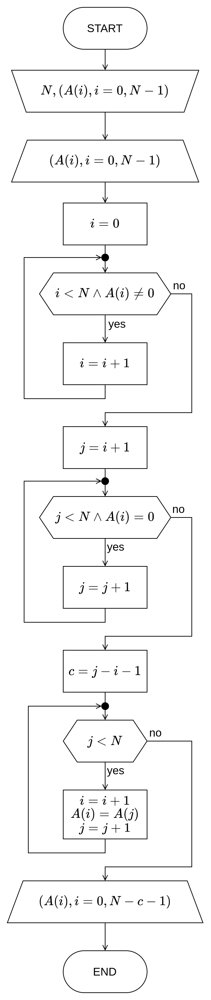
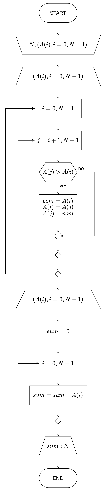
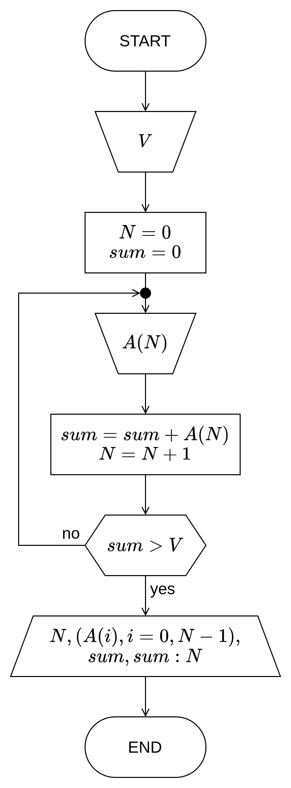
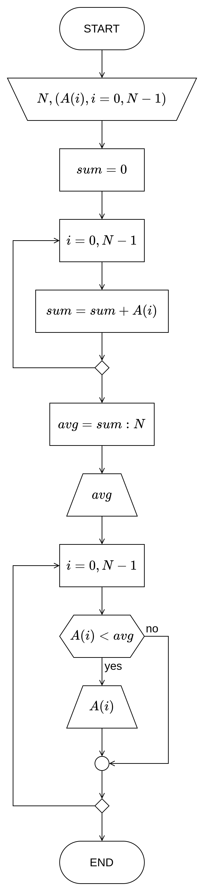
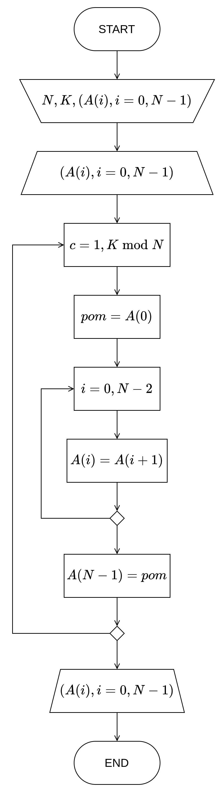
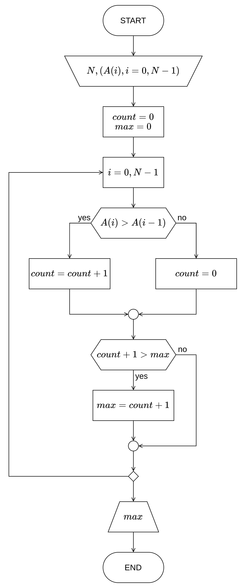
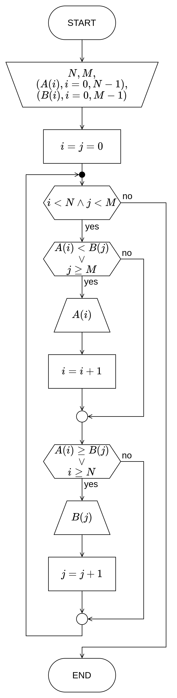
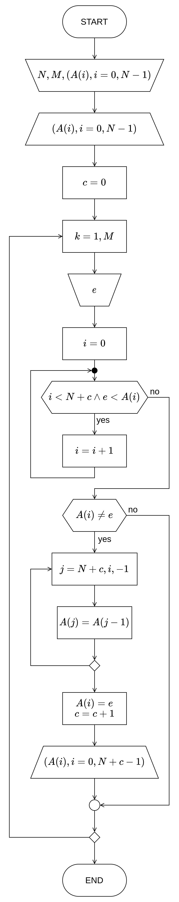
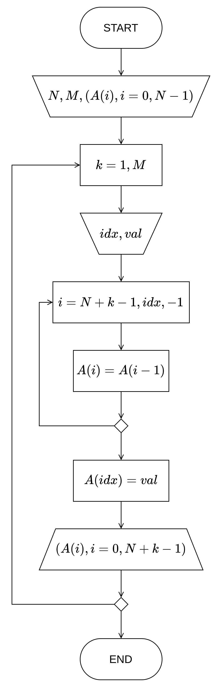
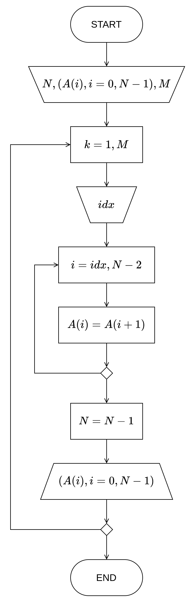

# Трећа вежба

**Низови**

[:fontawesome-regular-file-pdf: Нерешени задаци](../../assets/AIP_V3_zadaci_za_vezbu.pdf)

## Неке белешке...

**Низ** (једнодимензионо поље или вектор) је линеарна индексирана структура података сачињена од **хетерогених** (истог типа података) елемената који су складиштени у **сукцесивним** меморијским локацијама. Сви подаци, тј. елементи, једног низа деле **заједничко име**. У програмском језику _C_ то име **указује на** меморијску локацију у коју је уписан почетак низа, односно **први елемент**. Приступ елементима низа се врши заједничким именом и индексом који почиње од $0$, а завршава се до броја који је за један мањи од димензије (дужине) низа $N$, тј. завршава се до $N-1$.


{ .no-indent }

!!! warning "Разлика у нотацијама!"

    Немој Вас бунити ознаке које употребљавамо за означавање низова у програмирању и у математици! На пример, у математичкој нотацији велико слово, $A$, означава сам низ, док би се са $a_i$ означавао $i$-ти елемент низа $A$. У програмирању, како би избегли забуну око коришћења великих и малих слова како би их (обично) програмски језици третирали као различите индентификаторе (променљиве), и сам низ, као и заједничко име за приступ елементима су потпуно исти. Зато, пажљиво читајте задатке и у односу на контекст тумачите ознаке. $A_N$ може означавати низ дужине $N$, али и $N$-ти елемент низа! Како би било јасније, често ћемо користити $A(i)$ или $A[i]$ за означавање $i$-тог елемената, али нема стриктних правила.

Уколико није назначено да је потребно направити низ по неком правилу или да корисник уноси елементе низа, није неопходно претходно дефинисати низ у алгоритму, али га увек морамо декларисати у _C_-у и пожељно доделити елементима неку вредност како би имали да радимо са нечим и било могуће тестирати функционисање програма.

Декларација низа у _C_-у се врши на следећи начин: `<тип_податка> <идентификатор> '['<број_елемената>']'`.


{ .no-indent }

!!! example "Примери исправне декларације низа"

    ```c
    int a[100], b[100], A[10];
    double niz[250];
    char karakteri[300];
    ```

!!! danger "Димензија низа мора бити константа!"

    Иако се у задатку тражи да имамо низ од $N$ елемената, при декларацији низа у _C_ програмском коду на овом курсу, постављамо дужину низа на довољно велику константну вредност за коју сматрамо да корисник неће прекорачити. Обично $10$ или $100$, није ни битно. $N$ које би корисник нпр. унео би нам само служило као ограничење при обиласку низа у петљи! Само би се _правили_ да је низ дужине $N$, иако смо га декларисали на дужину од $100$ елемената.

    ***УПОЗОРЕЊЕ, СЛЕДЕЋИ КОД ^^НИЈЕ ВАЛИДАН^^, ПАЖЉИВО ЧИТАТИ!*** Наредни код декларише низ од `n` елемената, где је `n` вредност коју корисник уноси са стандардног улаза:

    ```c
    // ...
    int n;
    scanf("%d", &n);

    int a[n];
    // ...
    ```

    Али **неће увек** функционисати јер је ово **непортабилан** *C* код. Неки компајлери би ово прихватили (пример, *gcc/g++* који се користи у *Code::Blocks*-у), док други неће (*Microsoft Visual C/C++* у *Visual Studio*-у). Осим тога, не можемо овом „техником” да декларишемо све променљиве пре прве извршне наредбе, како `int n, a[n]` не би имало смисла, пре него да `n` добије неку вредност. Из ових разлога, никако не користити овакав код у програмима на овом курсу!!

    Исто тако, пак и да иницијализујемо променљиву `n` и одмах декларишемо низ, `int n = 10, a[n]`, то исто не би било валидно код неких компајлера. То је случај јер иако би променљива имала у том случају константну вредност, компајлер не жели руковати са таквим специјалним случајевима. Чак иако употребимо модификатор `const`, `const int n = 10`, при чему током извршавања програма загарантовано је да `n` не може променити вредност, опет неће бити дозвољено да потом декларишемо `int a[n]`.

    Уколико у програму имате више низова, па бисте желели да променом вредности променљиве мењате дужину свих тих низова, као замену за то може се употребити препроцесораска директива *`#define`* на следећи начин:

    ```c
    #define MAX_SIZE 100

    main() {
        int a[MAX_SIZE];

        // ...
    }
    ```

    С тим, први корак у процесу превођења ко̑да програма биће препроцесор, који ће у овом примеру заменити свако понављање `MAX_SIZE` у коду са `100`, што би била константна вредност и потом сваки компајлер би прихватио такав код као валидан.

Након што је низ декларисан, могуће је приступати елементима путем индекса на следећи начин `<заједнично_име>'['<индекс>']'` и користити као вредност у изразима или употребом релационих оператора додељивати вредност елементима на тај начин, као да је нека засебна променљива. Након декларације низа не знамо коју вредност елементи низа ће имати, тако да је увек потребно да им придодамо неку вредност – вредност елемената неће увек бити $0$ након декларације!

!!! example "Пример присупа елементима"

    ```c
    main() {
    	int a[3], sum;

        a[0] = 2;
        a[1] = 4;
        a[2] = a[0] - a[1];

        sum = a[0] + a[1] + a[2];
        printf("Suma elemenata niza iznosi %d.\n", sum);
    }
    ```

**_Обратити пажњу! Следећа напомена се често даје као питање на квизу!_**

!!! warning "Приступ путем меморијске локације"

    Као што је претходно речено, заједничко име, тј. променљива самог низа, указује на први елемент низа. То је заправо показивач, који показује на меморијску локацију првог елемента низа.

    Нека је `int a[100]` неки декларисан низ у програму. Првом елементу низа знамо да можемо приступити као `a[0]`, али можемо и са `*a`. Слично, другим елементом са `a[1]`, али и `*(а + 1)`, тј. било ком елементу `а[i]` можемо приступити и као `*(a + i)`. Пошто `а` показује на меморијску локацију, како би добили вредност са те меморијске локације употребљавамо унарни оператор `*`.

    Уколико нпр. желимо на меморијску локацију неког елемента да упишемо неку вредност употребом функције као што је `scanf()`, то можемо чинити као `&a[0]` или `a`, `&a[1]` или `a + 1`, тј. `&a[i]` или `a + i`. `&` није потребан уз `а` када се не користи индексирање са `a[<индекс>]` синтаксом, јер је само `a` већ меморијска локација.

За вршење операција над елементима низа често се употребљавају петље, како би одрадили неку операцију над произвољним бројем елемената. Три типа петљи постоји – _for_, _while_ и _repeat-until_ (имплементује се као _do-while_ у _C_-у са **негираним/обрнутим условом**).

**_for_** је бројачка петља. Ову петљу користити искључиво као такву на овом курсу без икаквих додатних услова петље! Бројачка петља садржи неки бројач, који се креће од задате почетне вредности до неке крајње вредности, при томе бројач се инкрементује или декрементује за задати корак (у алгоритму ако се не напише, подразумева се да је корак $1$).

!!! example "Пример 1: Чешће се користи у пракси."

    ```c
    for (i = 0; i < n; i++) {
        // Тело петље...
    }
    ```

!!! example "Пример 2: Може се користити и овако за обилазак целог низа. Исто ће радити као и пример 1."

    ```c
    for (i = 0; i <= n - 1; i++) {
        // Тело петље...
    }
    ```

!!! danger "НИКАКО НЕ КОРИСТИТИ _`for`_ ПЕТЉУ ОВАКО!"

    ```c
    for (i = 0; i < n && a[i] > v; i++) {
        // Тело петље...
    }
    ```

    Када је у петљи потребно уврстити још неки додатни услов, обавезно користити тада _`while`_! Видети дате примере испод.

**_while_** је петља општег типа. Уз адекватан услов и инкрементовање бројача на крају тела петље може се користити као замена за бројачку петљу. Када проласком кроз низ елементи редом треба да задовољавају неке додатне услове, погодно је користити _`while`_ петљу.

!!! example "Пример 1: Као замена за _`for`_ петљу."

    ```c
    i = 0;
    while (i < n) {
        // Тело петље...
        i++;
    }
    ```

!!! example "Пример 2: Често се користи када имамо придодат неки услов, као што је за трагање елементима одређених вредности."

    ```c
    i = 0;
    while (i < n && a[i] > v) {
        // Тело петље...
        i++;
    }
    ```

**_repeat-until (do-while)_** се користи слично као _`while`_ петља, самим тим да је увек загарантовано да ће се тело петље макар једном извршити како се услов проверава на крају итерације петље.

!!! danger "Постављање услова"

    Водити рачуна о постављању услова у _`repeat-until`_ петљи! Услов ће бити негиран/обрнут него ли у _`while`_ петљи, али у _C_ програмском коду ће бити исти као код _`while`_ петље!

    Код *`repeat-until`* петље, када услов није испуњен тело петље се поново извршава. У случају да је услов испуњен, следећи блок након петље се извршава.

    *`repeat-until`* алгоритамски се технички може користити са истим условом као и *`while`*, али само када се експлицитно гране обележе тако да `да` грана води назад у петљу, а `не` грана наставља са следећим блоком наредбе. ***АЛИ*** поједини асистенти **неће ово прихватити**, будите обазриви!!!

!!! example "Пример _`repeat-until`_ (_`do-while`_): Упис елемената низа са стандардног улаза све док је сума елемената ненегативан број."

    ```c
    i = 0;
    do {
        scanf("%d", &a[i]);
        sum += a[i];
        i++;
    } while (sum >= 0);
    ```

## Задатак 1.

Нацртати структурни дијаграм тока алгоритма и на програмском језику _C_ написати структурни програм који више узастопних појављања цифре $0$ у низу замењује једном цифром $0$. Све преостале елементе померити улево за потребан број места. Корисник уноси елементе низа. Приказати низ након уноса и након измена. Напомена: Сматрати да корисник задаје низ тако да низ садржи само један подниз са нулама.

### Териотисање

Први корак је налажење почетка и краја подниза нула. Једном петљом можемо тражити почетак, све док се не јави први елемент низа који је нула. Другом петљом можемо претрагу наставити докле је претходна петља дошла и да се крећемо низом док не дођемо до неког елемента који није нула. С тим, одређени су индекси првог ($i$) и последњег ($j$) елемента подниза нула.

На крају, за решавање задатка, трећом петљом померамо елементе улево тако да остане само једна нула из нађеног подниза.

### Дијаграм тока алгоритма


{ .no-indent .diag-40 }

### Изворни код програма

```c linenums="1"
#include <stdio.h>

main()
{
    int n, a[100], c, i, j;

    printf("Unesite broj elemenata niza A, N: ");
    scanf("%d", &n);

    printf("Unesite elemente niza A: ");
    for (i = 0; i < n; i++) {
        scanf("%d", &a[i]);
    }

    printf("Pre   -> A = { ");
    for (i = 0; i < n; i++) {
        printf("%d ", a[i]);
    }
    printf("}\n");

    // Трагање за првом нулом почињемо од почетка низа.
    i = 0;
    while (i < n && a[i] != 0) {
        i++;
    }

    // Наставак трагања до краја подниза, све док су елементи 0.
    j = i + 1;
    while (j < n && a[j] == 0) {
        j++;
    }

    // Чувамо број елемената које ћемо уклонити,
    // да знамо за колико елемента мањи ће бити низ при приказу.
    // Иако ће разлика између i и j остати иста након извршења
    // наредне петље, у петљи за приказ се вредност i-а мења
    // па је потребно њихову разлику сачувати пре.
    c = j - i - 1;

    // Померање елемента улево за c места.
    while (j < n) {
        a[++i] = a[j++];
    }

    printf("Posle -> A = { ");
    for (i = 0; i < n - c; i++) {
        printf("%d ", a[i]);
    }
    printf("}\n");
}
```

## Задатак 2.

Нацртати структурни дијаграм тока алгоритма и на програмском језику _C_ написати структурни програм којим се уређују елементи низа $A$ димензије $N$ у опадајућем редоследу. Приказати низ $A$ пре и после уређивања. Одредити и приказати и просечну вредност елементата у низу.

### Териотисање

Главна идеја овог задатка је примена неког од алгоритама за сортирање. Најједноставнији за применити јесте _selection sort_ (по мом мишљењу). Све што нам треба јесу две угњеждене петље. Спољашња петља ће се кретати од $i = 0$, док ће унутрашња кретати од броја за један већи од бројача спољашње петље, $j = i+1$, јер је сувишно посматрати претходне елементе како ће они бити већ на свом месту. Како се тражи да низ буде у неопадајућем поретку, први елемент мора бити већи од другог, други од трећег, итд. Значи, $A(i)$ мора бити већи од $A(j)$, тј. $A(j)$ мањи од $A(i)$. У супротном, потребно је заменити места елементима.

У новој петљи проћи кроз све елементе и сумирати их. Просечна вредност се потом може срачунати као сума елемената подељена бројем елементата низа.

### Дијаграм тока алгоритма


{ .no-indent .diag-40 }

### Изворни код програма

```c linenums="1"
#include <stdio.h>
#include <stdlib.h>
#include <time.h>

main()
{
    int n, a[100], sum = 0, i, j, pom;

    printf("Unesite broj elemenata niza A, N: ");
    scanf("%d", &n);

    // Попуњавање низа псеудо-насумичним вредностима.
    // Може се заменити са уносом елемената по жељи.
    srand(time(NULL));
    for (i = 0; i < n; i++) {
        a[i] = rand() % 100;
    }

    printf("Pre   -> A = { ");
    for (i = 0; i < n; i++) {
        printf("%d ", a[i]);
    }
    printf("}\n");

    // Сортирање низа применом selection sort-а.
    for (i = 0; i < n; i++) {
        for (j = i + 1; j < n; j++) {
            if (a[j] > a[i]) {
                pom = a[i];
                a[i] = a[j];
                a[j] = pom;
            }
        }
    }

    // Када већ пролазимо кроз све елементе за приказ,
    // што их не и сумирати у истој петљи?
    printf("Posle -> A = { ");
    for (i = 0; i < n; i++) {
        printf("%d ", a[i]);
        sum += a[i];
    }
    printf("}\n");

    printf("Prosecna vrednost elemenata niza iznosi %g.\n", (double)sum / n);
}
```

## Задатак 3.

Нацртати структурни дијаграм тока алгоритма и на програмском језику _C_ написати структурни програм којим се елемени низа $A$ уносе један по један све док збир унетих елемената низа $A$ не буде већи од задате вредности $V$. Приказати број унетих елемената $N$, као и елементе унетог низа. Након тога одредити и приказати збир вредности елемента низа, као и просечну вредност елемената низа $A$.

### Териотисање

Пошто се тражи унос елемената све док њихова сума не постане већа од неке вредности, потребно је макар једном извршити унос и сумирање елемента низа. Због тога, потребно је употребити _repeat-until_ (тј. _do-while_ у коду) петљу за решавање овог задатка. Сваким проласком кроз петљу ћемо затражити унос од корисника, додати нови елемент суми и продужити дужину низа за један. Напослетку, приказати број унетих елемената, што је дужина низа, приказати елементе, као и њихову суму и просечну вредност која је количник суме и броја елемента.

### Дијаграм тока алгоритма


{ .no-indent .diag-40 }

### Изворни код програма

```c linenums="1"
#include <stdio.h>

main()
{
    int a[100], v, sum = 0, n = 0, i;

    printf("Unesite vrednost V: ");
    scanf("%d", &v);

    do {
        printf("Unesite %d. element niza: ", n + 1);
        scanf("%d", &a[n]);
        sum += a[n];
        n++;
    } while (sum <= v);

    printf("Broj unetih elemenata: %d\n", n);

    printf("A = { ");
    for (i = 0; i < n; i++) {
        printf("%d ", a[i]);
    }
    printf("}\n");

    printf("Suma elemenata niza iznosi %d. Prosecna vrednost elemenata iznosi %g.\n", sum, (double)sum / n);
}
```

## Задатак 4.

Нацртати структурни дијаграм тока алгоритма и на програмком језику _C_ написати структурни програм који у низу $A$ дужине $N$ одређује број елемената чија је вредност мања од просечне вредности елемената низа. Корисник уноси број елемената $N$ и елементе низа. Приказати просечну вредност елемената низа и елементе који испуњавају услов. Сматрати да просечна вредност не мора да буде цео број.

### Териотисање

Једном петљом пролазимо кроз елементе низа да одредимо њихову суму, потом можемо срачунати просечну вредност као количник суме и броја елемената и приказати је. Потом другом петљом пролазимо поново кроз елементе низа, и уколико је тренутни елемент мањи од просечне вредности, штампати га.

### Дијаграм тока алгоритма


{ .no-indent .diag-40 }

### Изворни код програма

```c linenums="1"
#include <stdio.h>

main()
{
    int n, a[100], sum = 0, i;
    double avg;

    printf("Unesite broj elemenata niza: ");
    scanf("%d", &n);

    printf("Unesite elemente niza: ");
    for (i = 0; i < n; i++) {
        scanf("%d", &a[i]);
        sum += a[i];
    }

    avg = (double)sum / n;
    printf("Prosecna vrednost elemenata iznosi %g.\n", avg);

    printf("Elementi koji ispunjavaju uslov su { ");
    for (i = 0; i < n; i++) {
        if (a[i] < avg) {
            printf("%d ", a[i]);
        }
    }
    printf("}.\n");
}
```

## Задатак 5.

Нацртати структурни дијаграм тока алгоритма и на програмком језику _C_ написати структурни програм којим се врши циклично померање низа $A$ димензије $N$ за $K$ места улево. Приказати низ $A$ пре и после уређивања.

### Териотисање

Како би циклично померили елементе низа за $K$ места улево, први елемент је потребно сачувати у некој помоћној променљивој, затим улево померити елементе низа, $A(i) = A(i+1)$, за $i=0,N-2$, потом задњи елемент добија вредност помоћне променљиве у којој је претходно био сачуван први елемент. Тиме су циклично померени елементи за једно место улево.

Поступак је потребно поновити петљом $K$ пута, за померање $K$ места улево, али када је $K \geq N$, сувишно је то радити нужно $K$ пута. Укокико је низ дужине $N = 5$, нека је нпр. $K = 5$, циклично би кружили елементи и поново дошли на своје почетно место ($K \bmod N = 0$). За $K = 6$, резултат је исти као када би их померили за једно место ($K \bmod N = 1$), итд. С тим на уму, уместо да се увек циклично померају елементи за $K$ места, програм се може оптимизовати тако да се циклично померају елементи за $K \bmod N$ места.

### Дијаграм тока алгоритма


{ .no-indent .diag-40 }

### Изворни код програма

```c linenums="1"
#include <stdio.h>
#include <stdlib.h>
#include <time.h>

main()
{
    int n, k, a[100], i, c, pom;

    printf("Unesite broj N: ");
    scanf("%d", &n);

    printf("Unesite broj K: ");
    scanf("%d", &k);

    printf("Pre   -> A = { ");

    // Попуњавање низа псеудо-насумичним вредностима.
    // Може се заменити са уносом елемената по жељи.
    // Истовремено приказује елементе низа.
    srand(time(NULL));
    for (i = 0; i < n; i++) {
        a[i] = rand() % 100;
        printf("%d ", a[i]);
    }
    printf("}\n");

    // Спољашња за понављање померања K mod N пута.
    for (c = 1; c <= k % n; c++) {
        // Померање елемената за по једно место улево.
        pom = a[0];
        for (i = 0; i < n - 1; i++) {
            a[i] = a[i + 1];
        }
        a[n - 1] = pom;
    }

    printf("Posle -> A = { ");
    for (i = 0; i < n; i++) {
        printf("%d ", a[i]);
    }
    printf("}\n");
}
```

## Задатак 6.

Нацртати структурни дијаграм тока алгоритма и на програмском језику _C_ написати структурни програм који одређује дужину најдуже сортиране секвенце елемената у низу $A_N$ у растућем редоследу. Корисник уноси димензију низа, а затим и елементе низа $A$.

### Териотисање

Како би нека секвенца била у растућем поретку, други елемент мора бити већи од првог, трећи већи од другог, итд. Односно да је $A(i) > A(i - 1)$, за $i=1,N-1$. Проласком кроз низ бројачком петљом, све док је тај услов задовољен инкрементовати неки бројач и на тај начин бројити дужину соритране секвенце. Уколико услов није задовољен, бројач се ресетује. Пошто се тражи дужина најдужа соритана секвенце, сваки пут потребно је проверити да ли је тренутна дужина већа од неке максималне, ако јесте тренутна дужина постаје максимална. Напослетку, штампати тај податак.

### Дијаграм тока алгоритма


{ .no-indent .diag-60 }

### Изворни код програма

```c linenums="1"
#include <stdio.h>

main()
{
    int n, a[100], max = 0, count = 0, i;

    printf("Unesite broj elemenata niza: ");
    scanf("%d", &n);

    printf("Unesite elemente niza: ");
    for (i = 0; i < n; i++) {
        scanf("%d", &a[i]);
    }

    for (i = 1; i < n; i++) {
        if (a[i] > a[i - 1]) {
            count++;
        } else {
            count = 0;
        }

        if (count + 1 > max) {
            max = count + 1;
        }
    }

    printf("Duzina najduze rastuce sortirane sekvence niza iznosi %d.\n", max);
}
```

## Задатак 7.

Нацртати структурни дијаграм тока алгоритма и на програмском језику _C_ написати структурни програм који приказује све елементе низова $A_N$ и $B_M$, чије елементе корисник уноси у неопадајућем редоследу. Приказ треба да изгледа као један обједињени, уређени низ.  
Пример: $A_N = \{ 3, 6, 8, 9, 9, 15 \}$, $B_M = \{ 8, 9, 10 \}$, приказ: $\{ 3, 6, 8, 8, 9, 9, 9, 10, 15 \}$.

### Териотисање

С обзиром на то да су низови већ уређени, решавање задатка није тако тешко. Класично као и увек, затражити унос димензије низа и елементе низа, за два низа $A_N$ и $B_M$.

Пошто се тражи обједињен приказ ова два низа као уређени низ, можемо путем _`while`_ петље истовремено да пролазимо кроз ова два низа и зависно од задовољених услова инкременовати њихове бројаче. Нека је $i = 0$ индекс за низ $A_N$, а $j = 0$ бројач за низ $B_M$. Уколико је $A(i) < B(ј)$ или уколико се дошло до краја низа $B_M$ ($j \geq M$), штампати $A(i)$ и инкрементовати $i$ за један. Ако је $A(i) \geq B(j)$ или се дошло до краја низа $A_N$ ($i \geq N$), штампати $B(j)$ и инкрементовати $j$ за један.

### Дијаграм тока алгоритма


{ .no-indent .diag-40 }

### Изворни код програма

```c linenums="1"
#include <stdio.h>

main()
{
    int n, m, a[100], b[100], i, j, k;

    printf("Unesite N: ");
    scanf("%d", &n);

    printf("Unesite M: ");
    scanf("%d", &m);

    printf("Unesite elemente niza A: ");
    for (i = 0; i < n; i++) {
        scanf("%d", &a[i]);
    }

    printf("Unesite elemente niza B: ");
    for (i = 0; i < m; i++) {
        scanf("%d", &b[i]);
    }

    printf("Objedinjen i ureden niz je { ");
    i = j = 0;
    while (i < n && j < m) {
        if (a[i] < b[j] || j >= m) {
            printf("%d ", a[i]);
            i++;
        }

        if (a[i] >= b[j] || i >= n) {
            printf("%d ", b[j]);
            j++;
        }
    }
    printf("}.\n");
}
```

## Задатак 8.

Нацртати структурни дијаграм тока алгоритма и на програмском језику _C_ написати структурни програм који у низ $A_N$ умеће $M$ нових елемената, тако да низ при уметању новог елемента увек остане сортиран у опадајућем редоследу. Уколико елемент који треба уметнути већ постоји у низу не вршити уметање. Приказати елементе низа након уноса и након уметања сваког новог елемента. Напомена: сматрати да корисник задаје низ чији су елементи већ сортирани у опадајућем редоследу.

### Териотисање

### Дијаграм тока алгоритма


{ .no-indent .diag-40 }

### Изворни код програма

```c linenums="1"
#include <stdio.h>

main()
{
    int n, m, a[100], i, j, k, c = 0, e;

    printf("Unesite broj elemenata niza, N: ");
    scanf("%d", &n);

    printf("Unesite broj elemenata za umetanje, M: ");
    scanf("%d", &m);

    printf("Unesite elemente niza A: ");
    for (i = 0; i < n; i++) {
        scanf("%d", &a[i]);
    }

    printf("A = { ");
    for (i = 0; i < n; i++) {
        printf("%d ", a[i]);
    }
    printf("}\n");


    for (k = 1; k <= m; k++) {
        printf("Unesite %d. element za umetanje: ", k);
        scanf("%d", &e);

        i = 0;
        while (i < n + c && e < a[i]) {
            i++;
        }

        if (a[i] != e) {
            for (j = n + c; j >= i; j--) {
                a[j] = a[j - 1];
            }

            a[i] = e;
            c++;

            printf("A = { ");
            for (i = 0; i < n + c; i++) {
                printf("%d ", a[i]);
            }
            printf("}\n");
        }
    }
}
```

## Задатак 9.

Нацртати структурни дијаграм тока алгоритма и на програмском језику _C_ написати структурни програм којим се умеће $M$ нових елемената на задате позиције низа $A_N$. Корисник, након уноса броја елемената $N$, елемената низа $A$ и броја нових елемената $M$, задаје редом индексе и вредности елемената које треба уметнути. Приказивати низ $A$ након сваког уметнутог елемента.

### Териотисање

### Дијаграм тока алгоритма


{ .no-indent .diag-40 }

### Изворни код програма

```c linenums="1"
#include <stdio.h>

main()
{
    int n, m, a[100], i, k, idx, val;

    printf("Unesite broj elemenata niza, N: ");
    scanf("%d", &n);

    printf("Unesite broj elemenata za umetanje, M: ");
    scanf("%d", &m);

    printf("Unesite elemente niza A: ");
    for (i = 0; i < n; i++) {
        scanf("%d", &a[i]);
    }

    for (k = 1; k <= m; k++) {
        printf("Unesite indeks %d. elementa za umetanje: ", k);
        scanf("%d", &idx);

        printf("Unesite vrednost %d. elementa za umetanje: ", k);
        scanf("%d", &val);

        for (i = n + k - 1; i >= idx; i--) {
            a[i] = a[i - 1];
        }

        a[idx] = val;

        printf("A = { ");
        for (i = 0; i < n + k; i++) {
            printf("%d ", a[i]);
        }
        printf("}\n");
    }
}
```

## Задатак 10.

Нацртати структурни дијаграм тока алгоритма и на програмском језику _C_ написати структурни програм којим се брише $M$ елемената са задатих позиција из низа $A_N$. Корисник, након уноса броја елемената $N$, елемената низа $A$ и броја елемената које треба обрисати $M$, задаје редом индексе елемената. Приказивати низ $A$ након сваког брисања.

### Териотисање

### Дијаграм тока алгоритма


{ .no-indent .diag-40 }

### Изворни код програма

```c linenums="1"
#include <stdio.h>

main()
{
    int n, m, i, k, idx, a[100];

    printf("Unesite broj elemenata niza, N: ");
    scanf("%d", &n);

    printf("Unesite elemente niza A: ");
    for (i = 0; i < n; i++) {
        scanf("%d", &a[i]);
    }

    printf("Unesite broj elementata za brisanje, M: ");
    scanf("%d", &m);

    for (k = 1; k <= m; k++) {
        printf("Unesite indeks %d. elementa za brisanje: ", k);
        scanf("%d", &idx);

        for (i = idx; i < n - 1; i++) {
            a[i] = a[i + 1];
        }

        n--;

        printf("A = { ");
        for (i = 0; i < n; i++) {
            printf("%d ", a[i]);
        }
        printf("}\n");
    }
}
```
