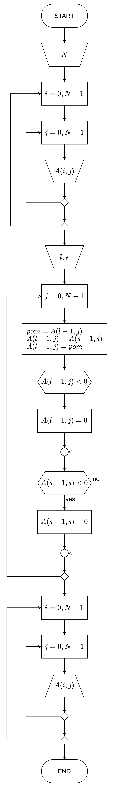

# Четврта вежба

**Матрице**

[:fontawesome-regular-file-pdf: Нерешени задаци](../../assets/AIP_V4_zadaci_za_vezbu.pdf)

## Неке белешке...

**Матрица** (дводимензионо поље) је линеарна индексирана структура података сачињена од **хетерогених** (истог типа података) елемената који су складиштени у **сукцесивним** меморијским локацијама. Елементи матрице су уређени по редовима (врстама) и колонама. Приступ неком елементу матрице се врши преко два индекса, један који означава ред, други колону у којој се елемент налази. Индекси редова и колона почињу од $0$, а завршавају се до броја који је за један мањи од димензија матрице, тј. $N - 1$ и $M - 1$. **Заједничко име** (променљива) за матрицу уједно указује и на меморијску локацију на којој је складиштен први ред матрице.

Уколико је нпр. `a` заједничко име (променљива) матрице, онда `a[0]` указује на прву, `a[1]` другу, односно `a[i]` указује на меморијску локацију $(i+1)$-тог реда.

Матрица се обично обилази путем две угњеждене петље чији бројачи су често названи `i` и `j`. Један бројач пролази редом кроз врсте, а други кроз колоне матрице. Није битно која је петља спољашња или унутрашња, осим наравно када почетна или крајња вредност једног бројача зависи од другог.

```c
int n = 4, m = 5;
int a[4][5] = {
	{1, 2, 3, 4, 5},
	{6, 7, 8, 9, 0},
	{4, 6, 8, 0, 2},
	{3, 3, 5, 6, 6},
};
int i, j;

for (i = 0; i < n; i++) {
	for (j = 0; j < m; j++) {
		print("%d ", a[i][j]);
	}
	print("\n");
}
```

Иницијалирација елемената матрице при декларацији се врши готово исто као и код низова (матрице јесу низови, само са две уместо једну димензију).

```c
int a[][5] = {
    /* 1. врста */ {1, 2, 3, 4, 5},
    /* 2. врста */ {9, 4, 2, 0, 1},
    /* 3. врста */ {5, 8, 2, 1, 1},
    /* ... још врста ... */
};

int b[3][5] = {
    {1, 2, 3, 4, 5},
    {9, 4, 2, 0, 1},
    {5, 8, 2, 1, 1},
};

int c[3][5] = {
    1, 2, 3, 4, 5,
    9, 4, 2, 0, 1,
    5, 8, 2, 1, 1,
};

int d[3][5] = { 1, 2, 3, 4, 5, 9, 4, 2, 0, 1, 5, 8, 2, 1, 1 }

/* Горе декларисане и иницијализоване матрице су све еквивалентне:
 *    1 2 3 4 5
 *    9 4 2 0 1
 *    5 8 2 1 1
 */

int e[3][5] = { {1, 2, 3, 4, 5}, {9, 4}, 2, 0, 1, 5, 8 }

/* Матрица e биће:
 *    1 2 3 4 5
 *    9 4 0 0 0
 *    2 0 1 5 8
 *
 * Због {9, 4} иницијализације друге врсте матрице,
 * компајлер ће ту врсту допунити нулама до краја.
 */

```

Уколико декларишемо и иницијализујемо елементе матрице, за прву димензију није неопдно спецификовати број елемената (број врста), али за другу (број колона) јесте (како би компајлер срачунао потребан број врста). Унутрашње велике заграде (`{ }`) и нови редови приликом навођења елемената за сваку од врста су такође опционални (олакшица програмеру, не ослањајте се на њих у теоријским питањима!), на основу димензија матрица _C_ ће препознати у којој врсти и колони треба сместити елементе редом.

Квадратне матрице имају по нека интересантна својства. Поседују **главну** и **споредну** дијагоналу. Нека је нпр. $i$ индекс врсте, а $j$ индекс колоне. **Индекси** елемената на **главној** дијагонали су **једнаки** ($j = i$). **Збир индекса** на **споредној** дијагонали су **једнаки димензији матрице умањену за један** ($j = N - 1 - i$).

Ове једнакости можемо применити као неједнакости ($<$, $\leq$, $>$, $\geq$). Функционише потпуно исто као кад би дијагонале посматрали као праве и осматрали у ком случају би се елементи налазили изнад/испод (лево/десно од) дијагонала, зависно од тога у ком смеру знак неједнакости показује.


{ .no-indent }

## Задатак 1.

Нацртати структурни дијаграм тока и написати структурни програм на _C_-у којим се израчунава сума елемената матрице $A_{N \times N}$ испод главне дијагонале и производ елемената матрице $A_{N \times N}$ испод споредне дијагонале. Елементе матрице $A$ иницијализовати приликом декларације матрице.

### Теориотисање

Променљиву у којој чувамо производ иницијализујемо на вредност $1$, што је неутрални елемент у односу на множење, јер је $a \cdot 1 = a, \forall a \in \mathbb{R}$.

Променљиву у којој чувамо суму иницијализујемо на вредност $0$, што је неутрални елемент у односну на сабирање (и одузимање), јер је $a + 0 = a, \forall a \in \mathbb{R}$.

За само решавање задатка, употребом две угњеждене петље, редом пролазимо кроз све елементе матрице. У случају када је $j < i$, елемент се налази испод главне дијагонале и у том случају је потребно елемент додати производу. У случају када је $j > N - 1 - i$, елемент се налази испод споредне дијагонале и у том случају је потребно елемeнт придодати суми. На крају приказати срачунату суму и производ.

### Дијаграм тока алгоритма


{ .no-indent .diag-40 }

### Изворни код програма

```c linenums="1"
#include <stdio.h>

main()
{
    int a[5][5] = {
            {1, 2, 3, 4, 5},
            {8, 7, 6, 5, 4},
            {0, 0, 3, 0, 7},
            {9, 9, 5, 5, 2},
            {1, 1, 1, 1, 1}
    };
    int n = 5, sum = 0, prod = 1, i, j;

    for (i = 0; i < n; i++) {
        for (j = 0; j < n; j++) {
            if (j < i) {
                sum += a[i][j];
            }

            if (j > n - i - 1) {
                prod *= a[i][j];
            }
        }
    }

    printf("Suma: %d, proizvod: %d.\n", sum, prod);
}

```

## Задатак 2.

Нацртати структурни дијаграм тока и написати структурни програм на _C_-у који замњеује места $l$-тој и $s$-тој врсти матрице $A_{N \times M}$. Приликом замене места врстама све негативне елементе $l$-те и $s$-те врсте матрице заменити са $0$.

### Териотисање

Како би извршили замену места врста, потребно је да обилазимо матрицу по колонама и замењујемо елементе који се налазе у $l$-тој и $s$-тој врсти. То чинимо једном петљом, која ће се кретати од $0$ до $М - 1$ (јелте, како би кретали по колонама). Како често користимо $j$ као општу ознаку индекса колона, нека нам је то бројач петље. Затим уз помоћ помоћне променљиве, готово је тривијално разменити вредности елементима $A(s - 1, j)$ и $A(l - 1, j)$.

Још увек у петљи, након (или пре, крајњи резултат биће исти) уколико је вредност елемената у $s$-тој или $l$-тој колони негативна (мања од $0$), поставити је на $0$. На крају, после извршења петље, штампати крајњу матрицу.

За приступ елементима $l$-те и $s$-те врсту матрице коришћени су индекси врста $l-1$ и $s-1$, како је реч о редним бројевима по тексу задатка, а у програмском коду индекси елемената не почињу од 1 већ од 0. Можете ставити и управо само $l$ и $s$ уместо $l-1$ и $s-1$ ако тумачите текст задатака другачије, не би требало да је грешка.

### Дијаграм тока алгоритма


{ .no-indent .diag-40 }

### Изворни код програма

```c linenums="1"
#include <stdio.h>

main() {
    int n, a[100][100], l, s, i, j, pom;

    printf("Unesite N: ");
    scanf("%d", &n);

    printf("Unesite matricu:\n");
    for (i = 0; i < n; i++) {
        for (j = 0; j < n; j++) {
            scanf("%d", &a[i][j]);
        }
    }

    printf("Unesite l: ");
    scanf("%d", &l);

    printf("Unesite s: ");
    scanf("%d", &s);


    for (j = 0; j < n; j++) {
        pom = a[l - 1][j];
        a[l - 1][j] = a[s - 1][j];
        a[s - 1][j] = pom;

        if (a[l - 1][j] < 0) {
            a[l - 1][j] = 0;
        }

        if (a[s - 1][j] < 0) {
            a[s - 1][j] = 0;
        }
    }

    for (i = 0; i < n; i++) {
        for (j = 0; j < n; j++) {
            printf("%d ", a[i][j]);
        }
        printf("\n");
    }
}
```

## Задатак 3.

Нацртати стукрутни дијаграм тока и написати структурни програм на _C_-у који врши ротирање елемената матрице $A_{N \times N}$ по врстама за једно место удесно. Поред ротације елемената матрице потребно је извршити трансформацију матрице тако да прва врста матрице прелази на место друге, друга на место треће, итд. Последња врста матрице, након трансформације, се налази на месту прве.

### Териотисање

За решавање овог задатка на памет падају два начина. Један који се види директно из задатка и други оптимизован који се види из посматрања промене позиције елемената почетне и крајње матрице, када се поиграмо мало са вредностима индекса елемената.

#### I начин

Као што задатак налаже, ротирати циклично елементе матрице по врстама за једно место удесно и потом ротирати циклично врсте матрице за једно место на доле (тј. циклично ротирати елементе колона). Управо тако, задатак се решава помоћу два пара угњеждених петљи и применом знања из претходне области о цикличној ротацији елемената низа.

Како би циклично ротирали елементе по врстама, прва (спољашња) петља ће редом пролазити кроз све колоне. Како је у питању циклично померање, вредност задњег елемента врсте чувамо у помоћној променљивој. Друга (угњеждена, тј. унутрашња) петља потом иде од задњег до другог елемента врсте. Након извршњења угњеждене петље, први елемент добија вредност последњег елемента сачуваног у помоћној променљивој.

Овај поступак се понавља са још једним паром петљи, само што су петље (унитрашња и спољашња), као и индекси ($i$ и $j$) окренути, како би циклично ротирали елементе по колонама.

#### II начин

Матрицу је могуће трансформисати на тражени начин и само једним проласком кроз матрицу. Посматрањем крајних и почетних позиција елемената, можемо приметити да су се елементи померили по дијагонали доле-удесно.

На пример хајде да матрицу запишемо у општем облику (уместо вредности елемената да напишемо њихове индексе). Затим хајде и да проширимо матрицу са $N - 1$ колона (или врста), потом посматрамо све дијагонале у смеру доле-удесно. Посматрањем сваке дијагонале као да су засебни низови и проналажењем законитости промене индекса елемената долази се и до другог оптимизованог решења. Фора је употреба оператора остатка при дељењу, како би кореговали индексе на потребне како не би прекорачили матрицу.


{ .no-indent }

Посматрајмо главну дијагоналу проширене матрице: Јасно је да елемент на позицији $(5,5)$ добија вредност елемента са позиције $(4,4)$, елемент $(4,4)$ добија вредност елемента $(3,3)$, $(3,3) \larr (2,2)$, $(2,2) \larr (1,1)$, $(1,1) \larr (0,0)$. $A(i, i) = A(i - 1, i - 1)$.

Посматрајмо дијагонале паралелне са главном дијагоналом, нпр. паралелна дијагонала десно од главне: $(5,6) \larr (4,5)$, $(4, 5) \larr (3, 4)$, $(3,4) \larr (2,3)$, $(2, 3) \larr (1,2)$, $(1,2) \larr (0,1)$. $A(i, i + 1) = A(i - 1, i - 1 + 1)$.

Наредна паралелна дијагонала десно: $(5,7) \larr (4,6)$, $(4,6) \larr (3,5)$, $(3,5) \larr (2,4)$, $(2,4) \larr (1,3)$, $(1,3) \larr (0,2)$. $A(i, i + 2) = A(i - 1, i - 1 + 2)$.

За остале дијагонале, слично, можемо закључити онда да ће за сваку дијагоналу померање елемената функционисати по формули $A(i, i + j) = A(i - 1, i - 1 + j)$ где је $j$ померај паралелних дијагонала од главне дијагонале, а $i$ је индекс врсте који се креће од задње до прве врсте како би редом елементи могли бити померени доле-удесно.

Пошто је потребно да решење функционише за матрицу величине $N \times N$, а $i + j$ за одређене вредности бројача прекорачује оквире матрице, како немамо фиктивне елементе $N + 1$, $N + 2$, ..., $N + k$-те врсте (колоне), потребно је индексе кореговати. За то можемо употребити модуло оператор (остатка при дељењу) као $(i + j) \bmod N$ и све наше муке су разрешене!

Не знам како другачије да ово објасним, самим тим није било ни мени лако доћи до овог решења и потребно је било макар сат времена лупање главе о астал и пуно погрешних решења који нису имали везу с везом.

### Дијаграм тока алгоритма


{ .no-indent }

### Изворни код програма

=== "I начин"

    ```c linenums="1"
    #include <stdio.h>

    main()
    {
        int a[100][100], n, i, j, pom;

        scanf("%d", &n);

        for (i = 0; i < n; i++) {
            for (j = 0; j < n; j++) {
                scanf("%d", &a[i][j]);
            }
        }

        // Циклична ротација елемената врста за једно место удесно.
        for (i = 0; i < n; i++) {
            pom = a[i][n - 1];
            for (j = n - 1; j > 0; j--) {
                a[i][j] = a[i][j - 1];
            }
            a[i][0] = pom;
        }

        // Циклична ротација врста за једно место на доле,
        // тј. циклична ротација елемената колона за једно место на доле.
        for (j = 0; j < n; j++) {
            pom = a[n - 1][j];
            for (i = n - 1; i > 0; i--) {
                a[i][j] = a[i - 1][j];
            }
            a[0][j] = pom;
        }

        printf("\n");
        for (i = 0; i < n; i++) {
            for (j = 0; j < n; j++) {
                printf("%d ", a[i][j]);
            }
            printf("\n");
        }
    }
    ```

=== "II начин"

    ```c linenums="1"
    #include <stdio.h>

    main()
    {
        int a[100][100], n, i, j, pom;

        scanf("%d", &n);

        for (i = 0; i < n; i++) {
            for (j = 0; j < n; j++) {
                scanf("%d", &a[i][j]);
            }
        }

        for (j = 0; j < n; j++) {
            pom = a[n - 1][(n - 1 + j) % n];
            for (i = n - 1; i > 0; i--) {
                a[i][(i + j) % n] = a[i - 1][(i - 1 + j) % n];
            }
            a[0][j] = pom;
        }

        printf("\n");
        for (i = 0; i < n; i++) {
            for (j = 0; j < n; j++) {
                printf("%d ", a[i][j]);
            }
            printf("\n");
        }
    }
    ```

## Задатак 4.

Нацртати стукрурни дијаграм тока и написати структурни програм на _C_-у који врши сортирање елемената матрице $A_{N \times M}$ у оквиру врста у растући редослед. Матрицу $A$ унети са тастатуре.

### Териотисање

Сортирање елемената матрице у оквиру врста слично функционише као што је то случај и код низова. Једина промена јесте да две угњеждене петље путем којих реализујемо _selection sort_ алгоритам су угњеждене унутар петље која ће редом пролазити кроз све врсте матрице, како би се сортирали елементи свих врста.

Угњеждена петља би се кретала од првог елемента у врсти до предпоследњег. Потом петља угњеждена у тој петљи би се кретала од наредног елемента до крајњег. Поређењем, да ли је наредни већи од претходног, и ако јесте вршењем замене вредности ових елемената, врсте се уређују у растући редослед.

### Дијаграм тока алгоритма


{ .no-indent .diag-40 }

### Изворни код програма

```c linenums="1"
#include <stdio.h>

main()
{
    int a[100][100], n, m, i, j, k, pom;

    scanf("%d %d", &n, &m);

    for (i = 0; i < n; i++) {
        for (j = 0; j < n; j++) {
            scanf("%d", &a[i][j]);
        }
    }

    for (i = 0; i < n; i++) {
        for (j = 0; j < m - 1; j++) {
            for (k = j + 1; k < m; k++) {
                if (a[i][k] < a[i][j]) {
                    pom = a[i][k];
                    a[i][k] = a[i][j];
                    a[i][j] = pom;
                }
            }
        }
    }

    printf("\n");
    for (i = 0; i < n; i++) {
        for (j = 0; j < m; j++) {
            printf("%d ", a[i][j]);
        }
        printf("\n");
    }
}
```

## Задатак 5.

Нацртати структурни дијаграм тока и написати структурни програм на _C_-у који врши сортирање елемената матрице $A_{N \times M}$ у оквиру колона у опадајући редослед. Матрицу $A$ иницијализовати приликом декларације.

### Териотисање

Слично као [4. Задатак](#4), само што су индекси обрнути како би се сортирали елементи у оквиру колона и услов поређења елемената такође окренут за уређивање у опадајући редослед. Додатно, тражи се да се елементи матрице иницијализују при декларацији уместо уноса са тастатуре.

### Дијаграм тока алгоритма


{ .no-indent .diag-40 }

### Изворни код програма

```c linenums="1"
#include <stdio.h>

main()
{
    int a[4][5] = {
            {1, 2, 3, 4, 5},
            {8, 7, 6, 5, 4},
            {0, 0, 3, 0, 7},
            {9, 9, 5, 5, 2}
    };
    int n = 4, m = 5, i, j, k, pom;

    for (i = 0; i < m; i++) {
        for (j = 0; j < n - 1; j++) {
            for (k = j + 1; k < n; k++) {
                if (a[k][i] > a[j][i]) {
                    pom = a[k][i];
                    a[k][i] = a[j][i];
                    a[j][i] = pom;
                }
            }
        }
    }

    for (i = 0; i < n; i++) {
        for (j = 0; j < m; j++) {
            printf("%d ", a[i][j]);
        }
        printf("\n");
    }
}
```

## Задатак 6.

Нацртати структурни дијаграм тока и написати структурни програм на _C_-у који рачуна и приказује производ матрице $A_{N \times N}$ и њене транспоновање матрице ($A^Т$). Матрицу $A$ иницијализовати приликом декларације.

### Териотисање

Потребно је наћи производ матрица, нпр. $C_{N \times М} = A_{N \times K}$ и $B_{K \times М}$. Рачунање производа две матрице је могуће реализовати на следећи начин са три угњеждене петље:

1. Спољашња бројачка петља ће се кретати редом по врстама матрице $A_{N \times K}$ - $i = 0, N - 1$;
1. У њој је угеждена петља која ће се кретати редом по колонама матрице $B_{K \times М}$ - $j = 0, М - 1$. На тај начин се праве све комбинације врста прве и колона друге матрице, што нам је и потребно како би помножили ове матрице. Унутар петље поставити вредност одговарајућег елемента резултујуће матрице на $0$ (неутрални елемент за сабирање) - $C(i, j) = 0$;
1. У тој пељи је потом угњеждена петља која ће се кретати по димензији $K$ обе матрице - $k = 0, K - 1$ и редом множити њихове елементе, сумирати их и придодати одговарајућем елементу резултујуће матрице - $C(i, j) = C(i, j) + A(i, k) \cdot B(k, j)$.

У случају овог задатка тражи се производ матрице $A_{N \times N}$ и њене транспоноване матрице $A^T_{N \times N}$. Принцип проналажење њиховог производа је наравно исти као што је горе претходно наведено, али поједине кораке можемо скратити. Сасвим је сувишно транспоновати матрицу $A$ и потом множити је са њеном транспонованом матрицом. Знамо да су колоне и врсте код транспоноване матрице у односу на оригиналну замењени, па тако можемо матрицу $А$ „суштински” помножити саму са собом, али тако да уместо множења елемената $A(i, k)$ и $A(k, j)$, множимо $A(i, k)$ и $A(j, k)$.

Како се у задатку не тражи да је резултат множења потребно складиштити у некој реултујућој матрици, можемо само искористити неку помоћну променљиву у којој би сумирали производе елемената. Ту неку суму би пре треће петље ресетовали на $0$, а по завршетку треће петље приказивати и самим тим би се штампали елементи производа матрица.

### Дијаграм тока алгоритма


{ .no-indent .diag-40 }

### Изворни код програма

```c linenums="1"
#include <stdio.h>

main()
{
    int n = 5, i, j, k, sum;
    int a[5][5] = {
            {1, 2, 3, 4, 5},
            {6, 7, 8, 9, 0},
            {8, 7, 6, 5, 4},
            {3, 2, 1, 0, 6},
            {20, 2, 4, 6, 8},
    };

    for (i = 0; i < n; i++) {
        for (j = 0; j < n; j++) {
            sum = 0;
            for (k = 0; k < n; k++) {
                sum += a[i][k] * a[j][k];
            }
            printf("%d ", sum);
        }
        printf("\n");
    }
}
```

## Задатак 7.

Нацртати структурни дијаграм тока и написати структурни програм на _C_-у који рачуна вредности израза $A=B \cdot C + D$, где су $A$, $B$, $C$ и $D$ квадратне матрице реда $N$. Матрице $B$, $C$ и $D$ иницијализовати приликом декларације.

### Териотисање

Принцип рада множења матрица је објашњен у претходном, [6. Задатку](#6).

Сабирање матрица вршимо тако што путем две угеждене петље (нпр. нека су бројачи $i = N - 1$ и $j = M - 1$) сабирамо одговарајуће елементе матрица са позиција $i,j$.

### Дијаграм тока алгоритма


{ .no-indent .diag-40 }

### Изворни код програма

```c linenums="1"
#include <stdio.h>
#define N 5

main()
{
    int i, j, k;
    int a[N][N];
    int b[N][N] = {
            {1, 2, 3, 4, 5},
            {6, 7, 8, 9, 0},
            {8, 7, 6, 5, 4},
            {3, 2, 1, 0, 6},
            {20, 2, 4, 6, 8},
    };
    int c[N][N] = {
            {1, 2, 3, 4, 5},
            {6, 7, 8, 9, 0},
            {8, 7, 6, 5, 4},
            {3, 2, 1, 0, 6},
            {20, 2, 4, 6, 8},
    };
    int d[N][N] = {
            {1, 2, 3, 4, 5},
            {6, 7, 8, 9, 0},
            {8, 7, 6, 5, 4},
            {3, 2, 1, 0, 6},
            {20, 2, 4, 6, 8},
    };

    // A = B ⋅ C
    for (i = 0; i < N; i++) {
        for (j = 0; j < N; j++) {
            a[i][j] = 0;
            for (k = 0; k < N; k++) {
                a[i][j] += b[i][k] * c[k][j];
            }
        }
    }

    // A = A + D <=> A = B ⋅ C + D
    for (i = 0; i < N; i++) {
        for (j = 0; j < N; j++) {
            a[i][j] += d[i][j];
        }
    }

    printf("\nA:\n");
    for (i = 0; i < N; i++) {
        for (j = 0; j < N; j++) {
            printf("%d ", a[i][j]);
        }
        printf("\n");
    }
}
```

## Задатак 8.

Нацртати структурни дијаграм тока и написати структурни програм на _C_-у који замењује места елементима $k$-те врсте и $j$-те колоне матрице $A_{N \times N}$. Приказати матрицу пре и после трансформације.

### Териотисање

!!! bug "Обазриво читајте текст задатка и тестирајте излаз програма!"

    **Сличан** задатак је рађен на рачунским вежбама (тј. налази се у збирци задатака), али по мом мишљену се не ради исто јер резултат које би то решење дало није одговарајуће за овај задатак!

    У збирци сличан задатак постоји, само што се тражи да се замене места $k$-тој врсти и $k$-тој колони, па се лако решава кроз две бројачке петље, класичном заменом места елементима редом. То решење би дало тачан резултат у овом задатку **само у случају** када $k$ и $ј$ имају **исту вредност**! Шта ако су различити, што је обично чест случај, да ли ће тада елементи одређене врсте и колоне коректно заменити места??? С обризом на то да би се дистанца пресека (заједничког елемента) врсте и колоне разликовала да ли обилазили матрицу по врсти или по колони, десило би се да елементи врсте и елементи колоне неће коректно заменити места, већ ће један елемент увек бити на погрешном месту, и не би се у потпуности одговорио задатак (по мом мишљењу, али можда грешим). Из тог разлога, овде је предложено мало другачије, чудно решење. Боље можда постоји, али ако Вам се не свиђа, увек можете ризиковати решењем из збирке за замену $k$-те врсте и $k$-те колоне или ризиковати овим, 50/50 шансе...

    **==У сваком случају, мало се поиграјте и увек тестирајте програме и проверите резултате који дају! Папир је Ваш најбољи пријатељ и трпи све. Запамтите то!==**

!!! warning "Називи променљивих"

    Обратите пажњу да у тексту задатака и у датом решењу се разликују имена променљивих. $j$ из текста задатка биће коришћено као $l$! Дакле, $l$ ће представљати редни број колоне матрице чије елементе је потребно заменити са елементима $k$-те врсте, а $j$ променљива биће коришћења као бројач за пролазак редом елемената $l$-те врсте!

Како би заменили елементе $k$-те врсте и $l$-те колоне матрице потребна нам је наравно петља. Једна је сасвим довољна, истовремено ћемо проћи кроз елементе тражене врсте и колоне како би им заменили места. Иако је матрица квадратна ($N \times N$), удаљеност заједничког елемента (пресека) тражене врсте и колоне од првог елемента врсте до заједничког и од првог елемента колоне до заједничког ће се разликовати када је $k \neq l$. Услед тога, за обилазак редом елемената по траженој врсти и колони би чинили са двема променљивама, једна која ће бројити редом елементе $k$-те врсте, а друга бројити редом елементе $l$-те колоне.

Нека бројач $j$ редом пролази кроз елементе $k$-те врсте, он ће бити индекс колоне елемента који је потребно заменити у тој врсти. Нека бројач $i$ редом пролази елементима $l$-те колоне, он ће бити индекс врсте елемента који је потребно заменити у тој колони.

У тренутку када бројач дође до заједничког елемента врсте и колоне ($i = k - 1$, тј. $j = l - 1$) тај бројач инкрементовати за један како би прескочио заједнички елементе. На тај начин заједнички елемент остаће на свом месту, нетакнут.

Ово се може спаковати у _while_ петљу чији ће услов бити ради све док бројачи $i$ и $j$ не дођу до краја. Потом, прво се индекси подвргавају провери да ли су на заједничком елементу и корегују ако јесу. Затим, елементи тражене врсте и колоне замене. На крају, уколико бројачи нису дошли до краја, повећавају се за један.

### Дијаграм тока алгоритма


{ .no-indent .diag-40 }

### Изворни код програма

```c linenums="1"
#include <stdio.h>

main()
{
    int n, i, j, k, l, pom;
    int a[100][100];

    scanf("%d %d %d", &n, &k, &l);

    for (i = 0; i < n; i++) {
        for (j = 0; j < n; j++) {
            scanf("%d", &a[i][j]);
        }
    }

    printf("\nPre:\n");
    for (i = 0; i < n; i++) {
        for (j = 0; j < n; j++) {
            printf("%d ", a[i][j]);
        }
        printf("\n");
    }

    i = 0;
    j = 0;
    while (i < n && j < n) {
        if (i == k - 1) i++;
        if (j == l - 1) j++;

        pom = a[k - 1][j];
        a[k - 1][j] = a[i][l - 1];
        a[i][l - 1] = pom;

        if (i < n) i++;
        if (j < n) j++;
    }

    printf("\nPosle:\n");
    for (i = 0; i < n; i++) {
        for (j = 0; j < n; j++) {
            printf("%d ", a[i][j]);
        }
        printf("\n");
    }
}
```

## Задатак 9.

Нацртати структурни дијаграм тока и написати структурни програм на _C_-у којим се одређује и приказује колона матрице $A_{N \times M}$ чији је збир елемената најмањи.

### Териотисање

У почетном тренутку, нека је минимум највећи могући број који може складиштити тип података који користимо. Нпр. нека је променљива у којој чувамо минималну вредност типа _`int`_. Њену вредност можемо поставити на неки довољно велик број или (боље) на вредност константе _`INT_MAX`_, из _`limits.h`_, највећа вредност коју је могуће запамтити у променљивој типа _`int`_.

Поставити бројачку петљу која ће редом бројити колоне матрице ($j = 0, M-1$). У њој поставити вредност суме на $0$. Потом, угњежденом бројачком петљом која ће редом бројити врсте матрице ($i = 0, N - 1$), сумирати елементе са позиција $i,j$. Срачуната сума на овакав начин биће сума елемената $ј$-те колоне. Након извршетка угњеждене петље проверавати да ли је срачуната сума мања од претходно одређеног минимума. Уколико јесте, срачуната сума постаје нови минимум и запамтити индекс колоне ($ј$) у некој помоћној променљивој ($minJ$).

Напослетку, путем једне бројачке петље, која ће редом бројити врсте матрице ($i = 0, N - 1$) штампати елементе са позиција $i, minJ$.

### Дијаграм тока алгоритма


{ .no-indent .diag-40 }

### Изворни код програма

```c linenums="1"
#include <stdio.h>
#include <limits.h>

main()
{
    int n, m, a[100][100],i, j, sum, min = INT_MAX, minJ;

    printf("Unesite N: ");
    scanf("%d", &n);

    printf("Unesite M: ");
    scanf("%d", &m);

    printf("Unesite matricu A:\n");
    for (i = 0; i < n; i++) {
        for (j = 0; j < m; j++) {
            scanf("%d", &a[i][j]);
        }
    }

    for (j = 0; j < m; j++) {
        sum = 0;
        for (i = 0; i < n; i++) {
            sum += a[i][j];
        }

        if (sum < min) {
            min = sum;
            minJ = j;
        }
    }

    for (i = 0; i < n; i++) {
        printf("%d ", a[i][minJ]);
    }
}
```

## Задатак 10.

Нацртати стурктурни дијаграм тока и написати структурни програм на _C_-у којим се матрица $A_{N \times N}$ модификује тако да елементи изнад главне дијагонале у свакој врсти циклично померени за $k$ места удесно ($k$ се уноси са тастатуре), и налази максималан елемент за елементе испод главне дијагонале. Приказати матрицу пре и после трансформације као и максимални елемент за елементе испод главне дијагонале.

### Териотисање

Прво, да би се елементи изнад главне дијагонале у свакој врсти циклично померили за $k$ места удесно, једном бројачком петљом можемо да се крећемо редом по врстама матрице без последње (јер у задњој врсти нема елемената који се налази изнад главне дијагонале), $i = 0, N-2$.

У тој петљи можемо да угњеждимо још једну петљу која ће бројити колико пута смо циклично померили елементе за по једно место удесно за резултујуће тражених $k$ пута цикличних померања. Ради оптимизације решење, није увек нужно потребно ротирати елементе $k$ пута, већ уколико знамо да имамо $N - 1 - i$ елементата изнад главне дијагонале у $i$-тој врсти, онда ће $k \bmod (N - 1 - i)$ број ротација дати исти резултат као и $k$ ротација. Управо је то могуће због цикличног ротирања елемената, јер ако је $k$ једнак броју елемента које треба циклично ротирати, елементи ће ротирати тако да ће се вратити натраг на своје место. Уколико је $k$ за један веће од број елемената које треба циклично ротирати, резултат ће бити исти као да смо ротирали елементе само једном циклично, итд. Зато, нека је угњеждена петља $c = 1, k \bmod (N - 1 - i)$.

У угњежденој петљи, у помоћној променљиви сачувати резултат последњег елемента врсте ($i, N - 1$). Још једном угњежденом петљом затим циклично ротирамо елементе, почевши од задњег елемента врсте до $i + 1$-ог (први елемент те врсте изнад главне дијагонале, како је $i$-ти елемент на главној дијагонали). Након петље за циклично померање елемената за једно место придодати елементу ($i, i + 1$) вредност последњег елемента сачуваној у помоћној променљиви.

Како би се одредила вредност елемента највећег елемента који се налази испод главне дијагонале, треба нам променљива која ће чувати максималну вредност. У почетном тренутку, вредност максималне променљиве треба поставити на неку довољну малу минималну вредности или поставити на произвољан елемент испод главне дијагонале. На пример, нека је максмимална вредност једнака константи `#!c INT_MIN` из заглавља `limits.h`.

Pотребне су на нове две угњеждене петље, $i = 1, N - 1$ и у њој угњеждена $j = 0, i - 1$. $i$ почиње од индекса $1$, јер у првој врсти (за $i = 0$) нема елемената који се налазе испод главне дијагонале. $j$ се креће до крајњег $i - 1$-ог елемента како је то задњи елементе $j$-те колоне у $i$-тој врсти који се налази испод главне дијагонале. На тај начин није нам потребно да проверавамо да ли се индекси налазе испод главне дијагонале, биће потребе за мањи број приступа меморији јер приступамо само елементима који су нам од интереса.

У угњежденој петљи је потребно само проверавати да ли је тренутно разматрани елемент већи од максималне вредност, и ако јесте његова вредност постаје нови максимум.

На крају штампати резултујућу матрицу као и нађену вредност максималног елемента испод главне дијагонале.

### Дијаграм тока алгоритма


{ .no-indent .diag-40 }

### Изворни код програма

```c linenums="1"
#include <stdio.h>
#include <limits.h>

main()
{
    int k, n = 5, i, j, c, pom, max = INT_MIN;
    int a[5][5] = {
            {1, 2, 3, 4, 5},
            {6, 7, 8, 9, 0},
            {8, 7, 6, 5, 4},
            {3, 2, 1, 0, 6},
            {0, 2, 4, 6, 8}
    };

    printf("Unesite broj k: ");
    scanf("%d", &k);

    printf("\nPre:\n");
    for (i = 0; i < n; i++) {
        for (j = 0; j < n; j++) {
            printf("%d ", a[i][j]);
        }
        printf("\n");
    }

    for (i = 0; i < n - 1; i++) {
        for (c = 1; c <= k % (n - 1 - i); c++) {
            pom = a[i][n - 1];
            for (j = n - 1; j > i + 1; j--) {
                a[i][j] = a[i][j - 1];
            }
            a[i][i + 1] = pom;
        }
    }

    for (i = 1; i < n; i++) {
        for (j = 0; j < i; j++) {
            if (a[i][j] > max) {
                max = a[i][j];
            }
        }
    }

    printf("\nPosle:\n");
    for (i = 0; i < n; i++) {
        for (j = 0; j < n; j++) {
            printf("%d ", a[i][j]);
        }
        printf("\n");
    }

    printf("Najveci element ispod glavne dijagonale je %d.\n", max);
}
```

!!! abstract "Испод се налазе стари задаци из ове области. Кад их већ ураде, ајд' што да их не ставим…"

[:fontawesome-regular-file-pdf: Нерешени стари задаци](../../assets/AIP_V4_zadaci_za_vezbu_stari.pdf)

## Задатак стари 1.

Нацртати структурни дијаграм тока алгоритма и на програмском језику _C_ написати структурни програм којим се израчунава сума елемената целобројне матрице $A_{N \times N}$ испод главне дијагонале и производ елемената матрице испод споредне дијагонале. Елементе матрице унети са тастатуре. На излазу приказати матрицу $A$, као и израчунату суму и производ.

```c linenums="1"
#include <stdio.h>

main()
{
    int n, a[100][100], sum = 0, prod = 1, i, j;
    printf("Unesite broj N: ");
    scanf("%d", &n);

    for (i = 0; i < n; i++) {
        printf("%d. vrsta: ", i + 1);
        for (j = 0; j < n; j++) {
            scanf("%d", &a[i][j]);
        }
    }

    for (i = 0; i < n; i++) {
        for (j = 0; j < n; j++) {
            printf("%d ", a[i][j]);

            if (j < i) {
                sum += a[i][j];
            }

            if (j > n - i - 1) {
                prod *= a[i][j];
            }
        }

        printf("\n");
    }

    printf("Suma: %d, proizvod: %d.", sum, prod);
}
```

## Задатак стари 2.

Нацртати структурни дијаграм тока алгоритма и на програмском језику _C_ написати структурни програм који мења места највећем елементу изнад главне дијагонале и најмањем елементу испод главне дијагонале матрице $A_{N \times N}$. Елементи на дијагонали се не разматрају. Корисник задаје ред матрице и елементе матрице $A$ са тастатуре. На излазу приказати матрицу пре и после трансформације.

```c linenums="1"
#include <stdio.h>

main()
{
    int n, a[100][100], minI, minJ, maxI, maxJ, i, j, pom;

    printf("Unesite N: ");
    scanf("%d", &n);

    printf("Unesite matricu: ");
    for (i = 0; i < n; i++) {
        for (j = 0; j < n; j++) {
            scanf("%d", &a[i][j]);
        }
    }

    printf("Пре:\n");
    for (i = 0; i < n; i++) {
        for (j = 0; j < n; j++) {
            printf("%d ", a[i][j]);
        }
        printf("\n");
    }

    minI = n - 1;
    minJ = 0;
    maxI = 0;
    maxJ = n - 1;

    for (i = 0; i < n - 1; i++) {
        for (j = i + 1; j < n; j++) {
            if (a[i][j] > a[maxI][maxJ]) {
                maxI = i;
                maxJ = j;
            }

            if (a[n - i - 1][n - j - 1] < a[minI][minJ]) {
                minI = n - i - 1;
                minJ = n - j - 1;
            }
        }
    }

    pom = a[maxI][maxJ];
    a[maxI][maxJ] = a[minI][minJ];
    a[minI][minJ] = pom;

    printf("\nPosle:\n");
    for (i = 0; i < n; i++) {
        for (j = 0; j < n; j++) {
            printf("%d ", a[i][j]);
        }
        printf("\n");
    }
}
```

## Задатак стари 3.

Нацртати структурни дијаграм тока алгоритма и на програмском језику _C_ написати структурни програм који у целобројној матрици $A_{N \times N}$ мења места врсти која садржи максимални елемент матрице и врсти која садржи минимални елемент матрице. Корисник задаје ред матрице и елементе матрице $A$ са тастатуре. На излазу приказати матрицу пре и после трансформације.

```c linenums="1"
#include <stdio.h>

main()
{
    int n, a[100][100], i, j, minI, minJ, maxI, maxJ, pom;

    printf("Unesite broj N: ");
    scanf("%d", &n);

    printf("Unesite matricu A: ");
    for (i = 0; i < n; i++) {
        for (j = 0; j < n; j++) {
            scanf("%d", &a[i][j]);
        }
    }

    printf("Пре:\n");
    for (i = 0; i < n; i++) {
        for (j = 0; j < n; j++) {
            printf("%d ", a[i][j]);
        }
        printf("\n");
    }

    minI = 0,
    minJ = 0,
    maxI = 0,
    maxJ = 0;

    for (i = 0; i < n; i++) {
        for (j = 0; j < n; j++) {
            if (a[i][j] < a[minI][minJ]) {
                minI = i;
                minJ = j;
            }

            if (a[i][j] > a[maxI][maxJ]) {
                maxI = i;
                maxJ = j;
            }
        }
    }

    for (j = 0; j < n; j++) {
        pom = a[minI][j];
        a[minI][j] = a[maxI][j];
        a[maxI][j] = pom;
    }

    printf("\nPosle:\n");
    for (i = 0; i < n; i++) {
        for (j = 0; j < n; j++) {
            printf("%d ", a[i][j]);
        }
        printf("\n");
    }
}
```

## Задатак стари 4.

Нацртати структурни дијаграм тока алгоритма и на програмском језику _C_ написати структурни програм који за задату целобројну матрицу $A_{N \times M}$ налази „одраз у огледалу”, тако што мења места елементима прве и последње колоне, друге и претпоследње колоне итд. Иницијализовати елементе матрице приликом декларације. На излазу приказати матрицу пре и после трансформације.  
Пример:

$$
A_{3 \times 6} = \begin{bmatrix} 1 & 2 & 3 & 4 & 5 & 6 \\
                                 1 & 2 & 3 & 5 & 7 & 9 \\
                                 2 & 2 & 4 & 4 & 6 & 6
                 \end{bmatrix}
\rightarrow
A_{3 \times 6} = \begin{bmatrix} 6 & 5 & 4 & 3 & 2 & 1 \\
                                 9 & 7 & 5 & 3 & 2 & 1 \\
                                 6 & 6 & 4 & 4 & 2 & 2
                 \end{bmatrix}
$$

```c linenums="1"
#include <stdio.h>

main()
{
    int n = 3, m = 6, i, j, pom;
    int a[3][6] = {
            {1, 2, 3, 4, 5, 6},
            {1, 2, 3, 5, 7, 9},
            {2, 2, 4, 4, 6, 6},
    };

    printf("Pre:\n");
    for (i = 0; i < n; i++) {
        for (j = 0; j < m; j++) {
            printf("%d ", a[i][j]);
        }
        printf("\n");
    }

    for (j = 0; j < m / 2; j++) {
        for (i = 0; i < n; i++) {
            pom = a[i][j];
            a[i][j] = a[i][m - j - 1];
            a[i][m - j - 1] = pom;
        }
    }

    printf("\nPosle:\n");
    for (i = 0; i < n; i++) {
        for (j = 0; j < m; j++) {
            printf("%d ", a[i][j]);
        }
        printf("\n");
    }
}
```

## Задатак стари 5.

Нацртати структурни дијаграм тока алгоритма и на програмском језику _C_ написати структурни програм којим се одрежује и приказује колона целобројне матрице $A_{N \times M}$ чији је збир елемената најмањи. Корисник задаје ред матрице и елементе матрице $A$ са тастатуре. На излазу приказати матрицу $A$, индекс пронађене колоне и елементе колоне.

```c linenums="1"
#include <stdio.h>
#include <limits.h>

main()
{
    int n, a[100][100], sum, minS, minJ, i, j;

    printf("Unesite broj N: ");
    scanf("%d", &n);

    printf("Unesite matricu A:\n");
    for (i = 0; i < n; i++) {
        for (j = 0; j < n; j++) {
            scanf("%d", &a[i][j]);
        }
    }

    printf("\nMatrica A:\n");
    for (i = 0; i < n; i++) {
        for (j = 0; j < n; j++) {
            printf("%d ", a[i][j]);
        }
        printf("\n");
    }

    minS = INT_MAX,
    minJ = 0;

    for (j = 0; j < n; j++) {
        sum = 0;
        for (i = 0; i < n; i++) {
            sum += a[i][j];
        }

        if (sum < minS) {
            minS = sum;
            minJ = j;
        }
    }

    printf("Indeks kolone: %d\nElementi: ", minJ);
    for (i = 0; i < n; i++) {
        printf("%d ", a[i][minJ]);
    }
}
```

## Задатак стари 6.

Нацртати структурни дијаграм тока алгоритма и на програмском језику _C_ написати структурни програм којим се целобројна матрица $A_{N \times N}$ модификује тако да елементи изнад главне дијагонале у свакој врсти буду циклично померени за $k$ места удесно ($k$ се уноси са тастатуре). Иницијализовати елементе матрице приликом декларације. На излазу приказати матрицу $A$ пре и после трансформације.

```c linenums="1"
#include <stdio.h>
#include <limits.h>

main()
{
    int k, n = 5, i, j, c, pom, max = INT_MIN;
    int a[5][5] = {
            {1, 2, 3, 4, 5},
            {6, 7, 8, 9, 0},
            {8, 7, 6, 5, 4},
            {3, 2, 1, 0, 6},
            {20, 2, 4, 6, 8},
    };

    printf("Unesite broj k: ");
    scanf("%d", &k);

    printf("\nPre:\n");
    for (i = 0; i < n; i++) {
        for (j = 0; j < n; j++) {
            printf("%d ", a[i][j]);
        }
        printf("\n");
    }

    for (i = 0; i < n - 1; i++) {
        for (c = 0; c < k % (n - i - 1); c++) {
            pom = a[i][n - 1];
            for (j = n - 1; j > i + 1; j--) {
                a[i][j] = a[i][j - 1];
            }
            a[i][i + 1] = pom;
        }
    }

    for (i = 1; i < n; i++) {
        for (j = 0; j < i; j++) {
            if (a[i][j] > max) {
                max = a[i][j];
            }
        }
    }

    printf("\nPosle:\n");
    for (i = 0; i < n; i++) {
        for (j = 0; j < n; j++) {
            printf("%d ", a[i][j]);
        }
        printf("\n");
    }
    printf("\nNajveci element ispod glavne dijagonale je: %d", max);
}
```

## Задатак стари 7.

Нацртати структурни дијаграм тока алгоритма и на програмском језику _C_ написати структурни програм који одређује вредност израза $A-2A^T$. $A$ је целобројна матрица, а $A^T$ је транспонована матрица матрице $A_{N \times N}$. Иницијализовати елементе матрице приликом декларације. На излазу приказати матрицу $A$, транспоновану матрицу $A^T$ и матрицу која је резултат датог израза.

```c linenums="1"
#include <stdio.h>

main()
{
    int n = 5, i, j;
    int a[5][5] = {
            {1, 2, 3, 4, 5},
            {6, 7, 8, 9, 0},
            {8, 7, 6, 5, 4},
            {3, 2, 1, 0, 6},
            {0, 2, 4, 6, 8},
    };

    printf("\nA:\n");
    for (i = 0; i < n; i++) {
        for (j = 0; j < n; j++) {
            printf("%d ", a[i][j]);
        }
        printf("\n");
    }

    printf("\nA^T:\n");
    for (i = 0; i < n; i++) {
        for (j = 0; j < n; j++) {
            printf("%d ", a[i][j]);
        }
        printf("\n");
    }

    printf("\nA-2A^T:\n");
    for (i = 0; i < n; i++) {
        for (j = 0; j < n; j++) {
            printf("%3d ", a[i][j] - 2 * a[j][i]);
        }
        printf("\n");
    }
}
```

## Задатак стари 8.

Нацртати структурни дијаграм тока алгоритма и на програмском језику _C_ написати структурни програм који налази врсте целобројне матрице $A_{N \times M}$ у којима су елементи уређени у неопадајућем редоследу. Корисник задаје ред матрице и елементе матрице са тастатуре. На излазу приказати матрицу $A$ и редне бројеве тражених врста матрице.  
Пример:

$$
A_{5 \times 4} =
\begin{bmatrix}
    1 & 2 & 3 & 4 \\
    4 & 3 & 2 & 1 \\
    1 & 2 & 2 & 4 \\
    2 & 4 & 3 & 1 \\
    3 & 3 & 3 & 3
\end{bmatrix}
\Rightarrow 0, 2, 4
$$

```c linenums="1"
#include <stdio.h>

main()
{
    int n = 5, m = 4, i, j;
    int a[5][4] = {
            {1, 2, 3, 4},
            {4, 3, 2, 1},
            {1, 2, 2, 4},
            {2, 4, 3, 1},
            {3, 3, 3, 3},
    };

    printf("\nA:\n");
    for (i = 0; i < n; i++) {
        for (j = 0; j < m; j++) {
            printf("%d ", a[i][j]);
        }
        printf("\n");
    }

    printf("\nTrazeni redovi:\n");
    for (i = 0; i < n; i++) {
        j = 0;
        while (j < m - 1 && a[i][j + 1] >= a[i][j]) {
            j++;
        }

        if (j == m - 1) {
            printf("%d ", i);
        }
    }
}
```

## Задатак стари 9.

Нацртати структурни дијаграм тока алгоритма и на програмском језику _C_ написати структурни програм који у целобројној матрици $A_{N \times N}$ сортира елементе на споредној дијагонали матрице у нерастући редослед. Корисник задаје ред матрице и елементе матрице са тастатуре. Приказати матрицу пре и после трансформације.

```c linenums="1"
#include <stdio.h>

main()
{
    int n, a[100][100], i, i1, i2, j, j1, j2, pom;

    printf("Unesite N: ");
    scanf("%d", &n);

    printf("Unesite matricu A:\n");
    for (i = 0; i < n; i++) {
        for (j = 0; j < n; j++) {
            scanf("%d", &a[i][j]);
        }
    }

    printf("\nPre:\n");
    for (i = 0; i < n; i++) {
        for (j = 0; j < n; j++) {
            printf("%d ", a[i][j]);
        }
        printf("\n");
    }

    for (i1 = 0; i1 < n; i1++) {
        for (i2 = i1 + 1; i2 < n; i2++) {
            j1 = n - 1 - i1;
            j2 = n - 1 - i2;

            if (a[i1][j1] < a[i2][j2]) {
                pom = a[i1][j1];
                a[i1][j1] = a[i2][j2];
                a[i2][j2] = pom;
            }
        }
    }

    printf("\nPosle:\n");
    for (i = 0; i < n; i++) {
        for (j = 0; j < n; j++) {
            printf("%d ", a[i][j]);
        }
        printf("\n");
    }
}
```

## Задатак стари 10.

Нацртати структурни дијаграм тока алгоритма и на програмском језику _C_ написати структурни програм који на основу целобројне матрице $A_{N \times N}$ формира низ $B_N$. Елементи низа са индексом $i$ се добија као збир вредности елемента на главној дијагонали и вредност елемента на споредној дијагонали $i$–те колоне матрице $A$. Иницијализовати елементе матрице приликом декларације. Приказати матрицу $A$ и добијен низ $B$.  
Пример:

$$
A =
\begin{bmatrix}
    \underline{1} & 2 & 3 & \underline{4} \\
    5 & \underline{6} & \underline{7} & 8 \\
    9 & \underline{10} & \underline{11} & 12 \\
    \underline{13} & 14 & 15 & \underline{16}
\end{bmatrix}
\Rightarrow
B_4 =
\begin{bmatrix}
    1 + 13 \\
    6 + 10 \\
    7 + 11 \\
    4 + 16
\end{bmatrix}
=
\begin{bmatrix}
    14 \\
    16 \\
    18 \\
    20
\end{bmatrix}
$$

```c linenums="1"
#include <stdio.h>

main()
{
    int n = 4, b[100], i, j;
    int a[4][4] = {
            {1, 2, 3, 4},
            {5, 6, 7, 8},
            {9, 10, 11, 12},
            {13, 14, 15, 16},
    };

    printf("\nA:\n");
    for (i = 0; i < n; i++) {
        for (j = 0; j < n; j++) {
            printf("%d ", a[i][j]);
        }
        printf("\n");
    }

    for (i = 0; i < n; i++) {
        b[i] = a[i][i] + a[n - 1 - i][i];
    }

    printf("\nB:\n");
    for (i = 0; i < n; i++) {
        printf("%d%s", b[i], i == n - 1 ? "" : ", ");
    }
}
```
