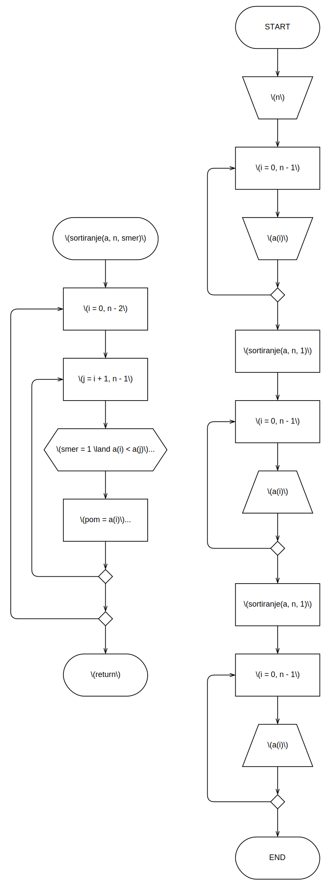

# Пета вежба

**Функције**

[:fontawesome-regular-file-pdf: Нерешени задаци](../../assets/AIP_V5_zadaci_za_vezbu.pdf)

## Неке белешке...

До сада програмски код који смо желели да извршимо смо писали унутар функције `main`, а по неке готове математичке функције из стандардне библиотеке користили како не би морали сами да имплементирамо поједина израчунавања, као и употребљавали фунцкије за унос података са стандардног улаза и штампање података на стандардни излаз.

У програмским језицима се често јављају појмови попут процедура, потпрограма, функција и сл., који омогућавају бољу организацију програмског кода као и могућност вишеструког коришћења истог програмског кода за различите вредност параметара, тј. аргумената. У савременим програмским језицима најчешће ћемо се сусретати са функцијама, које је програмски језик _C_ популаризовао.

Процедуре и потпрограми нпр. су чести називи за скупину програмског кода груписану под неким заједничким називом. Употребом тог назива могуће је тај програмски код више пута извршавати из главног програма или пак других процедура, тј. потпрограма.

Функције у математичком смислу нпр. су изрази који трансформишу улаз у неки одговарајући излаз.

У програмском језику _C_, функције су суштински процедуре (тј. потпрограми) који се могу понашати налик математичким функцијама, тј. да за неке улазна параметре дају одређену излазну (тј. повратну) вредност.

Функције се дефинишу на следећи начин:

```
[повратни_тип] <назив>([параметри]) {
    [програмски код]
}
```

```
[параметри] ::= <листа_параметра> | "void"
<листа_параметара> ::= <параметар> | <листа_параметара> "," <параметар> |
<параметар> ::= <тип_податка> <назив>
```


{ .no-indent }

Није обавезно навести повратни тип и у том случају компајлер ће функцију имплицитно сматрати као да је повратног типа `#!c int`. Наравно, увек је боље експлицитно назначити повратни тип функције.

Могуће је навести произвољан број параметра функције, међусобно одвојени карактером запета (`,`).

Параметре није обавезно навести, функција може бити без параметара. У случају да желимо да дефинишемо функцију без параметара коректније је по компајлеру да се напише `#!c void` уместо да се остави празнина.

Функције се позивају на следећи начин:
```
<назив_функције>([листа_аргумената])
```

```
<листа_аргумената> ::= <аргумент> | <листа_аргумената> "," <аргумент>
<аргумент> :== <константна вредност> | <променљива> | <израз> | <позив_функције>
```


{ .no-indent }

Уколико функција има повратну вредност, на место позива функције биће враћена та вредност у изразу.

За аргумент редудантно је навести да може бити константна вредност, променљива, позив функције, итд. јер су све то заправо изрази. При извршењу програмског кода, у тренутку када се дође до нпр. променљиве или позива функције, доћиће до њихове евалуације и они ће суштински бити замењени својом вредношћу, било то вредност коју променљива чува или вредност коју функција враћа. Управо зато су и изрази, јер је могуће њихову вредност евалуирати (израчунати у току извршења програма) као и користити аритметичке и логичке операције над њима како би формирали комплексније математичке или логичке изразе који потом све скупа када се евалуирају дају неку вредност целокупног тог израза.

При позиву фунцкије потребно је навести тачан број аргумента који одговарају параметрима те функције, као и да тип података за сваки од аргумента одговара типу параметара.

!!! example "Неки примери дефинисања функција и њихова употреба у главном програму"

    ```c
    #include <stdio.h>

    void stampajBroj(int broj) {
        if (broj == 69) {
            printf("Noice!\n");
        } else {
            printf("Vas broj je: %d\n", broj);
        }

        return;
    }

    int min(int a, int b) {
        return a < b ? a : b;
    }

    inkrement(void) {
        static int i;

        return i++;
    }

    main() {
        int i;

        for (i = 0; i < 10; i++) {
            stampajBroj(min(inkrement(), 17));
            inkrement();
        }
    }
    ```

    Шта ће бити излаз овог програма?

    Функција `stampajBroj` је повратног типа `#!c void`, што значи да нема повратну вредност и има само један параметар.

    Функција `min` је повратног типа `#!c int` и има два параметра. Њена повратна вредност биће вредност мањег параметра од два прослеђена.

    Функција `inkrement` наизглед нема дефинисану повратну вредност, међутим њена повратна вредност је заправо `#!c int` (када се повратна вредност функције не напише, подразумева се `#!c int`). Ова функција нема параметре, што се означава тако што се наведе `#!c void` уместо листе параметара.

    `#!c static` модификатор при декларацији променљиве налаже да ће променљива задржати своју вредност по завршетку програмског блока (_scope_-a) у коме је декларисана. На тај начин, променљива `#!c static int i` у функцији `inkrement` по завршењу функције ће заджати тренутну вредност која ће се пренети у наредно извршење функције.

!!! note "Функција без параметара"

    ```c
    int fn1(void) {
        return 5;
    }

    int fn2() {
        return 5;
    }

    main() {
        fn1(); // Коректна употреба функције.
        fn2(); // Коректна употреба функције.
        
        fn1(123); // Компајлерска грешка: функција има 0 параметара, а позвана је са аргументом!
        fn2(123); // Коректна употреба функције.

        fn1(1, 2, 3, 4); // Компајлерска грешка: функција има 0 параметара, а позвана је са 4 аргумената!
        fn2(1, 2, 4, 4); // Коректна употреба функције.
    }
    ```

    У програмском језику _C_ дефинисање функције без параметара је могуће тако што се уместо листе параметара наведе кључна реч `#!c void`.

    Уколико се листа параметра остави празна, таква функција нема параметре, али могуће је навести произвољан број аргумената при позиву функције, што може довести да забуне у начину на који је фунцкија дефинисана и на начину на који је могуће ту функцију потом користити јер неће проузроковати у компајлерској грешци. Једна од ситних и чудних ствари програмског језика _C_...

    За потребе овог курса, ово и није баш битно - користите шта год Вам је лакше.

`#!c return` наредбу је неопходно познавати за рад са функцијама. Чим се у току извршења програма наиђе на наредбу `#!c return`, функција која се тренутно извршава бива прекинута и ток извршења програма се враћа назад на место где је функција била позвана. Уколико функција има повратни тип и `#!c return` наредби се наведе аргумент у виду вредности која одговара повратном типу функције, та вредност биће враћена у изразу на место позива функције.

!!! warning "Разлике употребе функција на овом курсу"

    У програмском језику _C_ могуће је употребити кључну реч `#!c return` на више места и било где у функцији или да је нема. Када повратни тип фунцкије није `#!c void`, `#!c return` наредби је могуће додати аргумент који ће бити вредност коју ће функција вратити. Уколико у функцији нема `#!c return` наредбе или постоји `#!c return` без аргумента, повратну вредност функције није могуће знати и може бити било која заостала насумична вредност у меморији коју је компајлер предоделио за чување повратне вредности.

    На писменом делу испита овог курса обавезно је да све Ваше функције имају **само један** `#!c return` и то на **самом крају** фунцкије као **завршна наредба**! Додатно, уколико фунцкија није `#!c void` повратног типа, потребно је уз `#!c return` додати аргумент који ће бити повратна вредност функције и мора одговарати повратном типу функције.

Чест је случај да се тражи да функција примени неки рад на променљивама које су пренете преко параметра функције, тј. пренете преко референце или показивача. Некада се тражи да функција враћа више вредност, што технички није могуће услед лимитација програмског језика _C_ на начин на који функције раде, али суштински је могуће употребити излазне вредности пренете преко параметара функције, тј. референце или показивача, да емулирамо тако нешто.

Показивачи су променљиве чија је вредност меморијска локација. Често се каже да показивач показује на неку другу променљиву, тј. показује на меморијску локацију неке друге променљиве. Слично као што променљива која чува низ је заправо показивач који указује на први елемент низа, тј. променљива матрице је показивач који указује на прву врсту (ред) матрице.

Како употребом показивача добијамо приступ меморијској локацији на коју нека променљива из главног програма чува вредност, онда је могуће да на исту ту меморијску локацију из функције упишемо неку вредност, која ће потом бити приступачна из главног програма такође. На тај начин могуће је да функција „врати више вредности” преко параметара.

Пошто су променљиве низова и матрица показивачи (на први елемент низа, тј. на прву врсту/ред матрице), када се низ (односно матрица) проследи као аргумент функције и потом функција изврши неке промене над елементима, те промене биће видљиве и у главном програму. Уколико је потребно да елемети низа (тј. матрице) остану непромењени у главном програму, а функција врши промене над њима, функцији је потребно или проследити копију низа (матрице) или копирати елементе у нови низ (матрицу) декларисан унутар функције и вршити рад над том копијом.

Ако је променљива `a` показивач (`#!c int *a`), онда у изразу `#!c a` представљаће меморијску локацију, а `#!c *a` вредност која је ускладиштена на тој меморијској локацији (употребљавамо унарни оператор дереференцирања `*` над показивачем). Вредност сачувану на тој меморијској локацији је могуће модификовати као да сматрамо да је `#!c *a` било која обична променљива, тј. могуће је доделити нову вредност као `#!c *a = 10`, инкрементовати `#!c (*a)++`, декрементовати вредност `#!c (*a)--` итд.

Показивач је могуће декларисати као `#!c int *a`, `#!c int* a`, `#!c int * a`, али и као `#!c int*a`. Није битно да ли постоји бланко знак са леве или десне стране `*`. Најчешће се виђа облик `#!c int *a` због тога што је очигледније да је такво `a` заправо показивач, лакше је потом запамтити синтаксу `*a` за придобијање вредности на коју тај показивач указује. Такође  уколико на истој линији желимо да декларишемо више показивача потребно је то чинити на следећи начин `#!c int *a, *b, *c` (опет, није битно да ли је `*` одвојена бланко знаком од назива, како год је Вама лепше). Уколико би написали `#!c int* a, b, c` нпр. онда је овде само `a` показивач (`#!c int*`), док су `b` и `c` променљиве типа `#!c int`!

Користите шта год је Вама лакше, али такође будите обазриви када читате програмске кодове да Вам не промакне `*` била слепљена уз назив или тип податка. Наравно, показивач не мора да указује на тип `#!c int`, можемо имати показивач на било који тип, као и показивач на показивач, на показивач, ... (`#!c double *b`, `#!c char *c`, `#!c float **d`).

Да би показивач био користан, његова вредност треба бити постављена на вредност меморијске локације. Меморијску локацију било које променљиве (чак иако је та променљива показивач и она је ускладиштена на некој меморијској локацији па је могуће чак имати и показивач показивача показивача...) можемо добити употребом унарног оператора „адреса од” `&`. Овај оператор смо често употребљавали при позиву функције `scanf()` управо како би њој проследили као аргументе меморијске локације променљивих да би било могуће у њих уписати вредност коју би потом могли да користимо у главном прогрмау.

!!! example "Пример употребе показивача"

    ```c
    #include <stdio.h>

    void func(int *a, int b) {
        b += *a;
        *a *= b;
    }

    main() {
        int a = 10, b = 17, *c;

        c = &b;
        *c += 3;

        func(&a, b);

        printf("%d %d", a, b); // 300 20
    }
    ```

    `c` је показивач на променљиву `b`. `#!c *c += 3` ће повећати за 3 вредност на коју показивач `c` указује, тј. вредност променљиве `b`.

    Функција `func()` је позвана са аргументима адреса од `a` и вредност од `b`, самим тим иако функција мења вредност оба параметра и `a` и `b`, само је вредност променљиве `a` у главном програму промењена како је она једино пренета преко показивача (тј. њене меморијске локације).

## Задатак 1.

Нацртати структурни дијаграм тока алгоритма и написати функцију `int prost(int A)` на програмском језику _C_ која одређује да ли је број $A$ прост број. У главном програму испитати и приказати колико бројева, од укупно $N$ бројева које задаје корисник, је просто.

### Териотисање

Испитивање да ли је број прост је већ приказано у [1. Задатку Друге лабораторијске вежбе](./2.md#1).

Потребно је још то написати у функцији коју ћемо потом позивати у петљи како би одређивали да ли је унети број прост и уколико јесте инкрементовати неки бројач. На крају, штампамо резултат тог бројача.

### Дијаграм тока алгоритма


{ .no-indent }

### Изворни код програма

```c linenums="1"
#include <stdio.h>

int prost(int A) {
    int i, p;

    if (A == 2 || A == 3) {
        p = 1;
    } else if (A <= 1 || A % 2 == 0 || A % 3 == 0) {
        p = 0;
    } else {
        p = 1;
        i = 5;
        while (p && i * i <= A) {
            if (A % i == 0 || A % (i + 2) == 0) {
                p = 0;
            }

            i += 6;
        }
    }

    return p;
}

main() {
    int n, c = 0, i, a;
    printf("Unesite N: ");
    scanf("%d", &n);

    for (i = 1; i <= n; i++) {
        printf("Unesite %d. broj: ", i);
        scanf("%d", &a);

        if (prost(a)) {
            c++;
        }
    }

    printf("Broj unetih brojeva koji ispunjavaju uslov: %d\n", c);
}
```

## Задатак 2.

Нацртати структурни дијаграм тока алгоритма и на програмском језику _C_ написати функцију за замену места вредностима две целобројне променљиве $a$ и $b$, пренете преко параметара функције. У главном програму унети три променљиве и коришћењем формиране функције циклично их промерити за једну позицију улево. Приказати бројеве након уноса и након померања.

### Териотисање

Како би било могуће заменити вредности променљивих функцијом, потребно је пренети променљиве путем показивача у параметру функције. То чинимо тако што дефинишемо параметре функције да су типа показивача за одговарајући тип података који нам је потребан. За овај задатак како је потребно заменити места вредностима целобројног (`#!c int`) типа, параметри ће бити `#!c int *` типа (показивач на вредност типа `#!c int`). 

Пошто су показивачи меморијске локације, да би приступили вредностима на тим меморијским локацијама и извршили њихову замену, потребно је употребити унарни оператор `#!c *` (дереференцирање).

При позиву функције, потребно је проследити меморијске локације променљивих чије вредности је потребно заменити, што чинимо употребом унарног оператора `&` (адреса од).

### Дијаграм тока алгоритма


{ .no-indent .diag-60 }

### Изворни код програма

```c linenums="1"
#include <stdio.h>

void razmeni(int *a, int *b) {
    int pom = *a;
    *a = *b;
    *b = pom;

    return;
}

main() {
    int a, b, c;

    scanf("%d %d %d", &a, &b, &c);
    razmeni(&a, &b);
    razmeni(&b, &c);
    printf("%d %d %d\n", a, b, c);
}
```

## Задатак 3.

Нацртати структурни дијаграм тока алгоритма и на програмском језику _C_ написати функцију која одређује и приказује декадну вредност бинарног броја $B$ прослеђеног као низ бинарних цифара, тако да је цифра најмање тежине на почетку низа. У главном програму унети бинарни број у виду низа цифара и коришћењем формиране функције приказати његов декадни еквивалент.

### Териотисање

Како је бинарни бројни систем позициони систем и знамо да има основу $2$, лако можемо претворити бинарне цифре запамћене у низу у декадни број.

Да би претворилин неки произбољан број неког позиционог бројног система у декадни број, то чинимо тако што би издвајали цифре тог броја редом (нпр. дељењем броја са основом бројног система све док број не постане нула) и затим сумирати производ свих цифрара и основе бројног система на степен који одговара тежини издвојене цифре. Цифра најмање тежине ($0$), била би цифра скроз десно, док цифра највеће тежине (један број мањи од броја цифара броја) би била цифра скроз лево.

Како већ имамо издвојене цифре запамћене у низу у поретку од цифре најмање до највеће тежине, цифре бинарног броја који је потребно претворити у декадни број су у обрнутом редоследу. Можемо се нпр. кретати од почетка низа.

У почетном тренутку можемо одредити да је резултујући декадни број $0$ (неутрални елемент за сабирање), а множицал цифара једнак $1$ (за $2^0 = 1$). За сваку цифру редом у низу помножити цифру са множиоцем и додати производ суми резултујућег декадног броја, затим множилац помножити са $2$ како би припремили множилац за наредну цифру. На крају функције вратити добијен декадни број.

У главном програму потребно је унети број цифара, затим унети бинарне цифре броја у обрнутом редоследу (од најмање ка највеће тежине цифара) и запамтити их у низу. Можемо користити формат за унос цифара `%1d` како би ограничили да је могуће унети само једноцифрене целе бројеве, самим тим није обавезно при уносу одвајати цифре бланко знацима или новим редом.

Позвати функцију са аргументима низ бинарних цифара и број бинарних цифара, потом штампати њен резултат.

### Дијаграм тока алгоритма


{ .no-indent .diag-80 }

### Изворни код програма

```c linenums="1"
#include <stdio.h>

int binToDec(char b[100], int n) {
    int i, dec = 0, pow = 1;

    for (i = 0; i < n; i++) {
        dec += b[i] * pow;
        pow *= 2;
    }

    return dec;
}

main() {
    char b[100];
    int n, i;
    printf("Unesite broj cifara: ");
    scanf("%d", &n);

    printf("Unesite cifre binarnog broja u obrunutom redosledu: ");
    for (i = 0; i < n; i++) {
        scanf("%1d", &b[i]);
    }

    printf("Dekadni ekvivalent unetog binarnog broja: %d\n", binToDec(b, n));
}
```

??? tip "Модификација задатка / II начин"

    Ово решење је могуће применити и када су цифре у низу запамћене од најмање до највеће тежине, само је потребо тада петљу кореговати тако да се креће од $N - 1$ до $0$.

    Шта уколико је низ $B$ такав да се на првој позицији налази цифра највеће тежине, притом да низ обилазимо исто од његовог почетка?

    Уколико резултујући декадни број множимо са $2$, потом само додамо тренутну цифру суми, можемо срачунати декадни еквивалент бинарног броја и када се крећемо цифрама броја од највеће до најмање тежине. Притом, сваки пут када се резултујући број помножи са $2$, цифра претходно додата цуми биће одгурнута улево (посматрајте као да радите са декадним цифрама и множите са $10$), самим тим све цифре на самом крају дођу на своја места и дају адекватан резултат, као да смо их одмах множили са $2$ на степен тежине те цифре.

    ```c linenums="1"
    #include <stdio.h>

    int binToDec(char b[100], int n) {
        int i, dec = 0;

        for (i = 0; i < n; i++) {
            dec *= 2;
            dec += b[i];
        }

        return dec;
    }

    main() {
        char b[100];
        int n, i;
        printf("Unesite broj cifara: ");
        scanf("%d", &n);

        printf("Unesite cifre binarnog broja: ");
        for (i = 0; i < n; i++) {
            scanf("%1d", &b[i]);
        }

        printf("Dekadni ekvivalent unetog binarnog broja: %d\n", binToDec(b, n));
    }
    ```

## Задатак 4.

Нацртати структурни дијаграм тока алгоритма и на програмском језику _C_ написати функцију `minmax` која одређује и враћа индексе највеће и најмање вредности у низу $X$ са $N$ елемената. У главном програму унети број елемената и елементе низа, и коришћењем формиране функције одредити и приказати најмањи и највећи елемент низа.

### Териотисање

Како је потребно да функција враћа две вредност, потребно је да вредности преносимо преко параметара функције употребом показивача. Параметри за индекс највећег и најмање вредности нека су `maxI` и `minI` респективно, а њихов тип података биће `#!c int *` (показивач на вредност типа `#!c int`). Како су они показивачи, да би приступили вредности на коју они указују и како би је модификовали, потребно је употребити унарни оператор `*` (дереференцирање). У почетном тренутку можемо да претпоставимо да је елемент са индексом $0$ и најмањи и највећи елемент, потом у петљи од елемента са индексом $1$ до крајњег елемента са индексом $N-1$ проваравати да ли је тренутни мањи од претходно одређеног минималног, ако јесте његов индекс постаје нови најмањи индекс, као и проверавати да ли је тренутни елемент већи од претходно одређеног максималног, ако јесте његов индекс постаје нови највећи индекс.

У главном програму потребно је декларисати променљиве које ће нам служити да чувају повратне вредности функције које ћемо пренети преко параметара. При позиву функције меморијске локације тих променљивих је потребно проследити као аргументе употребом унарног оператором `&` (адреса од). Штампати најмањи и највећи елемент.

### Дијаграм тока алгоритма


{ .no-indent }

### Изворни код програма

```c linenums="1"
#include <stdio.h>

void minmax(int x[100], int n, int *minI, int *maxI) {
    int i;
    *minI = *maxI = 0;

    for (i = 1; i < n; i++) {
        if (x[i] < x[*minI]) {
            *minI = i;
        }

        if (x[i] > x[*maxI]) {
            *maxI = i;
        }
    }

    return;
}

main() {
    int a[100], n, minI, maxI, i;

    printf("Unesite broj elemenata niza: ");
    scanf("%d", &n);

    printf("Unesite elemente niza: ");
    for (i = 0; i < n; i++) {
        scanf("%d", &a[i]);
    }

    minmax(a, n, &minI, &maxI);

    printf("Najmanji element: %d\nNajveci element: %d\n", a[minI], a[maxI]);
}
```

## Задатак 5.

Нацртати структурни дијаграм тока алгоритма и на програмском језику _C_ написати функцију `delioci` која враћа низ са свим делиоцима природног броја пренетог преко параметара функције. У главном програму унети природан број $B$ и коришћењем формиране функције одредити и приказати све његове делиоце.

### Териотисање

Функцију можемо дефинисати са параметрима: број чије делиоце је потребно одредити и низ у којем ћемо сачувати делиоце тог броја. Повратна вредност функције може бити `#!c int`, самим тим функција би враћала број одређених делиоца као повратну вредност. Могуће је да је функција типа `#!c void`, а потом да је величина низа, тј. број одређених делиоца такође прослеђен преко параметра функције, али као показивач (`#!c int *n`) да би у функцији било могуће ту вредност из главног програма модификовати.

У функцији, петљом проласком кроз бројеве од 1 до самог броја чије делиоце тражимо, и употребом модуло оператора (остатка при дељењу), одређујемо делилац, сачувамо га у низу и повећавамо број одређених делиоца (тј. величину низа).

На крају функције вратити број одређених делилаца.

У главном програму позвати функцију са аргументима унетог природног броја и низа у коме ће се његови делиоци бити смештени, а повратну вредност функције доделити променљивој која ће представљати величину низа. Бројачком петљом потом штампати елементе низа.

### Дијаграм тока алгоритма


{ .no-indent }

### Изворни код програма

```c linenums="1"
#include <stdio.h>

int delioci(int a, int d[100]) {
    int i, n = 0;

    for (i = 1; i <= a; i++) {
        if (a % i == 0) {
            d[n++] = i;
        }
    }

    return n;
}

main() {
    int a, n, d[100], i;
    printf("Unesite prirodni broj: ");
    scanf("%d", &a);

    n = delioci(a, d);

    printf("Delioci broja %d su:\n", a);
    for (i = 0; i < n; i++) {
        printf("%d ", d[i]);
    }
    printf("\n");
}
```

!!! tip "Потенцијална оптимизација"

    Уместо да се проверавају делиоци неког броја $a$ до самог тог броја, трагање се може ограничити до $\sqrt{a}$, како су делиоци спарени (исти разлог иза оптимизације код провере да ли је број прост). Делиоци броја $100$ биће $1, 2, 4, 5, 10, 20, 25, 50, 100$ и они су на неки начин спарени - $1$ и $100$, $2$ и $50$, $4$ и $25$, $5$ и $20$ и $10$ спарен сам са собом. Производ ових парова даће дељник, у овом примеру број $100$, стога трагање можемо ограничити до половине делилаца једнако корену дељеника, јер се делиоци спарују први и задњи, други и предзадњи, ... С тим, пар било ког делиоца можемо одредити дељењем дељеника и делиоца. Применом овог знања можемо на тај начин смањити време извршења програма. Једини _trade-off_ овог приступа је што редослед делиоца неће бити уређен, већ ће у низу бити упамћени редом као први, задњи, други, предзадњи, трећи, ...

    ```c
    int delioci(int a, int d[100]) {
        int i, n = 0;

        for (i = 1; i * i <= a; i++) {
            if (a % i == 0) {
                d[n++] = i;

                if (i != a / i) {
                    d[n++] = a / i;
                }
            }
        }

        return n;
    }
    ```

## Задатак 6.

Нацртати структурни дијаграм тока алгоритма и на програмском језику _C_ написати функцију `sortiranje` која врши уређивање елемената низа пренетог преко параметара функције у нерастући или неопадајући редослед, у зависности од вредности целобројног параметара `smer`. У главном програму унети број елемената и елементе низа, и коришћењем функције уредити елементе низа у нерастући, а затим у неопадајући редослед. Приказати низ пре и после сваког уређења.

### Териотисање

У функцији можемо имплементовати алгоритам за сортирање елемената низа као по обичају што смо то чинили до сада. Једина разлика биће услов, како желимо да зависно од параметра `smer` применимо један од услова, употребом мало математичке логике можемо бирати ако је $smer = 1 \land a(i) < a(j)$, онда заменити елементе $a(i)$ и $a(j)$, или ако је $smer = -1 \land a(i) > a(j)$ онда такође заменити места елементима. Дакле ове услове можемо спојити дисјункцијом и проблем решен.

Из главног програма унети низ, позвати функцију са смером $1$, штампати низ, потом позвати функцију још једном са смером $-1$, поново штампати низ.

### Дијаграм тока алгоритма


{ .no-indent .diag-80 }

### Изворни код програма

```c linenums="1"
#include <stdio.h>

void sortiranje(int a[100], int n, int smer) {
    int i, j, pom;

    for (i = 0; i < n - 1; i++) {
        for (j = i + 1; j < n; j++) {
            if (smer == 1 && a[i] < a[j] ||
                smer == -1 && a[i] > a[j]) {
                pom = a[i];
                a[i] = a[j];
                a[j] = pom;
            }
        }
    }

    return;
}

main() {
    int a[100], n, i;

    printf("Unesite broj elemenata niza: ");
    scanf("%d", &n);

    printf("Unesite elemente niza: ");
    for (i = 0; i < n; i++) {
        scanf("%d", &a[i]);
    }

    printf("Nerastuci redosled: ");
    sortiranje(a, n, 1);
    for (i = 0; i < n; i++) {
        printf("%d ", a[i]);
    }
    printf("\nNeopadajuci redosled: ");
    sortiranje(a, n, -1);
    for (i = 0; i < n; i++) {
        printf("%d ", a[i]);
    }
    printf("\n");
}
```

## Задатак 7.

Нацртати структурни дијаграм тока алгоритма и на програмском језику _C_ написати функцију која приказује елементе матрице пренете преко параметара функције. Приликом приказа, коришћењем карактера `|` формирати матрицу као у примеру. У главном програму унети матрицу $A_{N \times N}$ и приказати је употребом формиране функције. Пример:

```
|     1    2     3  |
|    12  123  1234  |
|     0    0    10  |
```

### Териотисање

За овај задатак штампање матрице је потребно написати у фунцкцији, с тим да пре првог елемента врсте и након задњег елемента врсте буде одштампан карактер `|`, додатно можемо користити форматирано штампање бројева како би сви били поравнани подједнако као у датом примеру. Вероватно није битно са колико бланко знака слева поравњате елемент при штампању, у овом решењу је то чињено са 5 бланко знака употребом форматираног штампања `%5d`.

### Дијаграм тока алгоритма


{ .no-indent .diag-80 }

### Изворни код програма

```c linenums="1"
#include <stdio.h>

void prikaz(int a[100][100], int n, int m) {
    int i, j;

    for (i = 0; i < n; i++) {
        printf("| ");
        for (j = 0; j < m; j++) {
            printf("%5d ", a[i][j]);
        }
        printf("|\n");
    }

    return;
}

main() {
    int a[100][100], n, i, j;

    printf("Unesite dimenziju matrice N: ");
    scanf("%d", &n);

    printf("Unesite elemente matrice:\n");
    for (i = 0; i < n; i++) {
        for (j = 0; j < n; j++) {
            scanf("%d", &a[i][j]);
        }
    }

    prikaz(a, n, n);
}
```

## Задатак 8.

Нацртати структурни дијаграм тока алгоритма и на програмском језику _C_ написати функцију која одређује и враћа суму вредности елемената испод споредне дијагонале целобројне матрице $A_{N \times N}$, прослеђене преко параметара функције. У главном програму унети две целобројне матрице $B$ и $C$ и приказати ону чија је сума елемената испод споредне дијагонале већа.

### Териотисање

Да би одредили суму елеменаа испод споредне дијагонале, поставићемо неку променљиву сума на $0$ (неутрални елемент за сабирање). Како би заобишли проверу да ли се елемент налази испод споредне дијагонале можемо угњеждене петље за пролазак кроз елементе матрице модификовати тако да је спољашња петља врста $i = 1, N - 1$ (у врсти са индексом $0$ нема елемената испод споредне дијагонале), а унутрашња петља колона $j = N - i, N - 1$. Елементе на позицијама $(i, j)$ додати суми. На крају функције вратити суму.

Додатно можемо написати функције са унос и штампање матрице како би скратили код главног програма (`main` функцију).

Функцију можемо употребити у услову поређења како би поредили суму елемената испод споредне дијагонале једне и друге матрице и на основу тога штампати једну или другу.

### Дијаграм тока алгоритма


{ .no-indent }

### Изворни код програма

```c linenums="1"
#include <stdio.h>

int sumaIspodSD(int a[100][100], int n) {
    int i, j, sum = 0;

    for (i = 1; i < n; i++) {
        for (j = n - i; j < n; j++) {
            sum += a[i][j];
        }
    }

    return sum;
}

void unesi(int a[100][100], int n) {
    int i, j;
    for (i = 0; i < n; i++) {
        for (j = 0; j < n; j++) {
            scanf("%d", &b[i][j]);
        }
    }

    return;
}

void stampaj(int a[100][100], int n) {
    int i, j;
    for (i = 0; i < n; i++) {
        for (j = 0; j < n; j++) {
            printf("%d ", a[i][j]);
        }
        printf("\n");
    }

    return;
}

main() {
    int b[100][100], c[100][100], n, m, k, i, j;

    printf("Unesite dimenziju matrice B: ");
    scanf("%d", &n);

    printf("Unesite elemente matrice B:\n");
    unesi(b, n);

    printf("Unesite dimenziju matrice C: ");
    scanf("%d", &m);

    printf("Unesite elemente matrice C:\n");
    unesi(c, m);

    printf("Matrica sa vecom sumom ispod sporedne dijagonale:\n");
    if (sumaIspodSD(b, n) > sumaIspodSD(c, m)) {
        stampaj(b, n);
    } else {
        stampaj(c, m);
    }
}
```

## Задатак 9.

Нацртати структурни дијаграм тока алгоритма и на програмском језику _C_ написати функцију `exp(x, E)` која одређује вредност суме:

$$
exp(x) = \sum_{n = 0}^{\infty} \frac{x^n}{n!}
$$

Израчунавање прекинути када релативна вредност прираштаја суме постане мања од задате врености $E$. У главном програму учитати вредности параметара $x$ и $E$ и коришћењем формиране функције одредити и приказати вредности дате суме.

### Териотисање

Рачунање суме можемо извршити употребом _repeat-until_ петље, тј. `do-while` петље у програмском језику _C_ која ће имати обрнут услов у односу на `repeat-until` петљу у алгоритму. Пошто треба рачунање прекинути када је прираштај суме мањи од вредности $E$ потребно је да чувамо преходну вредност суме. Притом први корак у петљи јесте постављање нове претходне вредности суме једнаку тренутној вредности суме, затим суми додати $\frac{x}{n}$, инкрементовати $n$ за један. Петља се извршава све док апсолутна вредност разлике тренутне и претходне вредности суме је већа од вредности $E$ (тј. петља се завршава у тренутку када апсолутна вредност разлике тренутне и претходне вредност постане мања или једнака вредност $E$).

Функција за рачунање апсолутне вредност је у овом решењу такође имплементована, али није грешка искористити `fabsl()` функцију из стандардне библиотеке дефинисану у `math.h` заглављу.

### Дијаграм тока алгоритма


{ .no-indent }

### Изворни код програма

```c linenums="1"
#include <stdio.h>


long double fabsl(long double x) {
    return x < 0 ? -x : x;
}

long double exp(int x, double e) {
    int n = 1;
    long double exp = 1, prev;

    do {
        prev = exp;
        exp += (double)x / n++;
    } while (fabsl(exp - prev) > e);

    return exp;
}

main() {
    int x;
    double e;

    printf("Unesite x: ");
    scanf("%d", &x);

    printf("Unesite tacnost e: ");
    scanf("%lf", &e);

    printf("exp(x) = %Lf\n", exp(x, e));
}
```

## Задатак 10.

Нацртати структурни дијаграм тока алгоритма и на програмском језику _C_ написати функцију која транспонује матрицу $A_{N \times N}$, прослеђену преко параметара функције. У главном програму унети целобројну матрицу и приказати унету и транспоновану матрицу употребом формиране функције.

### Териотисање

Матрицу је могуће транспоновати тако што се крећемо елементима изнад (или испод) главне дијагонале и затим заменимо места елементима $a(i,j)$ и $a(j,i)$. Елементи на главној дијагонали остаће на свом месту и не обухватамо их у петљи, а не пролазимо кроз целу матрицу како би заобишли да елементи двапут замене места и самим тим матрица би остала непромењена.

Додатно можемо написати функцију за штампање матрице како би скратили код главног програма (`main` функцију).

### Дијаграм тока алгоритма


{ .no-indent }

### Изворни код програма

```c linenums="1"
#include <stdio.h>

void transpose(int a[100][100], int n) {
    int i, j, pom;

    for (i = 0; i < n - 1; i++) {
        for (j = i + 1; j < n; j++) {
            pom = a[i][j];
            a[i][j] = a[j][i];
            a[j][i] = pom;
        }
    }

    return;
}

void stampaj(int a[100][100], int n) {
    int i, j;
    for (i = 0; i < n; i++) {
        for (j = 0; j < n; j++) {
            printf("%d ", a[i][j]);
        }
        printf("\n");
    }

    return;
}

main() {
    int a[100][100], n, i, j;

    printf("Unesite broj N: ");
    scanf("%d", &n);

    printf("Unesite elemente matrice A:\n");
    for (i = 0; i < n; i++) {
        for (j = 0; j < n; j++) {
            scanf("%d", &a[i][j]);
        }
    }

    printf("\nA:\n");
    stampaj(a, n);

    transpose(a, n);

    printf("\nA^T:\n");
    stampaj(a, n);
}
```
