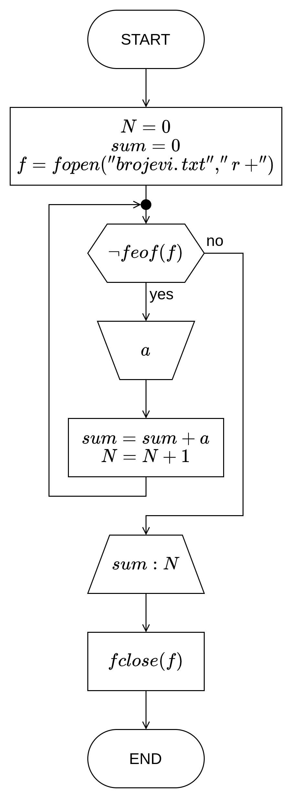
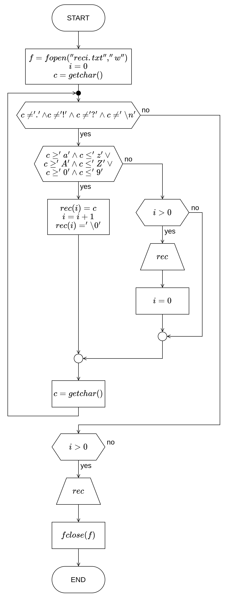
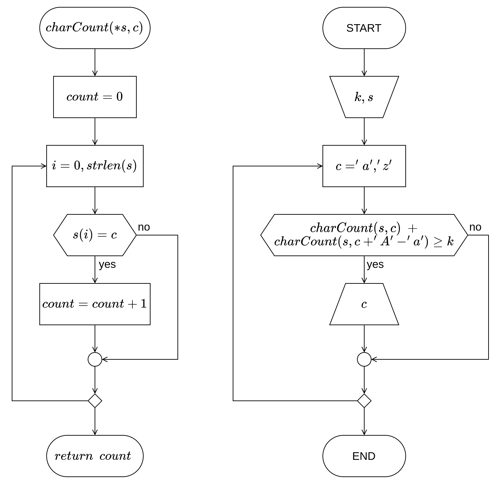

# Шеста вежба

**Ниске и датотеке (_Стрингови и фајлови_)**

[:fontawesome-regular-file-pdf: Нерешени задаци](../../assets/AIP_V6_zadaci_za_vezbu.pdf)

!!! warning "**_WORK IN PROGRESS!_**"

    За сада само доступни изворни кодови као решења задатака…

## Неке белешке...

## Задатак 1.

Нацртати структурни дијаграм тока алгоритма и на програмском језику _C_ написати структурни програм који из датотеке „_brojevi.txt_” учитава низ целих бројева, одређује њихову ариметичку средину и уписује је на крај исте датотеке.

### Териотисање

### Дијаграм тока алгоритма


{ .no-indent .diag-40 }

### Изворни код програма

```c linenums="1"
#include <stdio.h>

main()
{
    int a, n = 0, sum = 0, c;
    FILE *f;

    f = fopen("brojevi.txt", "r+");

    while (!feof(f)) {
        c = fscanf(f, "%d", &a);
        if (c > 0) {
            sum += a;
            n++;
        }
    }

    fprintf(f, "%lf\n", (double)sum / n);
    fclose(f);
}
```

## Задатак 2.

Нацртати структурни дијаграм тока алгоритма и на програмском језику _C_ написати структурни програм који издваја речи из задате реченице, и сваку издвојену реч уписује у нови ред текстуалне датотеке „_reci.txt_”.

### Териотисање

### Дијаграм тока алгоритма


{ .no-indent .diag-60 }

### Изворни код програма

```c linenums="1"
#include <stdio.h>

main()
{
    char rec[100], c;
    FILE *f;
    int i;

    f = fopen("reci.txt", "w");

    i = 0;
    c = getchar();
    while (c != '.' && c != '!' && c != '?' && c != '\n') {
        if (c >= 'a' && c <= 'z' ||
            c >= 'A' && c <= 'Z' ||
            c >= '0' && c <= '9') {
            rec[i++] = c;
            rec[i] = '\0';
        } else if (i > 0) {
            fprintf(f, "%s\n", rec);
            i = 0;
        }

        c = getchar();
    }

    if (i > 0) {
        fprintf(f, "%s\n", rec);
    }

    fclose(f);
}
```

??? tip "Са напредним функцијама за ниске."

    ```c linenums="1"
    #include <stdio.h>
    #include <string.h>

    main()
    {
        char a[100], *rec, *delim = " ,;:.?!-";
        FILE *f;

        gets(a);

        f = fopen("reci.txt", "w");

        rec = strtok(a, delim);
        while (rec != NULL) {
            fprintf(f, "%s\n", rec);
            rec = strtok(NULL, delim);
        }

        fclose(f);
    }
    ```

## Задатак 3.

Нацртати структурни дијаграм тока алгоритма и на програмском језику _C_ написати структурни програм који приказује сва слова унете реченице која се у реченици јављају $k$ или више пута. Реченицу у виду ниске задаје корисник, као и целобројни параметар $k$.

### Териотисање

### Дијаграм тока алгоритма


{ .no-indent }

### Изворни код програма

```c linenums="1"
#include <stdio.h>
#include <string.h>

int charCount(char *s, char c)
{
    int i, count = 0;

    for (i = 0; i < strlen(s); i++) {
        if (s[i] == c) {
            count++;
        }
    }

    return count;
}

main()
{
    char s[100], c;
    int k;

    printf("Unesite k: ");
    gets(s);
    sscanf(s, "%d", &k);

    printf("Unesite recenicu:\n");
    gets(s);

    printf("Slova koja se ponavljaju %d ili vise puta su: ", k);

    for (c = 'a'; c <= 'z'; c++) {
        if (charCount(s, c) + charCount(s, c + 'A' - 'a') >= k) {
            printf("%c ", c);
        }
    }
}
```

??? tip "Са напредним функцијама за ниске."

    ```c linenums="1"
    #include <stdio.h>
    #include <string.h>

    int charCount(char *s, char c)
    {
        int count = 0;
        char *p;

        p = strchr(s, c);
        while (p != NULL) {
            count++;
            p = strchr(p + 1, c);
        }

        return count;
    }

    main()
    {
        char s[100], c, *p;
        int k;

        printf("Unesite k: ");
        gets(s);
        sscanf(s, "%d", &k);

        printf("Unesite recenicu:\n");
        gets(s);

        for (c = 'a'; c <= 'z'; c++) {
            if (charCount(s, c) + charCount(s, c + 'A' - 'a') >= k) {
                printf("%c ", c);
            }
        }
    }
    ```

## Задатак 4.

Нацртати структурни дијаграм тока алгоритма и на програмском језику _C_ написати структурни програм који задату реченицу модификује тако што последњу реч пребацује на почетак реченице. Сматрати да су речи раздвојене са по тачно једним бланко знаком. Реченицу у виду ниске задаје корисник. Приказати модификовану ниску.

### Териотисање

### Дијаграм тока алгоритма

### Изворни код програма

```c
#include <stdio.h>
#include <string.h>

main()
{
    char s[256], pom[256];
    int i;

    gets(s);
    i = strlen(s);

    while (s[i] != ' ') {
        i--;
    }

    s[i] = '\0';

    strcpy(pom, s + i + 1);
    strcat(pom, " ");
    strcat(pom, s);

    printf("Modifikovana niska: \"%s\"", pom);
}
```

## Задатак 5.

Нацртати структурни дијаграм тока алгоритма и на програмском језику _C_ написати структурни програм који за задату реченицу $R$ одређује и приказује број свих појављивања неке задате речи.

### Териотисање

### Дијаграм тока алгоритма

### Изворни код програма

```c linenums="1"
#include <stdio.h>
#include <string.h>

void toLowerCase(char *s)
{
    int i, n = strlen(s);

    for (i = 0; i < n; i++) {
        if (s[i] >= 'A' && s[i] <= 'Z') {
            s[i] = s[i] + 'a' - 'A';
        }
    }
}

main()
{
    char r[100], rec[100], *p;
    int count = 0, n;

    printf("Unesite recenicu:\n");
    gets(r);
    printf("Unesite rec: ");
    scanf("%s", rec);

    n = strlen(rec);

    toLowerCase(r);
    toLowerCase(rec);

    p = strstr(r, rec);
    while (p != NULL) {
        count++;
        p = strstr(p + n, rec);
    }

    printf("Broj ponavljanja reci \"%s\" u recenici je: %d", rec, count);
}
```

## Задатак 6.

У датотеци „_binarne-cifre.txt_” запамћене су бинарне цифре неког позитивног целог броја и то тако да је на почетку датотеке запамћена цифра најмање тежине, а за њом и остале цифре по тежини, свака у новом реду. Нацртати структурни дијаграм тока алгоритма и на програмском језику _C_ написати структурни програм који из задате датотеке чита цифре и приказује декадну репрезернтацију запамћеног бинарног броја.

### Териотисање

### Дијаграм тока алгоритма

### Изворни код програма

```c linenums="1"
#include <stdio.h>

main()
{
    int pow = 1, dec = 0, b;
    FILE *f;

    f = fopen("binarne-cifre.txt", "r");

    while (!feof(f)) {
        fscanf(f, "%d", &b);
        dec += b * pow;
        pow *= 2;
    }

    fclose(f);

    printf("Dekadni ekvivalent binarnog broja iz datoteke: %d\n", dec);
}
```

??? tip "Модификација задатка"

    Шта уколико је низ $B$ такав да се на првој позицији налази цифра највеће тежине, притом да низ обилазимо исто од његовог почетка?

    <!-- Објасни... -->

    ```c linenums="1"
    #include <stdio.h>

    main()
    {
        int dec = 0, b;
        FILE *f;

        f = fopen("binarne-cifre.txt", "r");

        while (!feof(f)) {
            fscanf(f, "%d", &b);
            dec *= 2;
            dec += b;
        }

        fclose(f);

        printf("Dekadni ekvivalent binarnog broja iz datoteke: %d\n", dec);
    }
    ```

## Задатак 7.

Нацртати структурни дијаграм тока алгоритма и на програмском језику _C_ написати структурни програм који проверава да ли текст у датотеци „_tekst.txt_” садржи реч коју задаје корисник са тастатуре.

### Териотисање

### Дијаграм тока алгоритма

### Изворни код програма

```c linenums="1"
#include <stdio.h>
#include <string.h>

void toLowerCase(char *s)
{
    int i, n = strlen(s);

    for (i = 0; i < n; i++) {
        if (s[i] >= 'A' && s[i] <= 'Z') {
            s[i] = s[i] + 'a' - 'A';
        }
    }
}

main()
{
    char s[100], rec[100];
    int contains = 0, i;
    FILE *f;

    printf("Unesite rec: ");
    scanf("%s", rec);

    toLowerCase(rec);

    f = fopen("tekst.txt", "r");

    while (!feof(f) && !contains) {
        fgets(s, sizeof s, f);
        toLowerCase(s);
        if (strstr(s, rec)) {
            contains = 1;
        }
    }

    fclose(f);

    printf("Rec \"%s\" %s sadrzana u tekstu iz datoteke.\n", rec, contains ? "je" : "nije");
}
```

## Задатак 8.

Нацртати структурни дијаграм тока алгоритма и на програмском језику _C_ написати структурни програм који врши надовезивање једне задате ниске на другу задату ниску без коришћења библиотечке функције _`strcat`_. Приказати унете ниске, као и резултујућу ниску.  
Опционо: надовезивање имплементирати у виду корисничке функције `nadovezi(...)`.

### Териотисање

### Дијаграм тока алгоритма

### Изворни код програма

```c linenums="1"
#include <stdio.h>

int length(const char *s)
{
    int n = 0;

    while (s[n] != '\0') {
        n++;
    }

    return n;
}

void nadovezi(char *s1, char *s2, char *r)
{
    int n = length(s1), m = length(s2), i = 0, j;

    for (j = 0; j < n; j++) {
        r[i++] = s1[j];
    }

    for (j = 0; j < m; j++) {
        r[i++] = s2[j];
    }

    r[i] = '\0';
}

main()
{
    char s1[100], s2[100], r[200];

    printf("Unesite prvu nisku:\n");
    gets(s1);

    printf("Unesite drugu nisku:\n");
    gets(s2);

    nadovezi(s1, s2, r);

    printf("Prva niska: \"%s\"\nDruga niska: \"%s\"\nRezultujuca niska: \"%s\"\n", s1, s2, r);
}
```

## Задатак 9.

Нацртати структурни дијаграм тока алгоритма и на програмском језику _C_ написати струкрурни програм који унету реченицу „исправља” тако што сва велика слова замењује одговарајућим малим словима. Приказати модификовану ниску. Напомена: разлика кодова одговарајућих слова у _ASCII_ табели је увек константна и износи `'a' - 'A'`.

### Териотисање

### Дијаграм тока алгоритма

### Изворни код програма

```c linenums="1"
#include <stdio.h>
#include <string.h>

main()
{
    char s[100];
    int i, n;

    printf("Unesite nisku:\n");
    gets(s);
    n = strlen(s);

    for (i = 0; i < n; i++) {
        if (s[i] >= 'A' && s[i] <= 'Z') {
            s[i] = s[i] + 'a' - 'A';
        }
    }

    printf("Modifikovana niska: \"%s\"", s);
}
```

## Задатак 10.

Нацртати структурни дијаграм тока алгоритма и на програмском језику _C_ написати структурни програм који учитава реченицу по реченицу из датотеке „_recenice.txt_”, и у датотеку „_sadrze.txt_” уписује само оне које имају више од $m$ карактера.

### Териотисање

### Дијаграм тока алгоритма

### Изворни код програма

```c linenums="1"
#include <stdio.h>
#include <string.h>

main()
{
    int i = 0, m;
    char r[256], c;
    FILE *fIn, *fOut;

    scanf("%d", &m);

    fIn = fopen("./recenice.txt", "r");
    fOut = fopen("./sadrze.txt", "w");

    while (!feof(fIn)) {
        c = getc(fIn);

        if (i > 0) {
            r[i++] = c;

            if (c == '.' || c == '!' || c == '?') {
                r[i] = '\0';
                i = 0;
                if (strlen(r) > m) {
                    fputs(fOut, r);
                    fputs(fOut, "\n");
                }
            }
        } else {
            if (c >= 'a' && c <= 'z' || c >= 'A' && c <= 'Z' || c == '"' || c == '\'') {
                r[i++] = c;
            }
        }
    }

    fclose(fIn);
    fclose(fOut)
}
```
