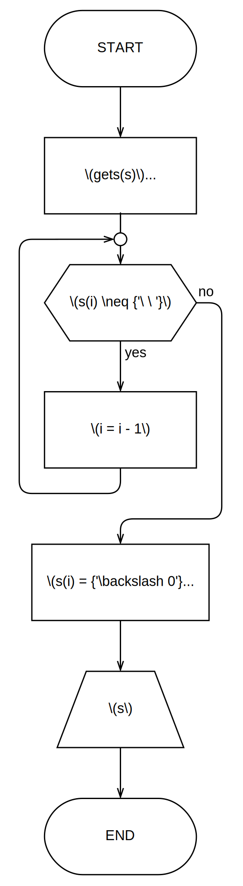

# Шеста вежба

**Ниске и датотеке (_Стрингови и фајлови_)**

[:fontawesome-regular-file-pdf: Нерешени задаци](../../assets/AIP_V6_zadaci_za_vezbu.pdf)

## Неке белешке...

Ниске су ништа друго него ли низови карактера. Специфично за ниске је што крајњи карактер је потребно да буде `\0`, _null-termination character_, чија је вредност 0 и он означава крај ниске. Функције из стандардне библиотеке за рад са нискама се крећу редом по карактерима ниске све док не дођу до `\0`, стога је веома битно да уколико вршите модификацију ниске да се уверите да адекватно поставите крајњи карактер да буде `\0`.

Употребом функција за унос ниске, као и када се ниска иницијализује употребом литерала ниске (енг. _string literal_), програмски језик _C_ аутоматски ће поставити крајњи карактер ниске на `\0`.

!!! example "Исправна употреба ниски"

    ```c
    #include <stdio.h>
    #include <string.h>


    main() {
        char s1[100] = "Hello world!", s2[100], s3[100];
        int i, j, n;

        // s1 = { 'H', 'e', 'l', 'l', 'o', ' ', 'w', 'o', 'r', 'l', 'd', '!', '\0' }
        // Крајњи '\0' jе аутоматски додат због коришћења литерала " "

        gets(s2); // Унос ниске са стандардног улаза
        // Задњи карактер s2 ниске биће аутоматски постављен на '\0' приликом употребе
        // функција за унос ниске

        j = 0;

        n = strlen(s1); // Дужина ниске, рачуна се до '\0' карактер и без њега.
        for (i = 0; i < n; i++) {
            // Копирање садржаја ниске s1 у s3.
            s3[j++] = s1[i];
        }

        s3[j++] = ' ';

        n = strlen(s2);
        for (i = 0; i < n; i++) {
            // Копирање садржаја ниске s2 у s3,
            // настављањем на претходно уписан садржај јер променљива j није ресетована
            s3[j++] = s2[i];
        }

        s3[j] = '\0'; // Постављамо задњни карактер на '\0'!!!

        // Резултат штампања биће садржајеви ниски s1 и s2 раздвојени размаком
        printf(s3);
    }
    ```

Уколико заборавите `\0` може се десити да при штампању ниске дође до појаве насумичних карактера на крају ниске - меморија додељена за складиштење променљивих није увек гарантована да ће бити чиста, тј. да ће сви њени битови бити постављени на 0.

Осим читања са стандардног излаза и уписа на стандардни излаз, програми такође могу читати и уписивати садржај у датотекама, да ли то био текстуални или бинарни садржај. За потребе овог курса потребно је познавати текстуални упис и читање датотека.

Стандардни улаз/излаз у погледу програмског језика _C_ јесте текстуална датотека. Стога, читање из датотека и упис у датотекама је веома сличан већ познатим руковањем стандардног улаза/излаза, пак функцијама за рад са датотекама као аргумент показивача датотеке можете проследити стандардне токове `stdin` (стандардни улаз), `stdout` (стандардни излаз), `stderr` (излаз намењен за сврхе дебагирања и дијагностике) који су дефинисани у `stdio.h` заглављу.

Датотеке пре употребе је потребно отворити употребом функције `fopen(назив_датотеке, режим)`, док ће повратна вредност функције бити показивач на структуру информације датотеке (`FILE *`).

Режими рада са датотекема су следећи:

| Режим  | Значење           | Дејство                            | Датотека већ постоји             | Датотека не постоји    |
| :----: | ----------------- | ---------------------------------- | -------------------------------- | ---------------------- |
| **r**  | _read_            | Отвори датотеку за читање          | Читај од почетка                 | Грешка                 |
| **w**  | _write_           | Направи датотеку за упис           | Брисање претходног садржаја      | Направи нову датотеку  |
| **a**  | _append_          | Додај датотеци                     | Упиши на крају                   | Напарави нову датотеку |
| **r+** | _read extended_   | Отвори датотеку за читање и упис   | Читај од почетка, упиши на крају | Грешка                 |
| **w+** | _write extended_  | Напарави датотеку за читање и упис | Брисање претходног садржаја      | Направи нову датотеку  |
| **a+** | _append extended_ | Отвори датотеку за читање и упис   | Упши на крају, читај од почетка  | Напарави нову датотеку |

За бинарни упис, односно бинарно читање датотеке уз горе напоменуте режиме додати још и карактер `b` за бинарно отварање датотеке.

Након завршетка свих операција са датотекама потребно је датотеке и затворити употребом функције `#!c fclose(показивач_датотеке)`.

Слично функцијама `#!c scanf()` и `#!c printf()`, за читање из датотека користи се `#!c fscanf(показивач_датотеке, формат_читања, ...аргументи)`, тј. за упис у датотеку користи се `#!c fprintf(показивач_датотеке, формат_уписа, ...аргументи)`.

!!! question "Да ли сте знали?"

    Функције `#!c scanf()`, `#!c printf()`, `#!c fscanf()` и `#!c fprintf()` имају повратну вредност типа `#!c int` која ће одговарати броју успешно испроцесираних аргумената. Ово може бити веома корисно нпр. како би заобишли грешке када садржај у датотеци можда није у свакој линији у адекватном формату, те можемо да покушавамо да читамо из датотеке по задатом формату, међутим у случају да је повратна вредност `fscanf()` функције мања од броја аргумента, знамо да тај улаз није исправан, можемо га занемартити и наставити да се крећемо даље по датотеци.

Поред ових функција за стандардне токове и за датотеке, постоје још и додатне фунцкије које нам олакшавају читање и испис ниски. `#!c gets(ниска)` учитаће у ниску једну целу линију са стандардног улаза, а `#!c fgets(ниска, број_бајтова, показивач_датотеке)` учитати у ниску једну целу линију из датотеке до одређеног броја бајтова (да се не би прекорачила ниска, `#!c gets()` функција не прима овај аргумент те се у пракси заобилази њена употреба). `#!c puts(ниска)` исписати ниску на стандардни излаз, а `#!c fputs(ниска, показивач_датотеке)` уписати ниску у датотеку.

Такође је могуће читати унос са стандардног улаза или датотеке карактер по каратер, као и исписивати карактер по карактер, уместо целих ниски одједном. `getchar()` вратиће као повратну вредност наредни прочитан карактер са стандардног улаза, а `getc(показивач_датотеке)` наредни прочитан карактер из датотеке. Наредним позивом ових функција биће прочитан следећи карактер и тако даље. Када повратна вредност ових функције буде једнака константи `EOF` (_end of file_), дошло се до краја улаза, тј. краја датотеке. `#!c putchar(катактер)` исписаће карактер на стандардни излаз, а `putc(карактер, показивач_датотеке)` уписати карактер у датотеку.

!!! question "Када користити `#!c scanf()` и `#!c fscanf()`, а када `#!c gets()` и `#!c fgets()`?"

    Уколико је познат формат уноса можете користити `#!c scanf()` и `#!c fscanf()`, међутим уколико формат није унапред познат или је потребно да учитате ниску која садржи произвољан број бланко знака користити `#!c gets()` и `#!c fgets()`.

    Нпр. уколико је познато да корисник уноси податке о студентима редом: број индекса, име, презиме, просечна оцена, бодови, који су међусобно раздвојени бланко знацима, новим редовима или табуларима, онда има смисла употребити `#!c scanf()` или `#!c fscanf()`.

    Међутим, уколико се тражи да корисник унесе реченицу, самим тим не знамо формат уноса и потребно нам је да унесемо целу реченицу заједно са бланко знацима који се у њој садрже, онда је потребно кориситит `#!c gets()` или `#!c fgets()`.

!!! note "Алгоритамско представљање функције за упис и читање"

    Уколико се користе функције за форматиран улаз/излаз (`#!c scanf()`, `#!c fscanf()`, `#!c printf()`, `#!c scanf()`), користити блокове за улаз/излаз.

	Функције за неформатиран улзаз/излаз (`#!c gets()`, `#!c fgets()`, `#!c puts()`, `#!c fputs()`) претстављати управо као позиве функције унутар блока за процесирање, тј. обичног блока наредби.

## Задатак 1.

Нацртати структурни дијаграм тока алгоритма и на програмском језику _C_ написати структурни програм који из датотеке „_brojevi.txt_” учитава низ целих бројева, одређује њихову ариметичку средину и уписује је на крај исте датотеке.

### Териотисање

Како би учитали низ бројева из датотеке, а потом одређену аритметичку средину уписати на крај исте те датотеке, потребно је отворити датотеку са режимом проширено читање (`r+`) које нам омогућава читање и управо такође и упис на крај датотеке. Могуће је и отворити датотеку први пут само за читање (`r`), затим је затворити и отворити је у режиму додавања садржаја (`a`), шта год Вам је лакше.

Нека је сума бројева и број учитаних бројева једнак нули. Када је датотека отворена и спремна за читање, потребно је све док не дођемо до краја садржаја датотеке да учитамо број из датотеке. Уколико је успешно прочитан број из датотеке (да је број испроцесираних аргумената функције `#!c fscanf()` једнак њеној повратној вредности већи од нуле), додати тај број суми и инкрементовати бројач.

Просечну вредност можемо срачунати као количник суме и бројача, те је и уписати на крај датотеке употребом функције `#!c fprintf()`. На крају, затворити датотеку.

### Дијаграм тока алгоритма


{ .no-indent .diag-40 }

### Изворни код програма

```c linenums="1"
#include <stdio.h>

main() {
    int a, n = 0, sum = 0, c;
    FILE *f;

    f = fopen("brojevi.txt", "r+");

    while (!feof(f)) {
        c = fscanf(f, "%d", &a);
        if (c > 0) {
            sum += a;
            n++;
        }
    }

    fprintf(f, "%lf\n", (double)sum / n);
    fclose(f);
}
```

## Задатак 2.

Нацртати структурни дијаграм тока алгоритма и на програмском језику _C_ написати структурни програм који издваја речи из задате реченице, и сваку издвојену реч уписује у нови ред текстуалне датотеке „_reci.txt_”.

### Териотисање

Да би било могуће уписати сваку реч из реченице у засебним новим редовима, прво је потребно отворити датотеку у режиму уписа (`w`). Није потребно да читамо из датотеке, реченица из које би издвајали речи биће задата на стандарном улазу.

Нека имамо помоћну ниску `rec`. Бројач `i` представљаће нам тренутан број учитаних слова речи у ниски `rec`.

Како би нам било лакше, да смањимо употребу ниски, можемо учитавати карактер по карактер са стандардног улаза функцијом `#!c getchar()` чија је повратна вредност следећи учитан карактер.

Петљом, све док не дођемо до краја реченице (да ли то били интерпункцијски знаци `.`, `!`, `?` или пак карактер за нови ред), ако је учитан карактер алфанумерички уписаћемо га у ниску `rec`, повећати бројач за један, и на последњем месту ниске обавезно ставити крајњи карактер `\0`. У супротном, ако је у питању неки други карактер (највероватније бланко знак или неки знак интерпункције) и уколико је бројач већи од нуле (да у ниску `rec` имамо нешто уписано) тврдимо да смо успешно издвојили реч из реченице и исписујемо је у датотеку. На крају петље учитавамо следећи карактер из стандардног излаза.

По завршетку петље, опет се питамо да ли је којим случајем задња реч из реченице претходно издвојена, уколико јесте и њу исписујемо у датотеку. Затварамо датотеку на крају програма.

### Дијаграм тока алгоритма


{ .no-indent .diag-60 }

### Изворни код програма

```c linenums="1"
#include <stdio.h>

main() {
    char rec[100], c;
    FILE *f;
    int i;

    f = fopen("reci.txt", "w");

    i = 0;
    c = getchar();
    while (c != '.' && c != '!' && c != '?' && c != '\n') {
        if (c >= 'a' && c <= 'z' ||
            c >= 'A' && c <= 'Z' ||
            c >= '0' && c <= '9') {
            rec[i++] = c;
            rec[i] = '\0';
        } else if (i > 0) {
            fprintf(f, "%s\n", rec);
            i = 0;
        }

        c = getchar();
    }

    if (i > 0) {
        fprintf(f, "%s\n", rec);
    }

    fclose(f);
}
```

??? tip "Са напредним функцијама за ниске."

    ```c linenums="1"
    #include <stdio.h>
    #include <string.h>

    main() {
        char a[100], *rec, *delim = " ,;:.?!-";
        FILE *f;

        gets(a);

        f = fopen("reci.txt", "w");

        rec = strtok(a, delim);
        while (rec != NULL) {
            fprintf(f, "%s\n", rec);
            rec = strtok(NULL, delim);
        }

        fclose(f);
    }
    ```

## Задатак 3.

Нацртати структурни дијаграм тока алгоритма и на програмском језику _C_ написати структурни програм који приказује сва слова унете реченице која се у реченици јављају $k$ или више пута. Реченицу у виду ниске задаје корисник, као и целобројни параметар $k$.

### Териотисање

Употребом функције `#!c gets()` учитавамо ниску са стандардног улаза, потом учитавамо параметар $k$ стандардно као и увек са `#!c scanf()`.

!!! note "Редослед коришћења функција за унос"

	Битно је напоменути да уколико би прво унели целобројни парамтар k са `#!c scanf()`, а потом употребили `#!c gets()` за унос ниске добили би празну ниску. Ово се може превазићи на више начина:
	
	1. Одрадити прво неформатирано учитавање ниски са `#!c gets()`, потом користити `#!c scanf()` за форматиран улаз;
	2. Додати бланко знак или карактер за нови ред (`#!c \n`) на крају формата за унос у функцији `#!c scanf()` како би први унос покупио уједно и карактер нове линије (настао услед потврде уноса притиском на ++enter++) да би `#!c gets()` потом коректно радио од почетка наредне линије;
	3. Све уносе вршити преко ниски са `#!c gets()` функцијом, а затим употребити `#!c sscanf(ниска, формат, ...аргументи)` функцију која се понаша исто као `#!c scanf()` функција, али процесира форматиран улаз из ниске уместо са стандардног улаза.

	=== "1."

		```c
		#include <stdio.h>
		main() {
			char s[100];
			int k;

			gets(s);
			scanf("%d", &k);
		}
		```

	=== "2."

		```c
		#include <stdio.h>
		main() {
			char s[100];
			int k;

			scanf("%d ", &k); // или scanf("%d\n", &k);
			gets(s);
		}
		```

	=== "3."

		```c
		#include <stdio.h>
		main() {
			char s[100], pom[100];
			int k;

			gets(pom);
			sscanf(pom, "%d", &k);
			gets(s);
		}
		```

Како би израчунали број понављања слова у реченици, нека се бројачка петља креће редом кроз карактере абецеде $c = a, z$. Потом је потребно да пребројимо колико пута се то слово понавља у унетој реченици, како би код био концизнији можемо направити функцију која ће управо пребројавати број јављања прослеђеног карактера у некој ниски.

Функција која пребраја број јављања датог карактера ниске је потребно да има бројач који ће да броји колико пута се тражени карактер јавља у ниски, затим петљом од почетка до краја ниске да се креће редом и уколико је `i`-ти карактер ниске једнак траженом карактеру инкрементовати бројач, на крају вратити тај бројач.

Слова могу бити мала и велика, али то је и даље једно исто слово, дакле пошто претходно постављена петља се креће малим словима абецеде, одговарајуће велико слово можемо добити као $c + {'A'} - {'a'}$. За $c = {'a'}, {'a'} + {'A'} - {'a'} = 'A'$; $c = {'b'}, {'b'} + {'A'} - {'a'} = {'A'} + 1 = {'B'}$ (јер је ${'b'} - {'a'} = 1$) и тако даље.

У петљи дакле употребом претходно формиране функције можемо сабрати број понављања траженог $c$ слова абецеде као збир понављања њега самог (малог слова) и великог слова ($c + {'A'} - {'a'}$), и уколико је њихов збир већи од или једнак $k$, одштампати слово $c$.

### Дијаграм тока алгоритма


{ .no-indent }

### Изворни код програма

```c linenums="1"
#include <stdio.h>
#include <string.h>

int charCount(char *s, char c) {
    int i, count = 0;

    for (i = 0; i < strlen(s); i++) {
        if (s[i] == c) {
            count++;
        }
    }

    return count;
}

main() {
    char s[100], c;
    int k;

    printf("Unesite recenicu:\n");
    gets(s);

    printf("Unesite k: ");
    scanf("%d", &k);

    printf("Slova koja se ponavljaju %d ili vise puta su: ", k);

    for (c = 'a'; c <= 'z'; c++) {
        if (charCount(s, c) + charCount(s, c + 'A' - 'a') >= k) {
            printf("%c ", c);
        }
    }
}
```

??? tip "Са напредним функцијама за ниске."

    ```c linenums="1"
    #include <stdio.h>
    #include <string.h>

    int charCount(char *s, char c) {
        int count = 0;
        char *p;

        p = strchr(s, c);
        while (p != NULL) {
            count++;
            p = strchr(p + 1, c);
        }

        return count;
    }

    main() {
        char s[100], c, *p;
        int k;

        printf("Unesite k: ");
        gets(s);
        sscanf(s, "%d", &k);

        printf("Unesite recenicu:\n");
        gets(s);

        for (c = 'a'; c <= 'z'; c++) {
            if (charCount(s, c) + charCount(s, c + 'A' - 'a') >= k) {
                printf("%c ", c);
            }
        }
    }
    ```

## Задатак 4.

Нацртати структурни дијаграм тока алгоритма и на програмском језику _C_ написати структурни програм који задату реченицу модификује тако што последњу реч пребацује на почетак реченице. Сматрати да су речи раздвојене са по тачно једним бланко знаком. Реченицу у виду ниске задаје корисник. Приказати модификовану ниску.

### Териотисање

Да би пребацили задњу реч на почетак, потребно је одредити индекс почетка задње речи. Речи у речени су раздвојене бланко знаком, тако да можемо у почетку да поставимо да је индекс задње речи једнак крају ниске, потом декрементовати индекс све до тренутка док не наиђемо на бланко знак. Самим тим, индекс који смо одредили је индекс бланко знака испред задње речи.

Како би нам било лакше да извршимо модификације, можемо да декларишемо неку помоћну ниску и да користимо функције за копирање и надовезивање ниски из стандардне библиотеке из заглавља `string.h`.

Употребом функције `strcpy()` можемо да копирамо задњу реч реченице у помоћни стринг. Ако смо одредили индекс бланко знака испред задње речи, онда индекс за један већи па до краја стринга биће само задња реченица.

Помоћном низу можемо надовезати бланко знак употребом функције `strcat()` са аргументима помоћни низ и ниска `" "` (ниска која садржи само један бланко знак).

Остаје само да помоћној ниски надовежемо остатак почетне ниске. То можемо учини тако што бланко знак испред задње речи заменимо са `\0` карактером, самим тим суштински смо скратили ниску тако да је задња реч обрисана. Надовезивањем ове ниске на помоћну ниску `strcat()` функцијом даје тражен резултат.

### Дијаграм тока алгоритма


{ .no-indent .diag-40 }

### Изворни код програма

```c
#include <stdio.h>
#include <string.h>

main() {
    char s[256], pom[256];
    int i;

    gets(s);
    i = strlen(s);

    while (s[i] != ' ') {
        i--;
    }

    s[i] = '\0';

    strcpy(pom, s + i + 1);
    strcat(pom, " ");
    strcat(pom, s);

    printf("Modifikovana niska: \"%s\"", pom);
}
```

## Задатак 5.

Нацртати структурни дијаграм тока алгоритма и на програмском језику _C_ написати структурни програм који за задату реченицу $R$ одређује и приказује број свих појављивања неке задате речи.

### Териотисање

Да би било могуће да израчунамо колико пута се реч понавља у реченици, први корак је кореговати и реч и реченицу тако да су сва слова мала. Шта уколико се унета реч садржи у првој речи реченице која почиње великим словом? Шта уколико корисник унесе реч са великим словом? Можемо да формирамо функцију која ће вршити ову корекцију ниске, затим је позвати за унету реч и реченицу. Претварање великог слова у мало није тако тешко, потребно је само неком великом слову додати разлику позиције малог слова и великог слова. Разлика било ког малог слова и његовог великог слова биће иста константна вредност за које год слово, тако да увек можемо нпр. узети ${'a'} - {'A'}$, па је онда ${'A'} + {'a'} - {'A'} = {'a'}$, ${'B'} + {'a'} - {'A'} = {'a'} + 1 = {'b'}$ (јер је ${'B'} - {'A'} = 1$), итд.

Употребом функције `strstr()` стандардне библиотеке из заглваља `string.h` можемо одредити позицију подниске у ниски, самим тим можемо то искористити за пребројавање броја понављања речи у реченици. Потребно нам је да одредимо дужину речи, што можемо учинити са функцијом `strlen()`. Употребићемо функцију `strstr()` и њену повратну вредност доделити неким помоћним показивачем. Све док је тај показивач различит од `NULL`, нашли смо реч у реченици. Можемо повећати неки бројач, затим поново позвати функцију `strstr()` и њену повратну вредност поново доделити показивачу, али као аргумент ниске у коју тражимо садржаност речи проследићемо показивач увечан за дужину речи, самим тим трагање за реч наставиће се након претходно нађеног понављања те речи у реченици.

### Дијаграм тока алгоритма


{ .no-indent }

### Изворни код програма

```c linenums="1"
#include <stdio.h>
#include <string.h>

void toLowerCase(char *s) {
    int i, n = strlen(s);

    for (i = 0; i < n; i++) {
        if (s[i] >= 'A' && s[i] <= 'Z') {
            s[i] = s[i] + 'a' - 'A';
        }
    }

	return;
}

main() {
    char r[100], rec[100], *p;
    int count = 0, n;

    printf("Unesite recenicu:\n");
    gets(r);
    printf("Unesite rec: ");
    scanf("%s", rec);

    n = strlen(rec);

    toLowerCase(r);
    toLowerCase(rec);

    p = strstr(r, rec);
    while (p != NULL) {
        count++;
        p = strstr(p + n, rec);
    }

    printf("Broj ponavljanja reci \"%s\" u recenici je: %d", rec, count);
}
```

## Задатак 6.

У датотеци „_binarne-cifre.txt_” запамћене су бинарне цифре неког позитивног целог броја и то тако да је на почетку датотеке запамћена цифра најмање тежине, а за њом и остале цифре по тежини, свака у новом реду. Нацртати структурни дијаграм тока алгоритма и на програмском језику _C_ написати структурни програм који из задате датотеке чита цифре и приказује декадну репрезернтацију запамћеног бинарног броја.

### Териотисање

Како је бинарни бројни систем позициони систем и знамо да има основу $2$, лако можемо претворити бинарне цифре запамћене у низу у декадни број.

Да би претворилин неки произбољан број неког позиционог бројног система у декадни број, то чинимо тако што би издвајали цифре тог броја редом (нпр. дељењем броја са основом бројног система све док број не постане нула) и затим сумирати производ свих цифрара и основе бројног система на степен који одговара тежини издвојене цифре. Цифра најмање тежине ($0$), била би цифра скроз десно, док цифра највеће тежине (један број мањи од броја цифара броја) би била цифра скроз лево.

Како већ имамо издвојене цифре запамћене у датотеци у поретку од цифре најмање до највеће тежине, цифре бинарног броја који је потребно претворити у декадни број су у обрнутом редоследу.

У почетном тренутку можемо одредити да је резултујући декадни број $0$ (неутрални елемент за сабирање), а множицал цифара једнак $1$ (за $2^0 = 1$). За сваку цифру редом коју читамо из датотеке множимо са множиоцем и додајемо тај производ суми резултујућег декадног броја, затим множилац помножимо са $2$ како би га припремили за наредну цифру. Када дођемо до краја датотеке, штампамо резултујући декадни број и обавезно затварамо датотеку.

Можемо користити формат за унос цифара `%1d` како би ограничили да се из датотеке редом учитавају једноцифрени цели бројеви, самим тим није битно да ли су цифре у датотеци свака у засебном реду, раздвојене бланко знаком или написане једна до друге без било ког другог карактер између.

### Дијаграм тока алгоритма


{ .no-indent .diag-40 }

### Изворни код програма

```c linenums="1"
#include <stdio.h>

main() {
    int pow = 1, dec = 0, b;
    FILE *f;

    f = fopen("binarne-cifre.txt", "r");

    while (!feof(f)) {
        fscanf(f, "%1d", &b);
        dec += b * pow;
        pow *= 2;
    }

    fclose(f);

    printf("Dekadni ekvivalent binarnog broja iz datoteke: %d\n", dec);
}
```

??? tip "Модификација задатка"

    Шта уколико су цифре у датотеци запамћене од цифре највеће тежине до цифре најмање тежине?

	Уколико резултујући декадни број множимо са $2$, потом само додамо тренутну цифру суми, можемо срачунати декадни еквивалент бинарног броја и када се крећемо цифрама броја од највеће до најмање тежине. Притом, сваки пут када се резултујући број помножи са $2$, цифра претходно додата цуми биће одгурнута улево (посматрајте као да радите са декадним цифрама и множите са $10$), самим тим све цифре на самом крају дођу на своја места и дају адекватан резултат, као да смо их одмах множили са $2$ на степен тежине те цифре.

    ```c linenums="1"
    #include <stdio.h>

    main() {
        int dec = 0, b;
        FILE *f;

        f = fopen("binarne-cifre.txt", "r");

        while (!feof(f)) {
            fscanf(f, "%1d", &b);
            dec *= 2;
            dec += b;
        }

        fclose(f);

        printf("Dekadni ekvivalent binarnog broja iz datoteke: %d\n", dec);
    }
    ```

## Задатак 7.

Нацртати структурни дијаграм тока алгоритма и на програмском језику _C_ написати структурни програм који проверава да ли текст у датотеци „_tekst.txt_” садржи реч коју задаје корисник са тастатуре.

### Териотисање

Да би било могуће да проверимо да ли се реч садржи у тексту из датотеке, први корак је кореговати и реч и учитан ред тескта из датотеке тако да су сва слова мала. Шта уколико се унета реч садржи у првој речи реченице која почиње великим словом? Шта уколико корисник унесе реч са великим словом? Можемо да формирамо функцију која ће вршити ову корекцију ниске, затим је позвати за унету реч и тренутно учитан ред текста из датотеке. Претварање великог слова у мало није тако тешко, потребно је само неком великом слову додати разлику позиције малог слова и великог слова. Разлика било ког малог слова и његовог великог слова биће иста константна вредност за које год слово, тако да увек можемо нпр. узети ${'a'} - {'A'}$, па је онда ${'A'} + {'a'} - {'A'} = {'a'}$, ${'B'} + {'a'} - {'A'} = {'a'} + 1 = {'b'}$ (јер је ${'B'} - {'A'} = 1$), итд.

Употребом функције `strstr()` стандардне библиотеке из заглваља `string.h` можемо одредити позицију подниске у ниски, самим тим уколико нађемо позицију подниске (тј. речи) онда се та речи садржи у тексу. 

Отворићемо датотеку за читање и поставити неки флег на нетачно (прептоставка да се реч не садржи у тексту датотеке). Све док не дођемо до краја датотеке и све док је флег нетачан, прочитаћемо један ред текста датотеке и сместити у неку помоћну ниску употребом `fgets()` функције. Помоћну ниску затим кореговати тако да велика слова постану мала, и онда и позвати функцију `strstr()` над помоћном ниском и речи (како би одредили позицију речи у учитаном реду текста из датотеке). Уколико је одређена позиција онда смо успешно нашли реч у тексу, постављамо флег на тачну вредност.

### Дијаграм тока алгоритма


{ .no-indent }

### Изворни код програма

```c linenums="1"
#include <stdio.h>
#include <string.h>

void toLowerCase(char *s) {
    int i, n = strlen(s);

    for (i = 0; i < n; i++) {
        if (s[i] >= 'A' && s[i] <= 'Z') {
            s[i] = s[i] + 'a' - 'A';
        }
    }
}

main() {
    char s[100], rec[100];
    int contains = 0, i;
    FILE *f;

    printf("Unesite rec: ");
    scanf("%s", rec);

    toLowerCase(rec);

    f = fopen("tekst.txt", "r");

    while (!feof(f) && !contains) {
        fgets(s, sizeof s, f);
        toLowerCase(s);
        if (strstr(s, rec)) {
            contains = 1;
        }
    }

    fclose(f);

    printf("Rec \"%s\" %s sadrzana u tekstu iz datoteke.\n", rec, contains ? "je" : "nije");
}
```

## Задатак 8.

Нацртати структурни дијаграм тока алгоритма и на програмском језику _C_ написати структурни програм који врши надовезивање једне задате ниске на другу задату ниску без коришћења библиотечке функције _`strcat`_. Приказати унете ниске, као и резултујућу ниску.  
Опционо: надовезивање имплементирати у виду корисничке функције `nadovezi(...)`.

### Териотисање

Надовезивање ниски можемо спровести тако што би нпр. имали неку помоћну ниску у коју би прво ископирали карактере прве ниске, затим на крај те ниске ископирали карактере из друге ниске. Две бројачке петље, један индекс за помоћну ниску који ће у обадве петље континуалну да ресте без да буде ресетован. На крају, крајњи карактер резултујуће ниске је потребно поставити на карактер `\0` који означава крај ниске.

### Дијаграм тока алгоритма


{ .no-indent }

### Изворни код програма

```c linenums="1"
#include <stdio.h>

int length(const char *s) {
    int n = 0;

    while (s[n] != '\0') {
        n++;
    }

    return n;
}

void nadovezi(char *s1, char *s2, char *r) {
    int n = length(s1), m = length(s2), i = 0, j;

    for (j = 0; j < n; j++) {
        r[i++] = s1[j];
    }

    for (j = 0; j < m; j++) {
        r[i++] = s2[j];
    }

    r[i] = '\0';
}

main() {
    char s1[100], s2[100], r[200];

    printf("Unesite prvu nisku:\n");
    gets(s1);

    printf("Unesite drugu nisku:\n");
    gets(s2);

    nadovezi(s1, s2, r);

    printf("Prva niska: \"%s\"\nDruga niska: \"%s\"\nRezultujuca niska: \"%s\"\n", s1, s2, r);
}
```

## Задатак 9.

Нацртати структурни дијаграм тока алгоритма и на програмском језику _C_ написати струкрурни програм који унету реченицу „исправља” тако што сва велика слова замењује одговарајућим малим словима. Приказати модификовану ниску. Напомена: разлика кодова одговарајућих слова у _ASCII_ табели је увек константна и износи `'a' - 'A'`.

### Териотисање

Претварање великог слова у мало није тако тешко, потребно је само неком великом слову додати разлику позиције малог слова и великог слова. Разлика било ког малог слова и његовог великог слова биће иста константна вредност за које год слово, тако да увек можемо нпр. узети ${'a'} - {'A'}$, па је онда ${'A'} + {'a'} - {'A'} = {'a'}$, ${'B'} + {'a'} - {'A'} = {'a'} + 1 = {'b'}$ (јер је ${'B'} - {'A'} = 1$), итд.

### Дијаграм тока алгоритма


{ .no-indent .diag-40 }

### Изворни код програма

```c linenums="1"
#include <stdio.h>
#include <string.h>

main() {
    char s[100];
    int i, n;

    printf("Unesite nisku:\n");
    gets(s);
    n = strlen(s);

    for (i = 0; i < n; i++) {
        if (s[i] >= 'A' && s[i] <= 'Z') {
            s[i] = s[i] + 'a' - 'A';
        }
    }

    printf("Modifikovana niska: \"%s\"", s);
}
```

## Задатак 10.

Нацртати структурни дијаграм тока алгоритма и на програмском језику _C_ написати структурни програм који учитава реченицу по реченицу из датотеке „_recenice.txt_”, и у датотеку „_sadrze.txt_” уписује само оне које имају више од $m$ карактера.

### Териотисање

Све док не дођемо до краја датотеке, можемо да читамо карактер по карактер из датотеке употребом функције `getc()`.

Уколико смо у помоћној ниски већ почели да уписујемо реченицу (индекс већи од нуле), можемо учитани карактер да додамо помоћној ниски и повећамо њен индекс. Ако је учитан карактер једнак `.`, `!` или `?`, дошли смо до краја реченице, задњи карактер постављамо на `\0` карактер који означава крај ниске. Индекс ресетујемо на нулу и уколико је дужина помоћне ниске већа од $m$, исписујемо је у излазну датотеку, као и `\n` како би следећа речени коју би исписали била у свом засебном новом реду.

Међутим, уколико нисмо претходно почели да уписујемо реченицу у помоћној ниски (индекс једнак нули), онда уколико је учитан карактер слово или знак `"` или `'` онда је то почетак реченице, у помоћној ниски уписујемо унети карактер и инкрементујемо индекс.

Затварамо датотеке на крају програма.

### Дијаграм тока алгоритма


{ .no-indent }

### Изворни код програма

```c linenums="1"
#include <stdio.h>
#include <string.h>

main() {
    int i = 0, m;
    char r[256], c;
    FILE *fIn, *fOut;

    scanf("%d", &m);

    fIn = fopen("./recenice.txt", "r");
    fOut = fopen("./sadrze.txt", "w");

    while (!feof(fIn)) {
        c = getc(fIn);

        if (i > 0) {
            r[i++] = c;

            if (c == '.' || c == '!' || c == '?') {
                r[i] = '\0';
                i = 0;
                if (strlen(r) > m) {
                    fputs(fOut, r);
                    fputs(fOut, "\n");
                }
            }
        } else {
            if (c >= 'a' && c <= 'z' || c >= 'A' && c <= 'Z' || c == '"' || c == '\'') {
                r[i++] = c;
            }
        }
    }

    fclose(fIn);
    fclose(fOut)
}
```
